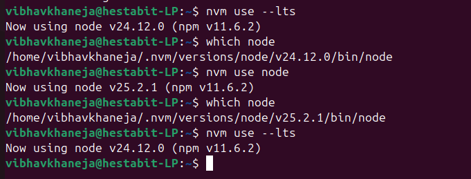
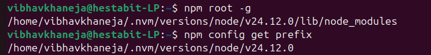
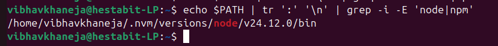
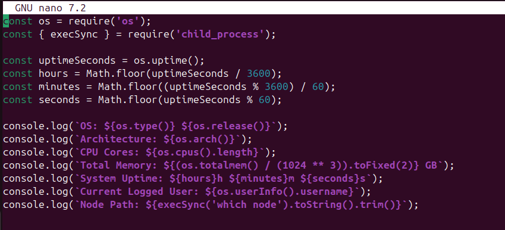
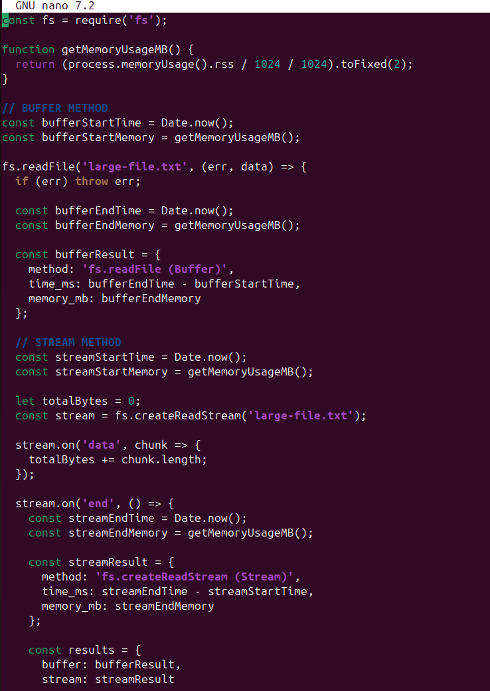
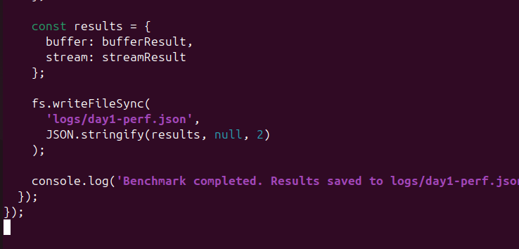

# DAY 1 — SYSTEM REVERSE ENGINEERING + NODE & TERMINAL MASTERING

## Objectives of the day

Today is our day 1 of training and our topics for the day comprises of basics of Node, nvm, Terminal Mastering and a small exercise on Stream vs Buffer.

1.We will be starting with learning about the basic terminal commands and going through current os version details, default shell etc which are essentially usefuil for terminal navigation.
2.Task 2 helps us go through nvm and Node which allows to switch from the latest and lts versions and basic commands for operating with them.
3.Later we will be wokring on a introspect.js file which allows us to understand the basic system stats like total memory, uptime which brushes our knowledge of these frequent used commands.
4.Last but not the least we will be completing an exercise where we will see the comparsion of Stream vs Buffer

### Task 1-2: Identify and Installation of Node and NVM
**1. OS Information:** 
**Command Used:** cat /etc/os-release
**Understanding:** This command helps us understand the basic details of the current OS in use such as the name of the OS, version of the OS, codename etc.

**2. Current Shell:**
**Command Used:** echo $SHELL
**Understanding:** This command returns the default login shell. If we break down the command, then echo is helped to print whatever is passed on the terminal and $SHELL helps to find the default login Shell

**3. Node Binary Path:**
**Commands Used:** nvm use --lts, nvm use node, which node, nvm version, node -v, npm -v 
**Understanding:**
Before starting with this task we need to complete the prerequisites; i.e. installing Node Version Manger(nvm) and then we need lts and then we also have to install node.
Now we can check the versions of the node and nvm to verify whether they have been installed perfectly or not, and from here we can use "nvm use" command to swicth between the latest and base versions.
"which node" command returns us which complete version of Node being used at that time.
These commands together help us understand Task 1.3 to switch and install the latest and base versions of node. 

**4. Node Binary Installation Path:**
**Command Used:** npm root -g, npm config get prefix
**Understanding:** The npm root -g command helps us to understand where global npm packages are stored while get prefix command helps us to find the base directory that controls the global installs.
For understanding, both the commands return the global directory but first commands returns us the exact location where actual package folders live while second command just returns the base directory

**5. Path entries including node/npm:**
**Command Used:** echo $PATH | tr ':' '\n' | grep -i -E 'node|npm'
**Understanding:** If we understand briefly then this commands returns us with all the paths which include which contains node or npm in them.
The importance of this command is that it helps and confirms that node and npm binaries are present and helps us debug better, for example whenever there is a path conflict or multiple node installations.
This command basically lists all the directories in the system which contain references to Node or npm.

These were the preview of the tasks which included setting up Node and NVm and also covered the basic terminal commands like use, grep, echo, nano etc.

### Task 3: Introspect.js

Create script introspect.js that prints:​

OS:​
Architecture:​
CPU Cores:​
Total Memory:​
System Uptime:​
Current Logged User:​
Node Path:

This is our Task 3 which will help us understand the system stats better and also about the basic commands which are needed to fetch them.

Here are the command and result stored for this task:

### Task4: Stream vs BUffer Method

We need to create a logs folder in the beginning where our end result will be stored and a large text file containing random text which will be approximately of size 50mb

This comparison is to help us understand the basics of stream method and buffer method.
**Stream Method:**
1) Reads the data chunk by chunk, and not the entire file at a go.
2) It has a lot of pros over Buffer such as low memory usage, higher scalability, safer for large files.

**Buffer Method:**
1) Reads the entire file in 1 go only and blocks memory until whole file is loaded.
2) It is suggested when the file size is small and it has advantage of speed over stream method but it is risky for larger files.

