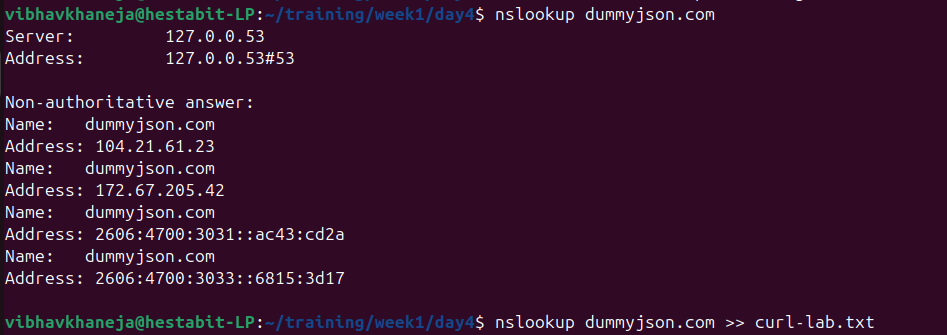
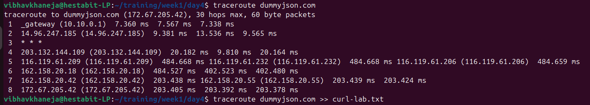
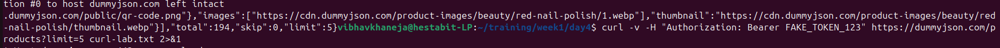
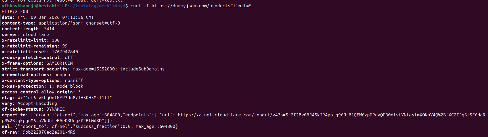
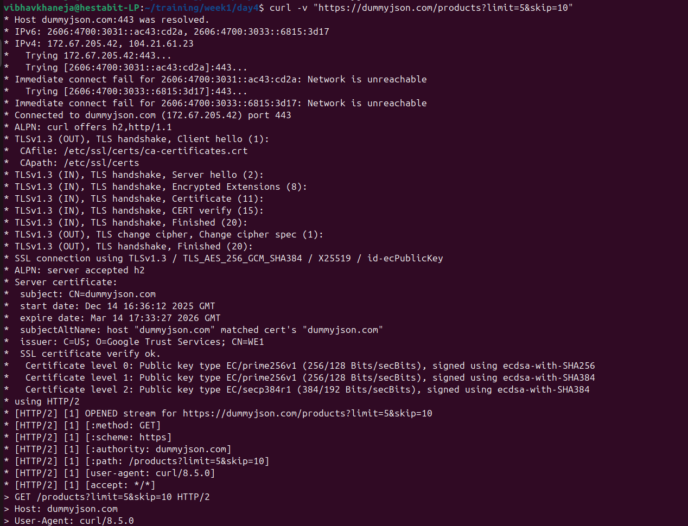
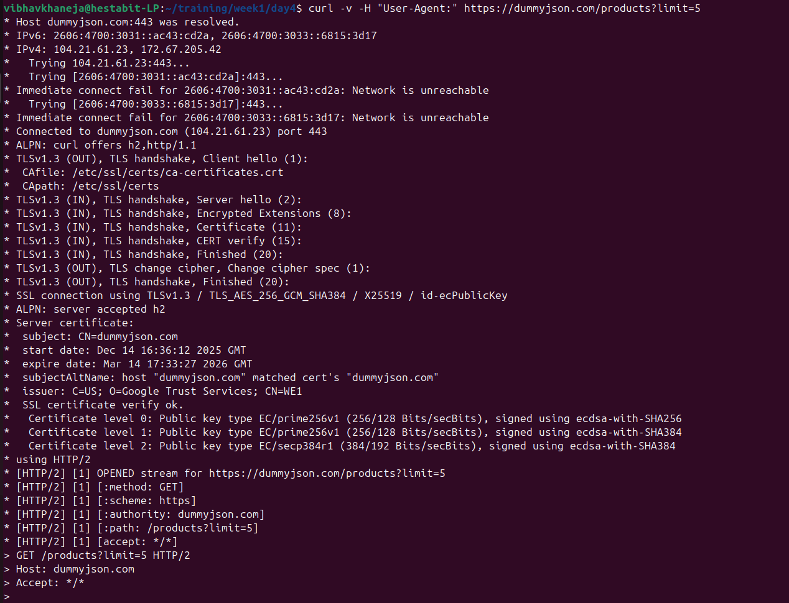
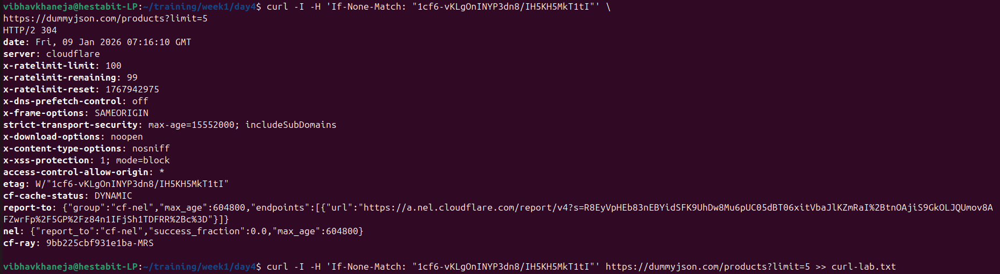
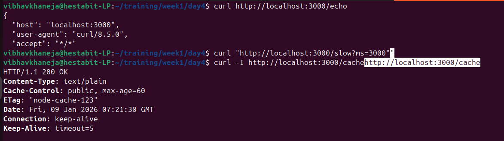

# Analysis of HTTP/API Forensics

Today is our Day 4 and we are going to take a deep dive into HTTP and API forensics

### DNS Lookup
DNS Lookup gives you the information of the Domain Name, Its IP address. This is essentially important to start before curl so that you know about your destination.
nslookup helps us to know about DNS Server used, ip address and about multiple IPs

### Traceroute
Traceroute is essentially important to know the exact route that how our request will reach the endpoint and to decide its path.
traceroute creates a patha dn every line equals to hop unit.

### Pagination
pagination is the technique to divide our content file into separate smaller bits or pages so that smaller pages can be fetched better and for load optimization
We are using limit and skip in this example where limit return the amount of units we require and skip is used to skip the n number of units and starts after that.

### Header
header are our meta data which give us the information of the HTTP request and response
They are not the data just the information about data.

Now we are going to see the working of curl verbose commands which gives us the detains of 
1) DNS Resolution Output
2) TLS/SSL Handshakes
3) HTTP Requests
4) HTTP Responses
5) Body/Payload Data

Modification of Header in verbose file using -H, which is used to modify, update, manipulate data. Here we are emptying the User Agent.

###Caching
Now we are going to understand the concept of etag/ Caching
To access particular data earlier cahing is used and w eare using etag to fetch it and see the changes

First we used etag then our output status code for 200 which refers success and later when we used If-None-Match, then it returned 304 that refers not modified

This is the node server output, we created a node http server for echo, slow and cache

