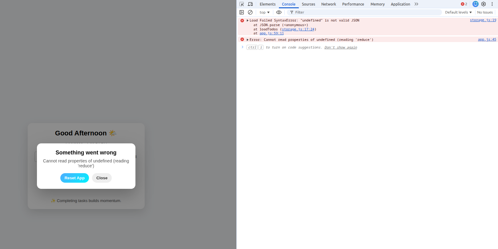
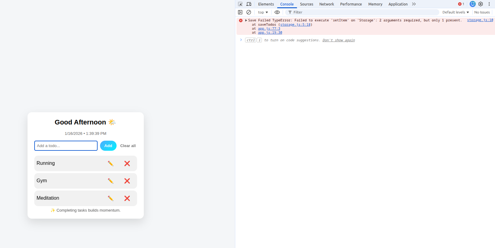
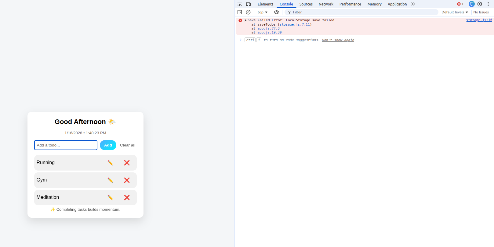
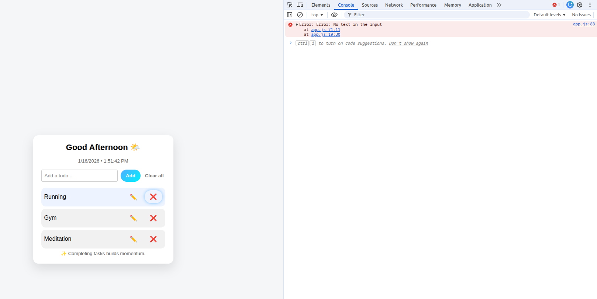

# Error Logs – Todo App

## LocalStorage Parse Error
- Triggered when corrupted JSON exists in LocalStorage
- Handled using try/catch in storage.js

This error occurs when our local storage is unable to be fetched and stored.
We have created the path in the file storage.js where we Parse our data from their and import it in App.js

export function loadTodos() {
  try {
    const data = localStorage.getItem(STORAGE_KEY);
    return data ? JSON.parse(data) : [];
  } catch (error) {
    console.error("Load Failed",error)
  }
}

If theres any missing items or issues in this piece of logic, then our function of loadTodos wont work and we will face a LocalStorage parse failed error.

## LocalStorage Load Error

This error takes place while adding data to local storage using storage.js file
export function saveTodos(todos) {
  try {
    localStorage.setItem( STORAGE_KEY, JSON.stringify(todos));
    if(STORAGE_KEY !== "todos"){
    throw new Error("LocalStorage save failed");
    }
  } catch (error) {
    console.error("Save Failed",error)
  }
}

So if theres any error, anything missing while creating the path to either fetching it in Storage.js or any issues for handling todos then it will give you a LocalStorage save failed error

## No text Error

const addTodo = debounce(() => {
  try{
  const text = input.value.trim();
  if (!text) 
    throw Error("No text in the input");

  todos.push({
    id: Date.now(),
    text,
    completed: false
  });

  saveTodos(todos);
  renderTodos();
  input.value = "";
} catch(e) {
  console.error("Error:", e);
}
}, 300);

If no text is entered in the input box and then we get use throw which directly redirects us to catch with a new error and we can our desired output in the console.

