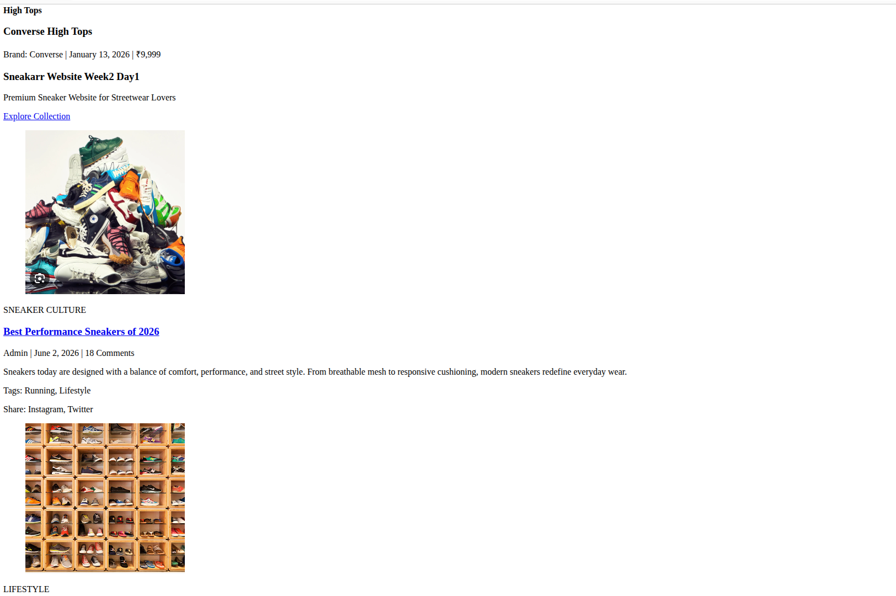
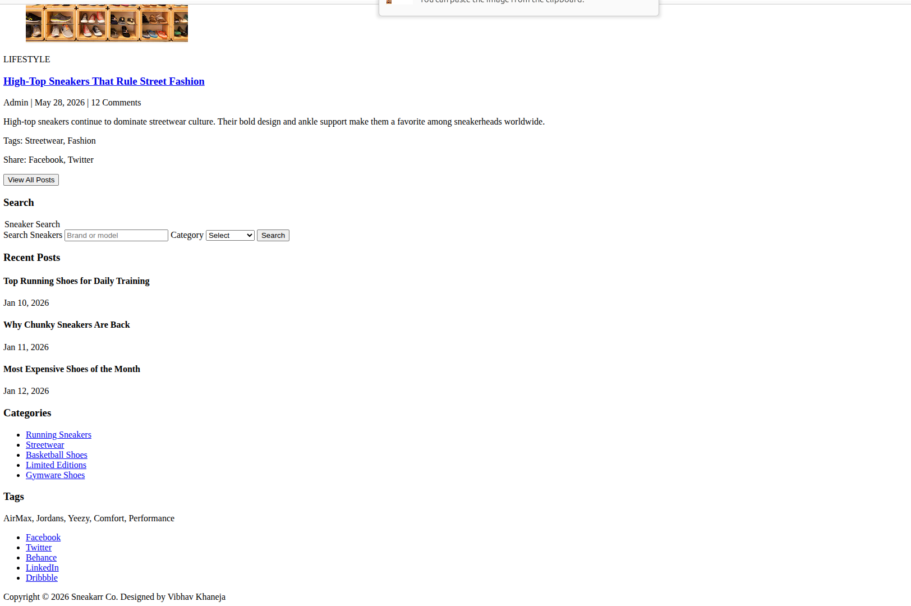
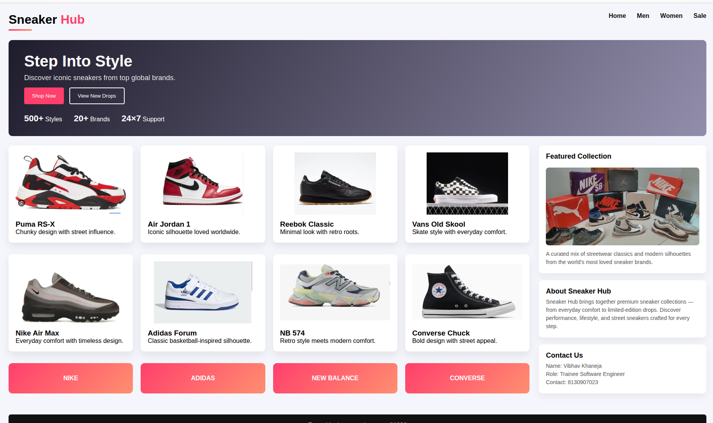
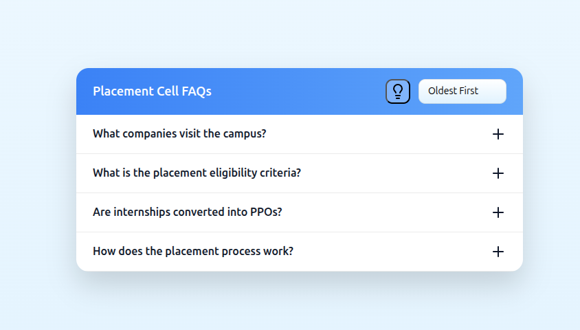
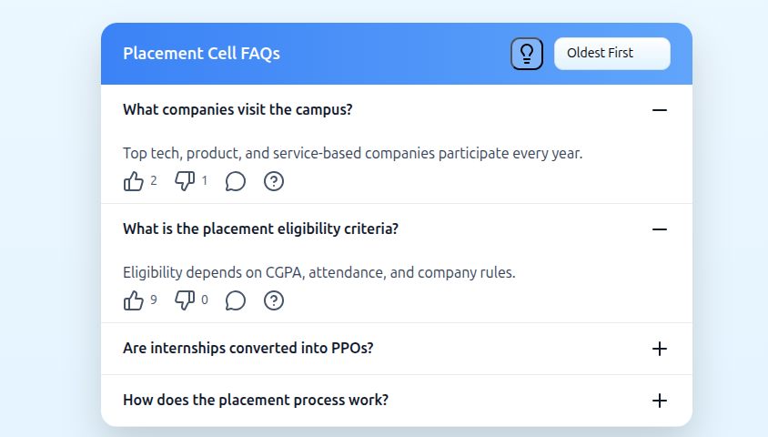
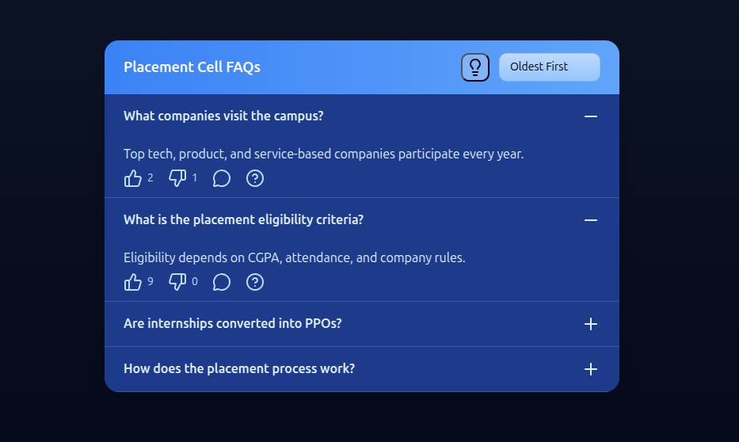
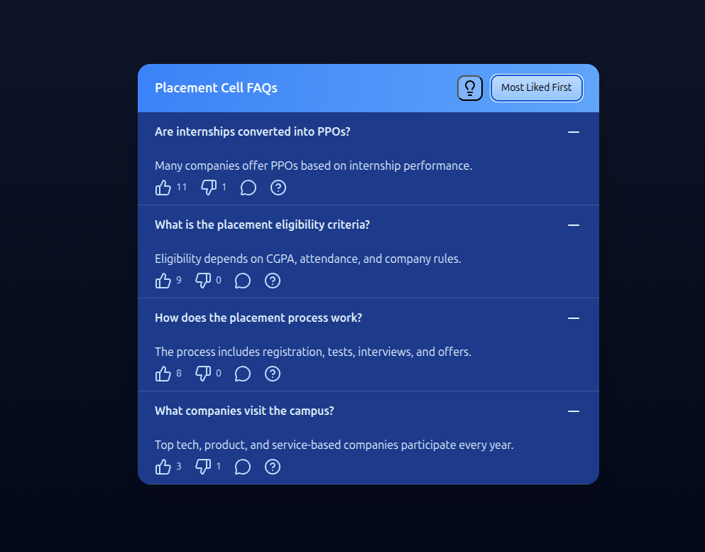
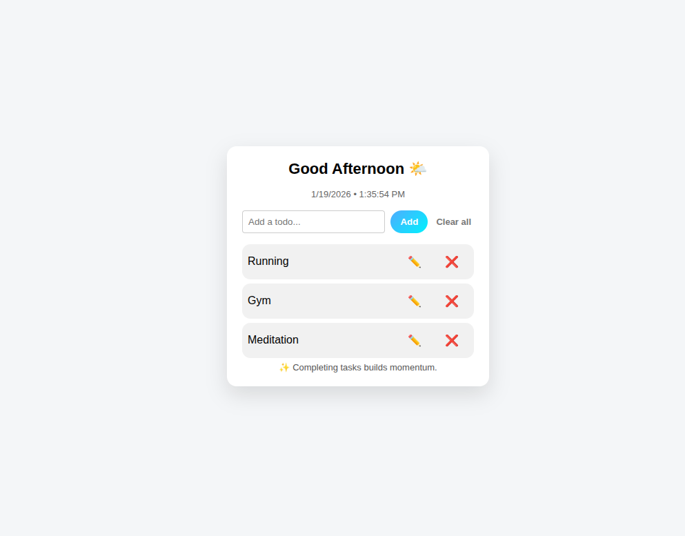
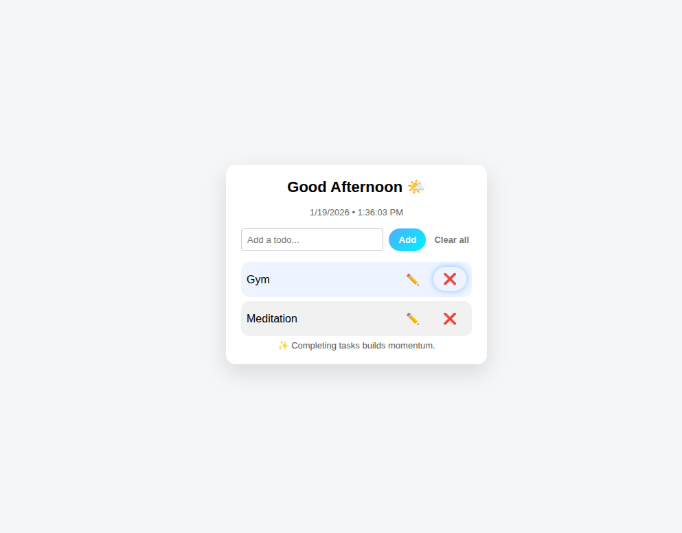
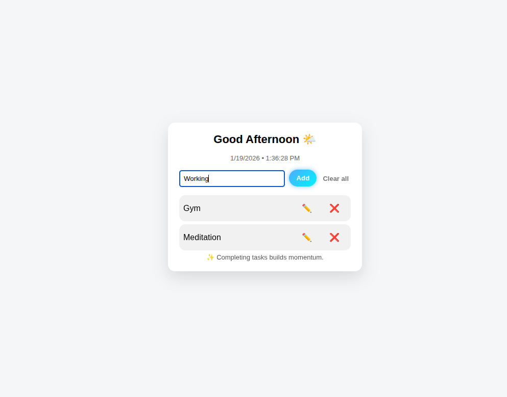

# Week 2: Frontend Fundamentals Learnings

This file will help us know about our learnings of Week 2 where we covered HTML, CSS and JS thoroughly.
Learning  basics to advance interactive level JS website at the end of the week.
In this report we will walkthrough our Week 2 journey covering each day deeply starting off with Day 1.

# Day 1: HTML5 + Semantic Layout

So as we are starting off with HTML and we have to know what HTML, CSS and JS core roles are:
**HTML- Structure => CSS- Presentation => JS- Behaviour**

This is onw of the most important learning which helps us understand whatever we are learning that eventually the core role while working and creating HTML pages is to give our webpage/content a structure or skeleton or meaning.
That is the sole purpose of a HTML file.

### Page Structure
The page structure of HTML file is divided into multiple section using multiple tags, starting off with:
1) Document Declartion
2) HTML: HTML Declaration
3) Head: Metadata purposes
4) Body: Contains the main content

## HTML Tags
HTML tags are enclosed brackets that enable to designate the role of content which has to be given to the browser, There are multiple different types of tags but the sole purpose of declaring tags is to define the role of content of the tags.
**HTML element => HTML opening tag + Content + HTML Closing Tag**

## Metadata
Metadata refers to the additional information which describes about the HTML page, its features and structure but it isnt the data.
Its just the information about the data.

## Semantic HTML5 
HTML5 is the latest version version of HTML which came out in 2014 and we will be going through the semantic HTML in detail.
Semantic HTML refers to **Clearly Describing the meaning** of whatever is being worked on at the moment;i.e.; every different action/section has its own tag/section which helps us to:
1) Improve accessibility
2) Makes the code self-explanatory
3) Enhances the Search Engine working

It provides **structural meaning** to the work which is being done.
Few commonly used Semantic Tags:
1) **Header** is used to provide authentic metadata information which is need at the top of the section.
2) **Footer** is required to conclude the section with essential info.
3) **Section** helps us bifurcate and divide different parts in different sections.
4) **Article** helps us write and store a particular interval/section of some information which is indepent in its own. Section can store multiple articles.
5) **Navigation** tag helps to guide us about different locations.
6) **Aside** tag helps us to divide the data from the main and visualize it separately.

Semantic tag article and semantic tag section both have few similarities but are used for different purposes.
When we have standalone meaning and resuable content then we used Articles.
But when we have related content which can be grouped together then we combine them in section.

## Form and Media
The data collection mechanism in HTML is achieved through forms. It enables the **interaction** between the users and the system.
Form provides you mutiple input controls and fields such as- Text, email, checkbox, select, dropdown, date etc. and provides you multiple features also such as Label, Legend, Placeholder etc. These are used to improve the accessibility of the content and for better understanding purposes espscially for screen readers and differntly-abled people.

HTML allows you to store multiple kinds of media aswell such as images, videos, etc.
We can store images using img tag, and we can also use fig tag which helps us give a caption to our image also using figcaption tag.

## ARIA: Accesible Rich Internet Application
It refers to the additional information which is given to assist technologies, when HTML alone is not enough then we use ARIA tag for labelling navigation, describing and clarifying content. ARIA tag specifically helps screen readers and assists them to learn better.

# Day 2: CSS Layout Mastering

After creating the content and giving a meaning and structure to our work, now is the time to give presentation and layout to our content to describe how it looks or how it appears.

There are 3 different ways by which we can apply our style to our HTML work which are:
1) Inline: in the HTML itself
2) Internal: BY using style tag to assign it
3) EXternal: by creating a .css file and giving its path in the HTML file

## CSS Selectors
A CSS Selector tells the browser to select HTML elements to apply style to.
There are multiple types of selectors such as:
1) Element Selector
2) Class Selector
3) ID Selector
4) Universal Selector
5) Grouping Selector
6) Pseudo-classes
7) Pseudo-elements

## Specificity
Specificity refers to which rule to apply/ which rule wins when multiple target the same element.

Universal => Element => Class => ID => Inline

## Flexbox
Flexbox is used to align items when are content is in One Dimension;i.e; it is a One Dimensional Layout system to arrange rows or columns with the help of main axis/cross axis.
Uses Cases: Align items, distribute space, arrange items in one direction.

## Grid
Gris is a two dimensional layout system which helps us to arrange rows and columns simultaneously together and is used for particularly complex layout purposes. When we have to work on both rows and coloumns and on powerful complexs layouts, then grid comes into matter tto control the layout system and for customization and handling of Page Layouts.

# Day 3: JS + DOM Manipulation
Day 3 marked the transition from static layouts to interactive web pages using JavaScript. The focus was on understanding modern JavaScript (ES6) and learning how to manipulate the DOM (Document Object Model) without using any external frameworks.

We started with ES6 features that make JavaScript cleaner, safer, and easier to maintain. **Variables** (let, const) were used instead of var to ensure block scoping and avoid accidental redeclarations.
1) let: block scoped variable which is re-assignable.
2) const: block scoped varible which is not re-assignable.

## Arrow functions 
Arrow functions provide a concise syntax for writing functions and helped in understanding lexical scoping of this instead of writing the entire fucntion. These features encouraged writing predictable and readable code, which is essential for large applications.

## Arrays and Objects
Arrays were used to store lists of values or objects, while objects were used to represent real-world entities with properties.
To work efficiently with data, we learned the following array methods:
1) map() – to transform data into a new array.
2) filter() – to extract specific data based on conditions.
3) reduce() – to combine data into a single value.
These methods introduced a functional programming approach and avoided mutating original data.

## DOM Manipulation
The DOM represents the HTML structure as objects that JavaScript can access and modify.
1) Selecting elements using getElementById and querySelector
2) Updating text and HTML content
3) Adding, removing, and toggling CSS classes dynamically
This allowed JavaScript to directly control what users see on the screen.

## Event Listeners
Event listeners were used to handle user interactions such as clicks and key presses. They work as a callback function that whenever one task or one event or its conditon gets satisfies, then to invoke, start off with a new fucntion which is added by addEventListener.
By combining DOM manipulation with events, we were able to build interactive components.

# Day 4: JavaScript Utilities + LocalStorage Mini-Project
Day 4 focused on writing reusable JavaScript utilities, debugging code efficiently, and building a mini-project using LocalStorage for data persistence.mWe learned how to debug JavaScript using browser DevTools instead of relying only on console.log.

## Key debugging tools:
1) **Breakpoints** to pause code execution at specific lines
2) **Watch** expressions to monitor variable values in real time

This helped in understanding program flow and identifying logical errors effectively.

## Custom JavaScript Utilities
- Debounce: Executes a function only after a delay once repeated calls stop.
- Throttle: Limits function execution to once per fixed time interval.
- groupBy: Groups objects in an array based on a specific property.
These utilities are commonly used in real-world applications for optimization and data manipulation.

## LocalStorage
LocalStorage was introduced as a way to persist data in the browser even after a page refresh. Data stored as key–value pairs which helpes us to store essential details locally itself. Objects stored using JSON.stringify() and retrieved using JSON.parse()

## Error Handling

Error handling was implemented using try/catch blocks to gracefully handle runtime errors. A conceptual error boundary approach was followed by logging errors in a structured format. We learnt the working of try/catch block where we learnt how try command work, what is the workflow when it reads a throw command and if try block fails or throw block appears then it directs redirects to catch block.

