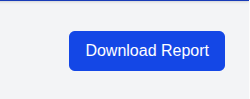
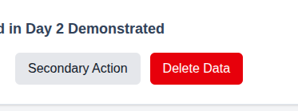
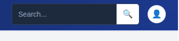
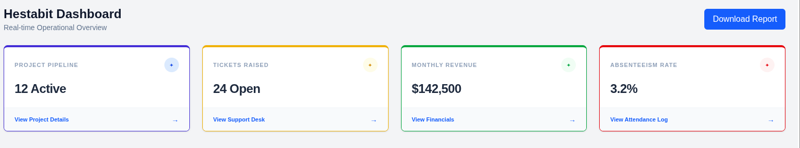
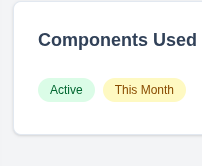

# Readme File for Component Usage

This is the report file which will help us learn about the components which we have added in our dashboard till now, about there use cases and how we tried to utilize thier efficiency.

- Button
**What it is:** A Button is an interactive element used to trigger an action when clicked

**Use Cases:**
1) Global Search: Integrated into the Navbar for system-wide searches.
2) Filtering: Used above data tables to filter through employee or project lists.
3) User Forms: Collecting information inside the "Hestabit" admin modules.

**How It Helps Us:** Button is a clickable functionality which ensures behavioural consistency that is by using each and every button an action will trigger with the help of onclick. For example, your "Download Report" button is blue because it's a helpful, safe action. Without buttons, a dashboard is just a static page you can't interact with.

- Input
**What it is:** An Input is a field that allows a user to enter text or data into the system

**Use Cases:**
1) Global Search: Integrated into the Navbar so you can find projects or employees from anywhere.
2) Data Entry: Used in forms to collect names, revenue figures, or project details.

**How It Helps Us:** Inputs are the primary way to collect information in any file, and we use one here for our search bar. Although this could have been integrated using a standard input tag in the same file, creating a separate Input.jsx file allows us to centralize our styling. By importing this component, we ensure that if we ever want to change the border color, focus ring, or font size for Hestabit's branding, we only have to edit it in one place rather than hunting through every page.

- Card
**What it is:** A Card is a structured container used to group related information into a neat, visible block.

**Use Cases:**
1) Mulltiple Functionality Display: Showing high-level metrics like Project Pipeline or "Monthly Revenue.
2) Status Overview: Providing a quick snapshot of Absenteeism or Tickets Raised.

**How It Helps Us:** Cards create visual hierarchy by creating a container like space which potrays everything in a cleaner and better manner. Instead of a screen full of loose numbers, cards organize data into categories. By using the Border-Accent colors (Blue, Yellow, Green, Red), we tell the user the vibe of the data—like using Red to flag a high absenteeism rate—without them having to read a single word of explanation.

- Badge
**What it is:** A Badge is a small, colored label used to show the status or category of an item

**Use Cases:**
1) Project Status: Labeling a project as Active, Pending, or Completed.
2) Time Markers: Showing that a specific metric belongs to This Month.

**How It Helps Us:** Badges are built for rapid understanding and labelled information which helps the user to understand better while working. Because they are color-coded, a manager can look at a list and immediately see how many projects are Success-Green versus Warning-Yellow. They provide a quick **at-a-glance** status that doesn't require the user to stop and think.

- Modal 
**What it is:** A Modal is a popup window that sits on top of the dashboard content, requiring the user to interact with it before it closes

**Use Cases:**
1) Task Confirmation: Showing a "Success" message after clicking Download Report.
2) Short Forms: Letting a user add a new ticket or employee without leaving the page they are on.

**How It Helps Us:** Modals help us maintain context;i.e.; it is a popup box whose display at the beginning is set to be none/hidden and whenever an event/action is completed then we trigger the popup Modal boc to appear which is required at that time to portray/enlighten the significant information. They allow us to do side tasks without breaking their workflow. Instead of loading a whole new page, the user handles the business in the popup and gets right back to their dashboard.

