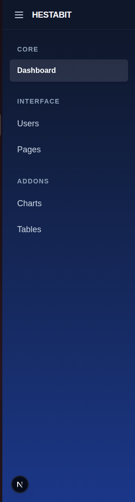
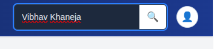
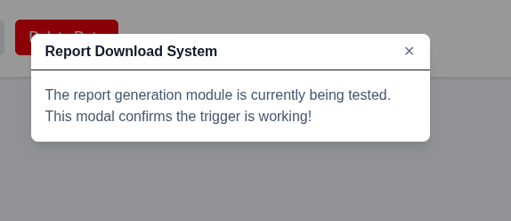
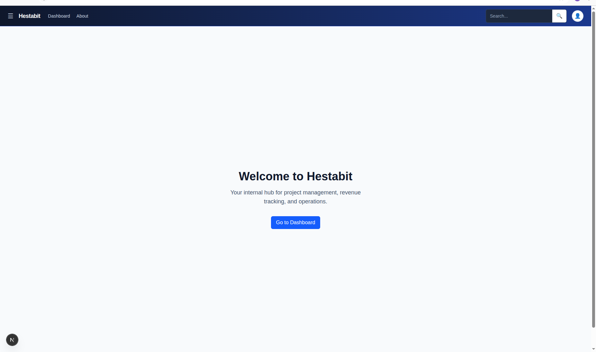
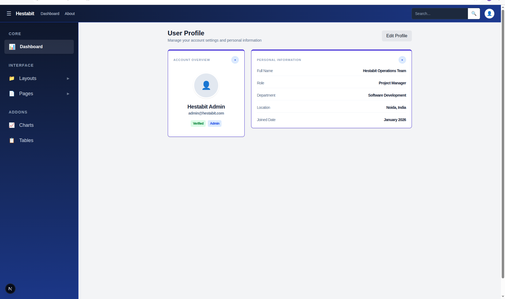
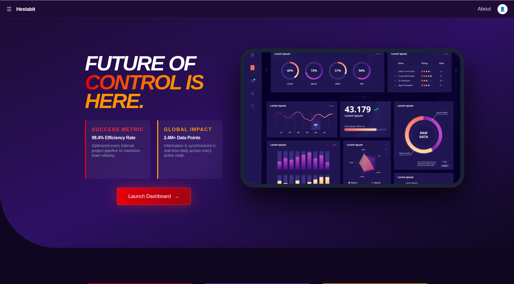

# Readme Report for Week 3: Advance Frontend (Next.js + TailwindCSS)

We will be covering the entire week day by day, so that the flow remains maintained.

We have worked on the same file/dashboard only but with each step increased its functionality;i.e.; added profile page, about page , added layout system in our project; i.e.; switching from one place to other, understanding the concept of routing;i.e,; fetching the data using {children}, from basic Tailwind utilities to advance tailwind fucntionalities we covered it all and created a full end to end fully multi page UI in next.js and Tailwind.

## Week3: Day 1- TailwindCSS + UI System Basics

So firstly we need to understand the concept of components while using tailwind and next.js becuase we started off with our journey by creating seperate components for separate entities and imported them in our page.jsx file. Before creating our page.jsx we must create a layout.jsx file which contains the entire layout of our project and which can act as the parent so that we dont need to reconfigure the same parent layout in each and every file and can be added in all just by using our {children} keyword.

- Next.js Integration: We successfully installed and initialized Tailwind CSS within the Next.js environment to enable rapid styling via utility classes
- We began by creating 2 components on day 1, the navbar and the sidebar which werent operatable right now, used flex for navbar and flex-col for sidebar to maintain them on x and y axis and practiced how to position them properly 
- Utility-First Design: We mastered the use of spacing (p-, m-), specialized colors (slate and blue palettes), and typography to create a high-fidelity interface.
- "import Sidebar from "@/components/ui/Sidebar";" Using this command at the top of our file helps us to import any component into our page.jsx/ layout.jsx whereever it is required.

## Week3: Day 2- Tailwind Advanced + Component Library

This day we worked extensively on more components so that we knew how components ar ecreated, what are props insides components, how to use those props, and how to assign values. We also worked using the useState which is a feature of react which helps us to swtich different states and set new states.

- We worked on multiple components like Badge, button, card, input, modal and worked with their props/attributes;i.e.; whenever you are using button who need to give onclick as a prop which will definitely be used in page.jsx/layout.jsx whereever we are using that button and in the same way we use onClose as a prop in modal and give its value whereever it is used in any file.
- In modal, our open is set to be display: hidden or return null, if (!open) return null;. 
- Then we have created isOpen and a new property setIsOpen which can be used only by useState, const [isOpen, setIsOpen] = useState(false); and set is as false.
- Button variant="primary" onClick={() => setIsOpen(true)}>Download Report, while calling the button on which we have applied onClick, we have used our setIsOpen and changed its property to be true which makes our Modal visible
- Modal open={isOpen} title="Report Download System" onClose={() => setIsOpen(false)}, and to close modal and set the property back to false we have paired it with onClose which helps us intregating our Modal and button components in our page.jsx
- We have also used card and different button states which are referred as variants where there are multiple of varities/options to work on. For ex. Warning, Success, Danger etc and added different colours and properties and wherever any particular varient of the button/card is needed then we just need to call that varient and not reinitialize everythign again.
- A special prop children is used which helps to fetch all the page.jsx data/ attributes which is being used in the adjacent page.jsx file.

## Week3: Day 3- Next.js Routing + Layout System

This was the day when we created multiple pages, layout structure and routing onto our project. Before that we were just using page.jsx and layout.jsx but here came the entire concept of routing and structure design making multiple folders and layout.jsx if required and page.jsx for each particular page. We also inculcated the concept of children in layout.jsx so that we didnt need to hardcode the repetitive entities required in our project in every page such as navbar, header, footer, sidebar etc.

- Multi-Page Structure which helped in engineered routes for the Landing Page, About, Dashboard, and Profile.
- Nested Layouts: Applied shared layouts so that internal dashboard pages automatically inherit the sidebar and navbar, while public pages remain full-screen. 
- We also made the icons, navbar appear and disappear for different pages as the profile icon was needed in our dashboard page but not in our landing page so we set that if the pathname followed our landing page's path then its display will be none, in the same manner we used usePathname to add different attributes of the same entity in differnt conditions, that is we designed our landing page in a dark purple theme but our dashboard in dark blue theme so we used usePathname to assign particular themes after matching is the path follows the landing page or the dashbaord.

## Week3: Day 4- Dynamic UI + Image Optimization

This day was entirely utilized to enhnace our landing page our undertsand how dynamicically we can configure our UI and also inserted an image in our landing to learn Image Optimization. We added header section, testimonials, action cards, and a footer section in our landing page to make iyt look appealing and attractive and also added a image to know how to work with them.

- Optimized Image Rendering: We moved away from standard  tags to the next/image component, implementing features like automatic resizing, lazy loading, and WebP conversion to maintain high performance without sacrificing visual quality.
- Responsive Architecture using Tailwind’s mobile-first breakpoints (sm:, md:, lg:), we engineered a layout that seamlessly adapts from a wide-screen desktop view to a single-column mobile experience. If no sm, md or lg is given then it follows the default for all and if only sm is given then it is also applied for md and lg devices, i.e.; only the minimum dimension is required to fetch and it will be only contniued in the bigger dimensions also. 
- Then we enabled it with semantic section such as header, footer and could have also used aside which helped us to place our content at any one side and using them we could focus on separate individual content as I configured my page width to 40% and divided the heading of the page in multiple lines and multiple colours.

## Week3: Day 5- Capstone Mini Project (No backend)

This is the day where we compiled all our learnings of the entire week in 1 place, created mutilple folder and pages, for ex: login page, about page, profile page etc. Added them in the layout system and added routing to them so that it was convinient for us to fetch from one place to another, added a users page and table and associated it with data using map, adaptive navbar, sidebar and buttons wherever they were required were kept and other pages had their estemeed buttons, icons. Inculcated each page with responsive approach.

- System Integration: We successfully merged isolated modules—the vibrant landing page, the high-performance analytics dashboard, and the administrative attendance tables—into a cohesive routing structure.
- Component Scalability: We utilized a shared UI library (/components/ui) for Button, Card, Badge, Modal, and Input, proving that a well-architected design system reduces development time for new pages like /dashboard/profile.
- Responsive Engineering: Every page was optimized with Tailwind's grid and flex systems to maintain clarity and usability from mobile screens to enterprise-grade desktop monitors using sm, md and lg which helped us configure for all device sizes. 

