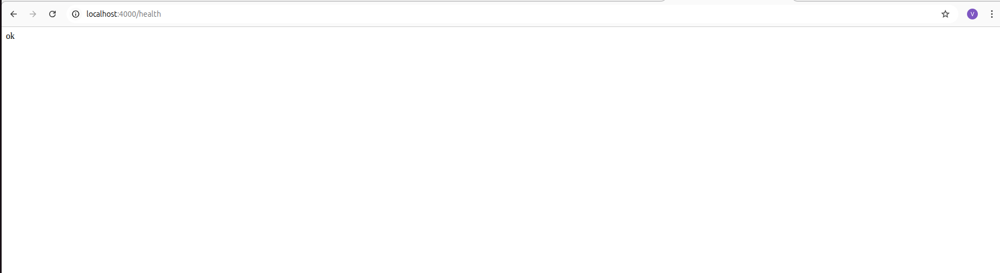
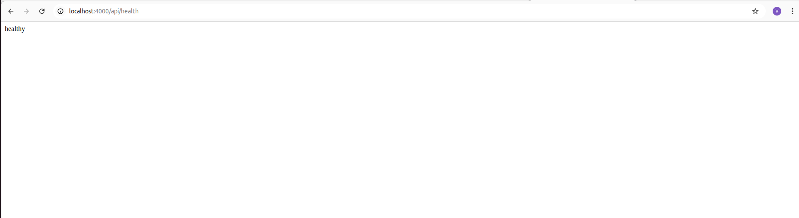
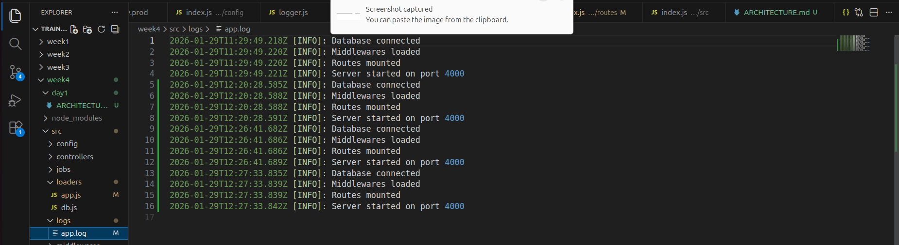

# Architecture Report file 

This file will summarize our learnings for Day 1 and will help us understand whatever we studied and learned in Week 4, Day 1 where we started our backend journey and beginned our journey of Node.js, Express, MongoDB, and APIs.

Backend development is essential for production so that every developer is able to read, change, debug, scale and deploy thier applications.

## Architecture Contents:
1) config
2) loader
3) models
4) routes
5) controllers
6) services
7) repositories
8) middlewares
9) utils
10) jobs
11) logs

Before beginning we must know the pre-requisites;i.e.; we must know that we need to install Mongoose, Express, dotenv and winston for logging. The basic idea behind this layered architecture and structured approach is:
- Logic doesnt get duplicated
- DB Changes doesnt break
- Testing is much easier
- Better team collaboration

## **Understanding Layers**
### Config

It is the centralizaed place that containes all our environment variables and the home to fetch the environment files. We have created three .env files, local, dev and prod. Hardcoding values is dangerous, thats why port numbers, DB connection, strings, secrets, rate limits to avoid system bugs and credentials leak. 
Helps to create a more secured and safe environment.
By creating multiple environment files, we can decide which environment to run at runtime. The config loader reads the active environment, loads the appropriate variables, and ensures the application runs with the correct settings.

### Loaders

To start our application and to start our server loader is used. The 6 prime Loader functions are Load Config, Connect Database, Initiliaze Express, Register Middlewares, Mount Routes and Start Server.
Loader contains app.js and db.js which helps to boot express and connects database. Hence, it contains the startup logic.

### Models 

This contains the structure of the Database, Data shape and the schema design which is being followed by our database. 
It defines the indexes, validation rules, contrainsts and relationship between the data.

### Repositories

Repositories is responsible for the DB connectivity and acts as the Data Access Layer;i.e; it fetches, saves, updates, delete data. It actually runs the DB queries which are being run to fetch and work on the data.
Helps in Database abstraction and hide the DB logic from the services. 

### Services

This is the Brain of the application or the business logic layer which contains the actual logic of the work which is supposed to be executed. For ex. Signup logic, permissions, rules, and provides decision to our data. It is framework independent and resuable.

### Controllers

Controllers are the ones which handle our HTTP level concerns. They are responsible to read request, validate input, call services and return response. They have no relation with the DB structure or the business logic but they act as the API translators and request handlers for us which handle the HTTP level concerns.

### Routes

Routes the API endpoints which is the API Contact definition, i.e.; they contain the method, urls, middleware etc and help us know about the REST principles, route grouping etc.

### Middleware

They handle the cross cutting concerns and have the feature of reusability.
They help integrate our application with functionalities like:
- Authentication
- Authorization
- Rate Limiting
- Input Sanitization
- Error Hadnling

### Utils

Utils is the helper which helps us avoid duplication and helps us with utilities of logger, formatters, helper and constants.
To implement professional logging we avoid using console.log to avoid console level problems like: timestamps, levels , file etc but using winston/pino we are able to get the answers for queries like
- Did the server start
- Did the DB connect
- How many routes

###  Jobs

Heavy tasks go onto the background, like: email, notification, reports, cleanup tasks etc.
They help in load management to manage the heavy tasks.

### Logs

Logs help in observability and debugging, because when we have the record of our entire data, history then it gets easier to know where is the root issue which caused any problem to our application, hence logs help to store the history of the content and results which are being run.

