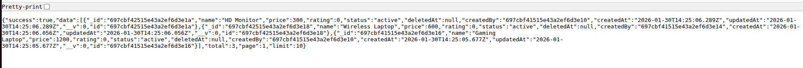
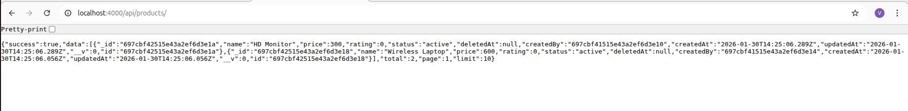
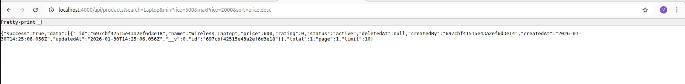
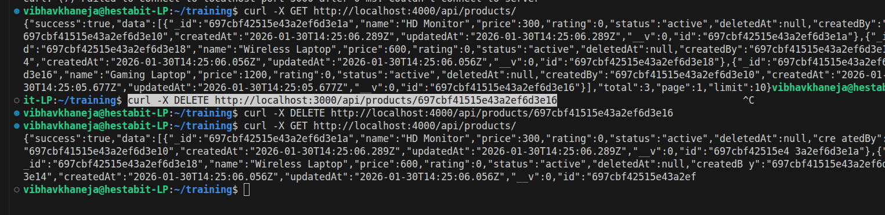

# Query Engine Documentation Documentation

We are going to summarize our learnings for advance query searching and fucntionality which we have covered in Day 3 to support real world production level queries.

These learnings include:
- Searching
- Filter
- Sorting
- Pagination
- Soft Delete Handling 

We also worked on and created all different HTTP methods and tried showcased CRUD operations eith advance functionlities.

To retrieve data and showcase the products we use GET method and GET /api/products/ query which helps us view all our products

To apply advance search while retrieving the information, we must understand the process flow for backend development

Route => Controller => Services => Repository => Models

- We give the API endpoints in our Routes
- Then Controller works as our API translator and the HTTP level concerns and API are written in it
- Services control the actual logic/functionalities which are used in the query, acts as the brain of the system and its functions are imported from repository 
- Repository are the ones which talks to the database and this is the place where we create our soft delete and advanced search functions
- Models is the one which contains the structure of the database and defines the schema. Schema is not just field but the structure + indexes + constraints + hooks + validations

**Responsibilities:**
Controller: Parse query params, send response
Service: Build filters & rules
Repository: Execute MongoDB queries

To make an advanced query we used min price, max price, search operation, filter and sorting logic and pagination using skip and limit & soft delete mechanism.

  async findAdvanced({ filters = {}, sort = { createdAt: -1 }, page = 1, limit = 10 }) 

**Error Handling Format**

{
"success": false,
"message": "Product not found",
"code": "PRODUCT_NOT_FOUND",
"timestamp": "2026-01-30T15:22:00Z",
"path": "/api/products/123"
}

Error handling is handled by middlewares/error.middleware.js

We have also used pre-save hooks, virtual and compound undexes which help us retrieve only required information and not the entire files.

Soft deletes avoid costly remove operations.

Day 3 focused on designing and implementing production-grade REST APIs that go far beyond basic CRUD operations. By the end of this day, we built a scalable, extensible, and performant Product API using a clean Controller → Service → Repository architecture.

We implemented a dynamic query engine capable of handling complex real-world requirements such as text search, multi-field filtering, sorting, and pagination through a single endpoint. This approach mirrors how modern APIs are designed in startups and large-scale systems, where flexibility and performance are critical.
