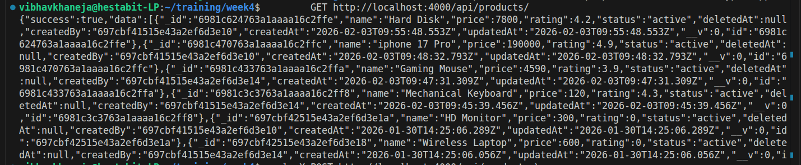
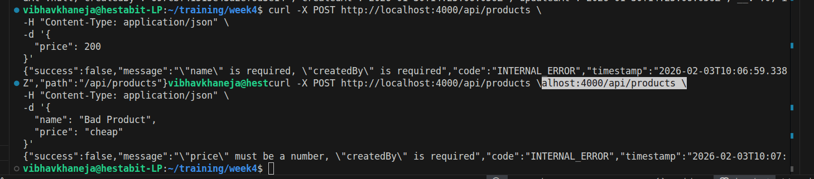
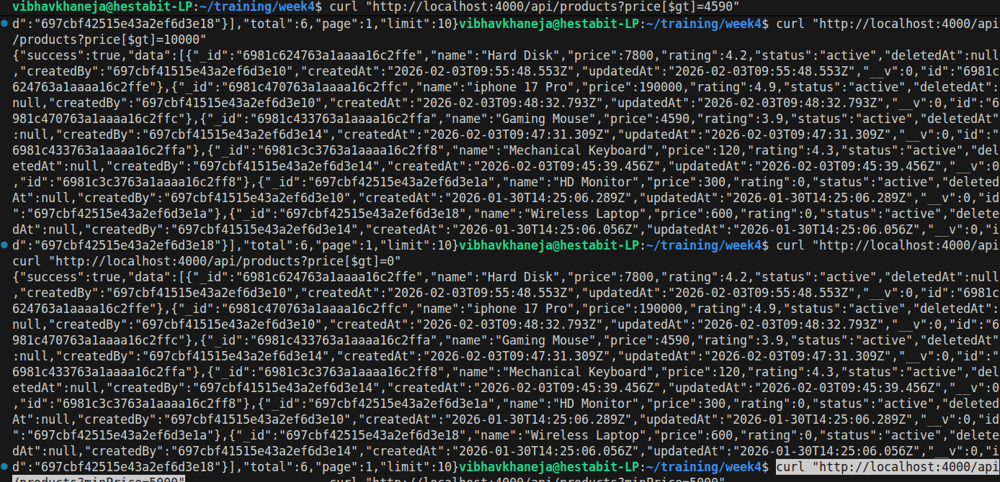
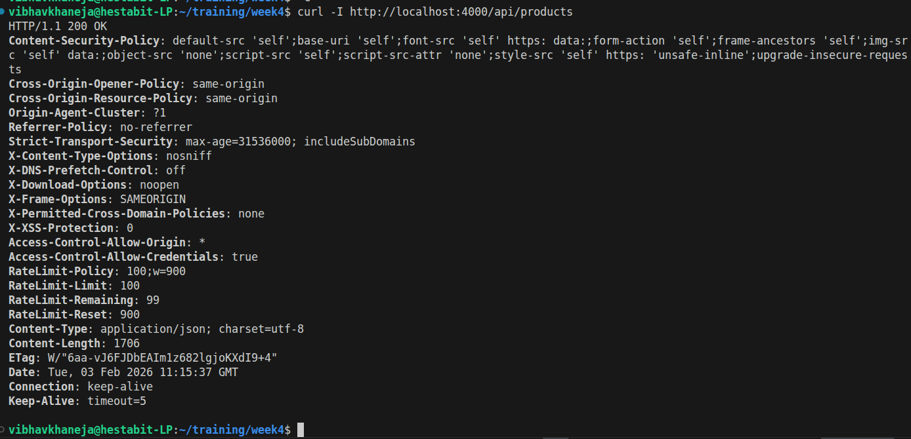
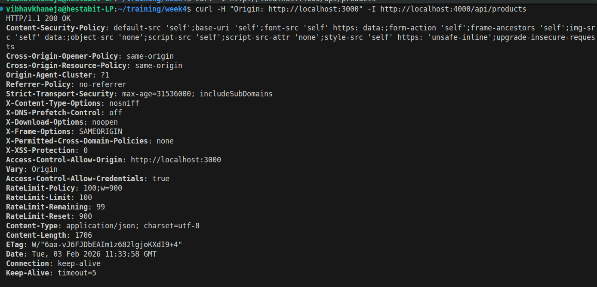
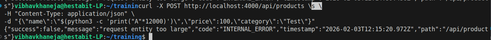
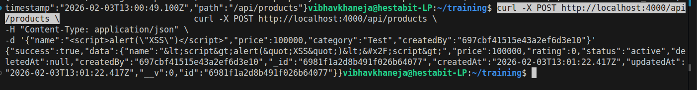
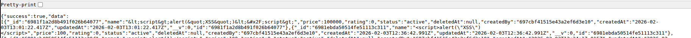
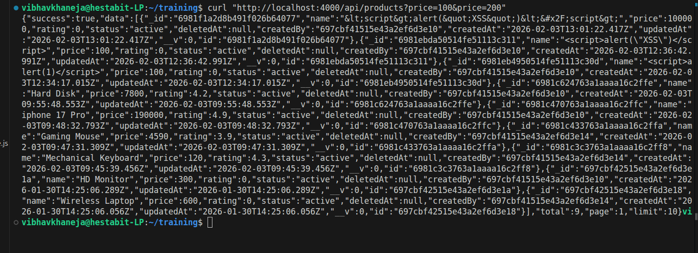

#  Security Report

We are going to summarize our learnings of our Day 4 which include security enhancements including validation, rate limiting, hardening to showcase real-world security concerns. One of the most important takeaway from Day 4 is that now we know how to use security features and retrive only that data which is required

These learnings include:
- Request Validation
- NoSQL Injection
- Helmet
- Cors
- Rate Limiting
- Payload
- XSS
- HPP

**Request Validation**
We used JOI to validate our inputs and only if they were correct, all required fields were there and input types were matched, they only our command will run and we will have the desired output.
We tried to showcase Request Validation with 2 examples where in first one we didnt gave of name field, and in the other example gave a string value but number value was expected in the field price.

vibhavkhaneja@hestabit-LP:~/training/week4$ curl "http://localhost:4000/api/products?price[$gt]=4590"
{"success":true,"data":[{"_id":"6981c624763a1aaaa16c2ffe","name":"Hard Disk","price":7800,"rating":4.2,"status":"active","deletedAt":null,"createdBy":"697cbf41515e43a2ef6d3e10","createdAt":"2026-02-03T09:55:48.553Z","updatedAt":"2026-02-03T09:55:48.553Z","__v":0,"id":"6981c624763a1aaaa16c2ffe"},{"_id":"6981c470763a1aaaa16c2ffc","name":"iphone 17 Pro","price":190000,"rating":4.9,"status":"active","deletedAt":null,"createdBy":"697cbf41515e43a2ef6d3e10","createdAt":"2026-02-03T09:48:32.793Z","updatedAt":"2026-02-03T09:48:32.793Z","__v":0,"id":"6981c470763a1aaaa16c2ffc"},{"_id":"6981c433763a1aaaa16c2ffa","name":"Gaming Mouse","price":4590,"rating":3.9,"status":"active","deletedAt":null,"createdBy":"697cbf41515e43a2ef6d3e14","createdAt":"2026-02-03T09:47:31.309Z","updatedAt":"2026-02-03T09:47:31.309Z","__v":0,"id":"6981c433763a1aaaa16c2ffa"},{"_id":"6981c3c3763a1aaaa16c2ff8","name":"Mechanical Keyboard","price":120,"rating":4.3,"status":"active","deletedAt":null,"createdBy":"697cbf41515e43a2ef6d3e14","createdAt":"2026-02-03T09:45:39.456Z","updatedAt":"2026-02-03T09:45:39.456Z","__v":0,"id":"6981c3c3763a1aaaa16c2ff8"},{"_id":"697cbf42515e43a2ef6d3e1a","name":"HD Monitor","price":300,"rating":0,"status":"active","deletedAt":null,"createdBy":"697cbf41515e43a2ef6d3e10","createdAt":"2026-01-30T14:25:06.289Z","updatedAt":"2026-01-30T14:25:06.289Z","__v":0,"id":"697cbf42515e43a2ef6d3e1a"},{"_id":"697cbf42515e43a2ef6d3e18","name":"Wireless Laptop","price":600,"rating":0,"status":"active","deletedAt":null,"createdBy":"697cbf41515e43a2ef6d3e14","createdAt":"2026-01-30T14:25:06.056Z","updatedAt":"2026-01-30T14:25:06.056Z","__v":0,"id":"697cbf42515e43a2ef6d3e18"}],"total":6,"page":1,"limit":10}

vibhavkhaneja@hestabit-LP:~/training/week4$ curl "http://localhost:4000/api/products?price[$gt]=10000"

**NoSQL Injection**
Sanitization is the process of cleaning or filtering user input to prevent it from executing unintended commands. Bypassing refers to the act of getting around security controls, such as a login screen.

curl "http://localhost:4000/api/products?price[$gt]=10000"

We sanitize the content and replace it with what is safe and remove all the malicious content which can cause harm to our application.
AS it sees a $gt in the command it understands that it can be malicious and removes it compltely making the command price:{}, Hence all our proudcts are listed and "$gt" is not applied.

**Helmet**

Helmet is a security-focused middleware for Node.js that automatically sets various HTTP response headers to protect your application from common web vulnerabilities. Helmet add few HTTP headers which acts as a shield by providing a layer of defense-in-depth, ensuring that browsers interact with your API or website using strict, secure protocols

curl -I http://localhost:4000/api/products

Result:
Helmet successfully adds industry-standard security headers.

**CORS**

Cross-Origin Resource Sharing (CORS) controls which domains are allowed to access your backend APIs from the browser. It is a browser-enforced security feature. Therefore we can add our required filters/requirements whatever is needed as we can seet the frontend origin to be localhost:3000 but curl command doesnt fetch it. THat is browser has blocked all other origin and will respond only to origin:localhost:3000.

curl -H "Origin: http://localhost:3000" -I http://localhost:4000/api/products

origin → Only requests from this domain are allowed.
credentials → Allows cookies or auth headers to be sent.
methods → Allowed HTTP methods.
allowedHeaders → Headers the frontend can send.

**Rate Limiting**

Rate limiting is a way to control how many requests a client (usually an IP) can make to an API in a certain time window. In our setup, each IP can make up to 100 requests every 15 minutes.

It protects the server from being overloaded by too many requests at once, prevents abuse like brute-force attacks, and keeps the API fast and reliable for everyone.

for i in {1..110}; do
  echo "Request #$i"
  curl -s http://localhost:4000/api/products
  echo ""  # newline
done

**Payload Size Limits**

This test checks if our server limits the size of incoming requests. In this example, we try to send a very large request body (2 million characters for the name field) to the /api/products endpoint.

Payload size limiting restricts how large an incoming request body can be. This prevents clients from sending extremely large JSON payloads that could slow down the server or exhaust memory.
Without a payload limit, attackers could send massive request bodies to overload the server (DoS attacks). By setting a limit (for example using express.json{limit: "10kb"} the server automatically rejects oversized requests.

**XSS**

Cross-Site Scripting (XSS) is a security vulnerability where an attacker injects malicious scripts (usually JavaScript) into content that is sent to other users. Since the browser cannot distinguish between the website's legitimate code and the injected script, it executes the malicious code, allowing the attacker to steal session cookies, redirect users, or deface the page.

      .replace(/&/g, "&amp;")
      .replace(/</g, "&lt;")
      .replace(/>/g, "&gt;")
      .replace(/"/g, "&quot;")
      .replace(/'/g, "&#x27;")
      .replace(/\//g, "&#x2F;");

**HPP**

HTTP Parameter Pollution occurs when a client sends the same query parameter multiple times in a request, which can lead to unpredictable behavior if the backend uses the first, last, or combines them incorrectly. To prevent this, we use the hpp middleware in Express. It removes duplicate parameters from the request, keeping only the last value by default, and allows whitelisting certain parameters where duplicates are acceptable. This ensures consistent and safe behavior for query handling.

For example, a request like GET /api/products?price=100&price=200 will only pass price=200 to the backend if price is whitelisted. Any non-whitelisted duplicate parameters are completely ignored. This protects the API from accidental or malicious parameter injection, keeping queries predictable and the system secure.

