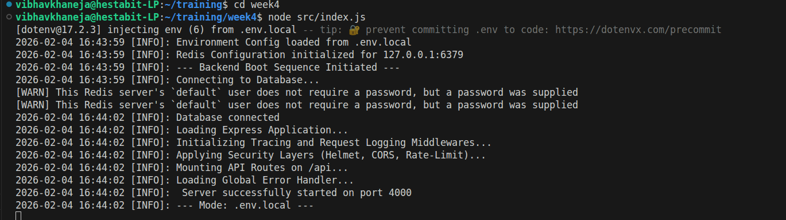
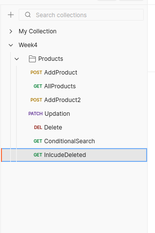
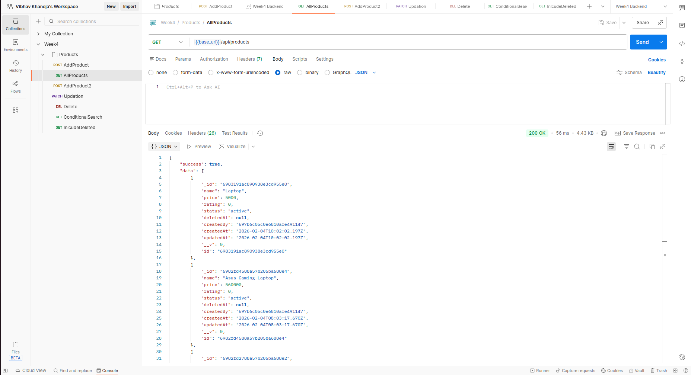
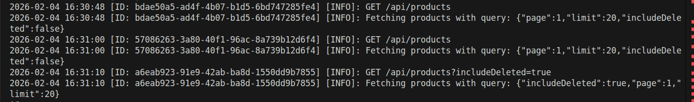
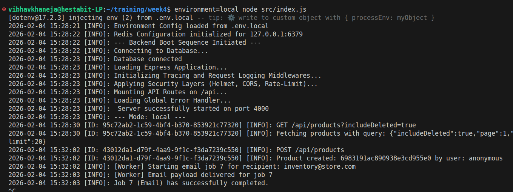

# Deployment_Notes Day 5

### Pre-requisites

- Node.js: The runtime environment for executing JavaScript code.
- MongoDB: A NoSQL database used to store product data.
- Redis: An in-memory data store required for managing the BullMQ job queue.
- Postman: A tool for testing the API endpoints and viewing request tracing headers.

### Environment SetUp

We had already built three env files which were env.local, env.prod and env.dev and in the deliverables of Day 5 we were asked to create an .env.example file where we updated it with Redis credentials also.
In the config folder of our project we have config/index.js with environment details and config/redis.js with redis credentails but they cannot be hard coded, therefore we create .env.local and combined our credentials in it.

### Redis Startup

- Before starting the application, ensure the Redis server is active to handle background email jobs.
- Start Redis Service: Run sudo service redis-server start (on Linux) or use the Redis executable for your OS to initialize the server.
- Enable Redis: Ensure the configuration in config/redis.js matches your running Redis instance, typically at 127.0.0.1:6379.
- Connectivity Test: Open your terminal and type redis-cli ping. The server should return PONG, confirming the connection is active and ready for the BullMQ worker.

### API Performed on Postman

These endpoints are documented in the provided Postman Collection and support request tracing with the X-Request-ID header.

1) GET:    /api/products             - Retrieves a paginated list of all active products.
2) GET:    /api/products/search      - Performs a conditional search based on filters like price or category.
3) POST:   /api/products             - Adds a new product to the database and triggers an email job.
4) PATCH:  /api/products/:id         - Updates the details of a specific product identified by its unique ID.
5) DELETE: /api/products/:id         - Performs a soft-delete on a product and triggers an audit email job.
6) GET:    /api/products?includeDeleted=true - Fetches all products, including those that have been soft-deleted.

### Request Tracing and Observability

The application implements a tracing mechanism to ensure every request can be tracked across the system.
Unique Identifiers: A custom middleware assigns a unique X-Request-ID (UUID) to every incoming HTTP request.
Log Correlation: This ID is injected into every log entry generated during the request lifecycle, allowing developers to group logs by a specific interaction.
Header Response: The generated ID is sent back in the response headers, enabling clients to provide a reference ID when reporting issues.

### Background Job Processing

The system offloads time-consuming tasks to a background layer to maintain high API performance.
Queue Management: BullMQ and Redis handle the queueing of tasks like email notifications and report generation.
Worker Execution: A dedicated worker process listens for new jobs in the emailNotifications queue and executes them independently of the main API thread.

