# Week 5 — Day 1: Docker Fundamentals + Linux Internals

Today we marked our beginning of the Week 5, Day 1 where we will be covering the Docker Fundamentals, DevOps basics and LInux INternal commands and today we will be going through docker images, containers, how to create a shell and start a node application inside a docker container.

## Objectives

- Understanding Docker images, containers, volumes, and networks.
- Performing basic Linux operations inside containers: exploring users, permissions, processes, disk usage, and logs.
- Learning Dockerfile creation and container deployment.
- Running a Node.js application inside a Docker container and observing its behavior.

## Installation 

1) Adding Docker’s GPG Key: A secure GPG key was added to the system to verify the authenticity of Docker packages. This ensures that all Docker software installed comes from the official source and hasn’t been tampered with.
2) Adding Docker’s Official Repository: The Docker stable repository was added to Ubuntu’s package manager (apt) so that the latest Docker version (29.2.1) could be installed. This allows apt to fetch Docker packages directly from the official Docker source instead of the default Ubuntu repository.
3) Installing and Configuring Docker:Docker packages were installed using apt, the daemon was started and enabled at boot, and the current user was added to the docker group. This setup allows running Docker commands without sudo while ensuring the Docker service runs reliably in the background.

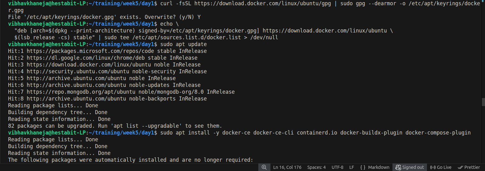
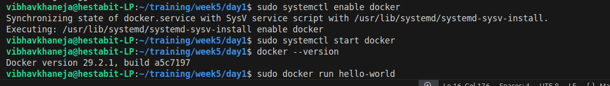

## Docker Basics

1) Images: A Docker image is a **read-only template** that contains your application code, runtime, libraries, and OS dependencies. Think of it as a **blueprint** for creating containers. Images are immutable and can be reused to create multiple containers consistently.
2) Containers: A container is a **running instance** of an image. It includes the image plus a writable layer for any changes while it runs. Containers are isolated from the host system and other containers, making them lightweight and portable.
3) Volumes: Volumes provide **persistent storage** for containers. Any data stored in a volume is retained even if the container is stopped or removed, making them ideal for databases or logs.
4) Networks: Docker networks **allow containers to communicate** with each other and the host. Networks can be private (isolated between containers) or shared, enabling scalable multi-container applications.

## Dockerfile

A Dockerfile is a plain text file that contains instructions to build a Docker image. It specifies the environment, dependencies, and commands needed for an application to run inside a container.

```
FROM node:18-alpine
WORKDIR /app
COPY . .
RUN npm install
EXPOSE 3000
CMD ["node", "app.js"]
```

## Docker Commands
1) Docker Build: Builds a Docker image from a Dockerfile in the current directory.

```
docker build -t node-image .
```
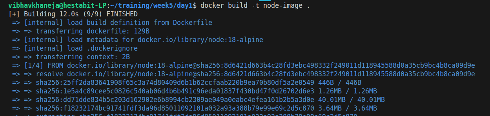

2) Docker Run: Creates and runs a container from the node-image

```
docker run -d -p 3000:3000 --name node-cont node-image
```

**-d** is used to run in detach mode, **-p 3000:3000** maps port 3000 of the host machine to port 3000 inside the container, **--name node-cont** gives the container a name and **node-image** is the docker image to use

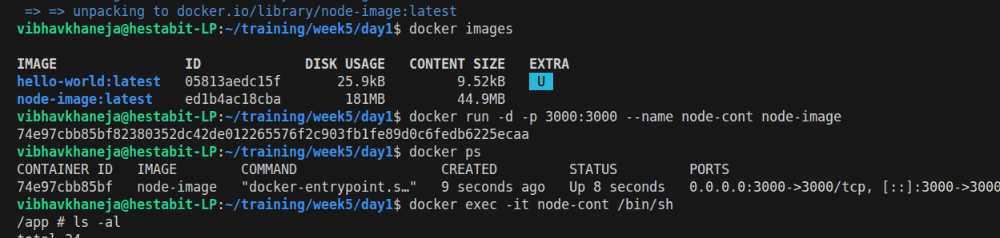


3) Docker Exec Command: It is used to access a running container’s shell (like logging in via SSH) to explore or interact with its filesystem and processes.

```
docker exec -it node-cont /bin/sh
```
- **-it** is used to combine two flags which are: 
- **-i:** Enable interactive mode
- **-t:** Allocate a terminal so you can type commands inside the container
- **/bin/sh**: The shell to open inside the container.

## Linux Internals

1) ls -al: It is used to list all the files and directories in the current folder where -a shows all files and -l displays the detailed information also.

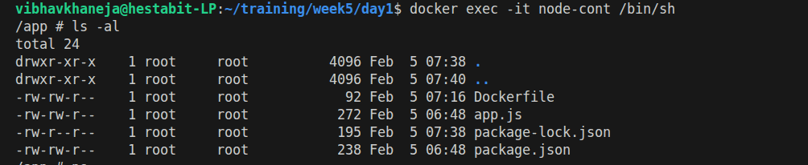

2) ps aux: Shows all the running processes inside a container

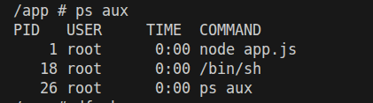

3) top: Top shows real-time system metrics and active processes. Displays CPU usage, memory usage, process IDs, and running programs.

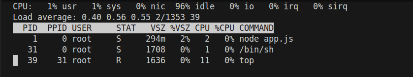

4) df -h: It is used to show disk space usage of the container’s filesystem. **-h** is used for Human-readable format

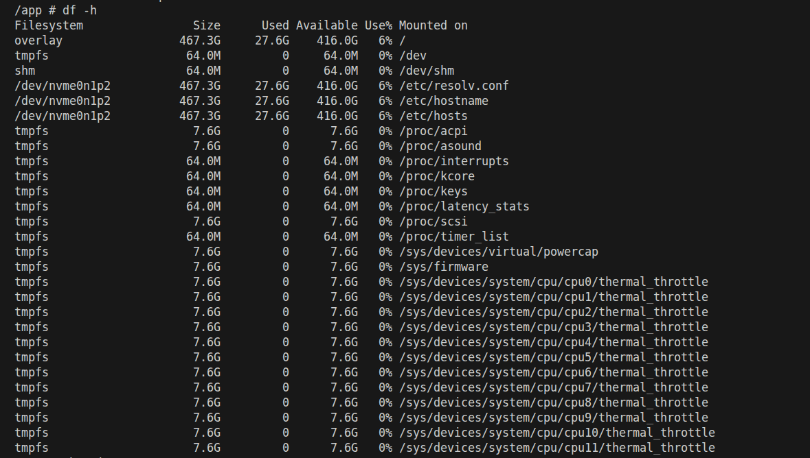

5) whoami: Displays the current user inside the container

6) id: Shows user ID (UID), group ID (GID), and groups of the current user

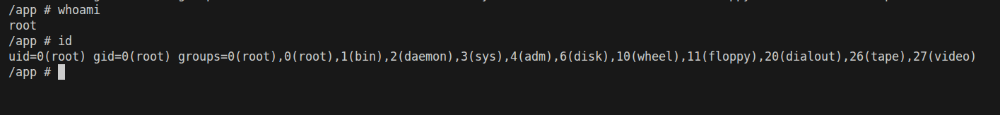

7) cat app.js: Displays the contents of our file.

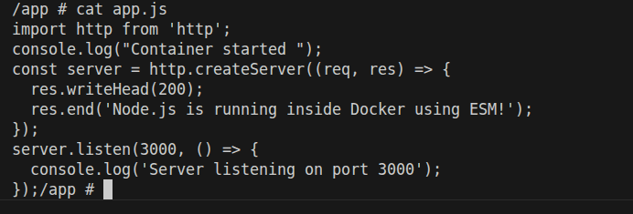

8) Docker logs: Used to see the logs generated by your running docker container. Displays output from console.log or errors in the application.

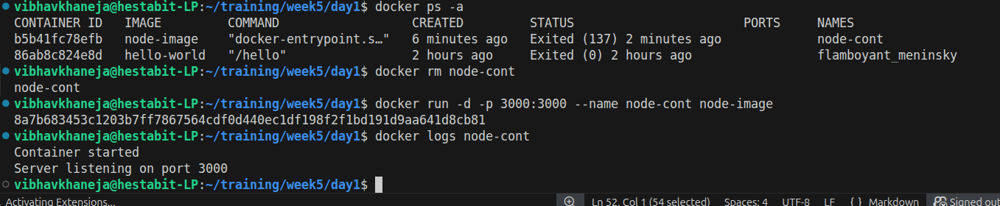

