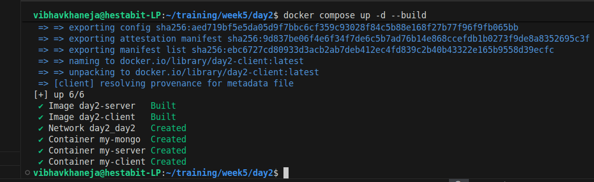
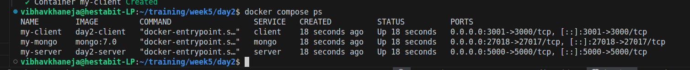
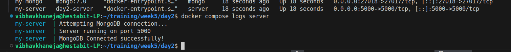
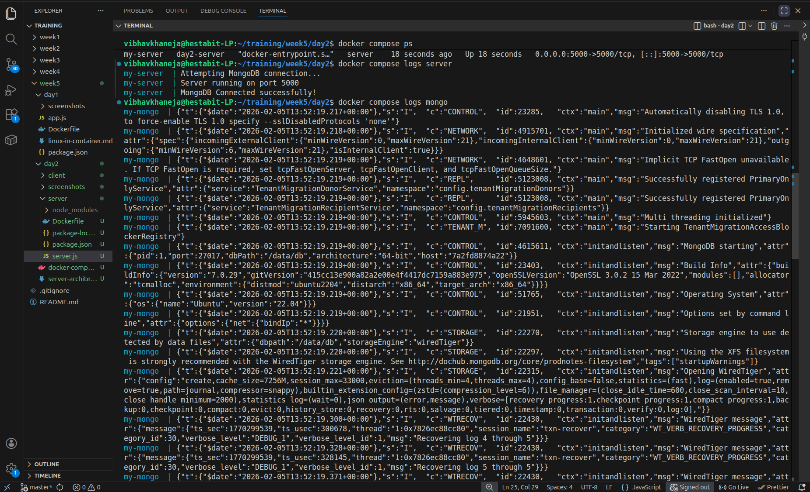
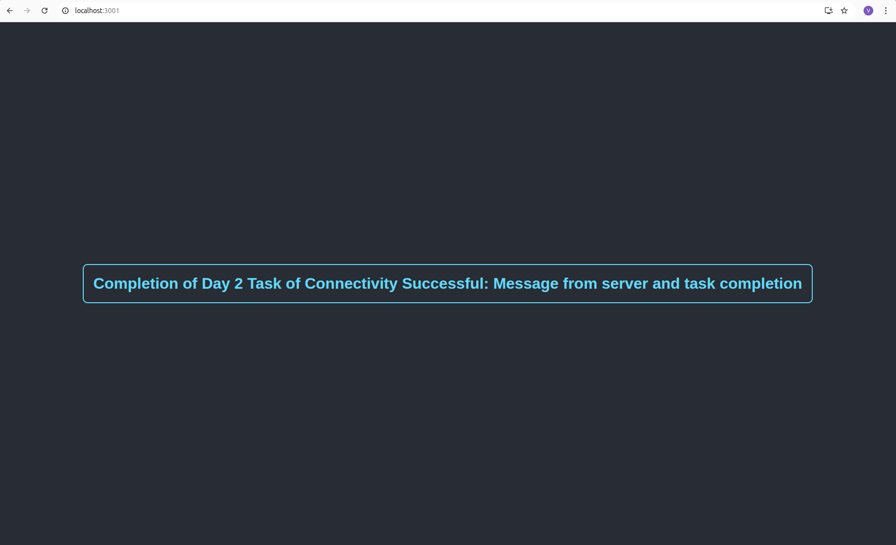

# Week 5 — Day 2: Docker Compose + Multi-Container Apps

Today we moved from running single containers manually to orchestrating a full-stack application using Docker Compose. We deployed a React Client, a Node.js Server, and a MongoDB Database, ensuring they communicate securely over a custom Docker network.

## Objectives

- Understanding Docker Compose as an orchestration tool for multi-container applications.
- Implementing Docker Networking to allow containers to communicate via service names.
- Configuring Volumes for database persistence.
- Deploying the full stack (Client + Server + DB) with a single command.

## Service Architecture

We designed a 3-tier architecture running entirely in Docker:
1) Client (React): Runs on port 3000 (mapped to host 3001). It runs in the browser, so it communicates with the server via the host network (localhost:5000).
2) Server (Node.js): Runs on port 5000. It communicates with the Database using the internal Docker network alias (mongo).
3) Database (MongoDB): Runs on port 27017 (mapped to host 27018 for debugging). It is isolated and stores data in a persistent volume.

## Docker Compose

Docker Compose is a tool for defining and running **multi-container applications**, managing what a single Dockerfile cannot. It uses a simple YAML file to configure services, networks, and volumes, orchestrating your entire architecture so you can spin up the frontend, backend, and database with just one command: docker compose up.

Its primary goal is to simplify **networking** by replacing complex manual commands with an automatic default network. This allows services to communicate easily by name without manual linking, streamlining configuration and removing the hassle of managing individual IP addresses.

Compose ensures **consistency and persistence** by defining volumes that keep data, like MongoDB records, safe even if containers are deleted. This Infrastructure as Code approach guarantees every developer runs the exact same setup, effectively eliminating the "it works on my machine" problem in multi-service environments.

## Docker Network

Docker networking enables containers to communicate with each other securely, isolated from the host machine. In our setup, Docker Compose creates a network that provides automatic DNS resolution, allowing the backend to find the database simply by using its service name instead of dealing with IP addresses.

If we don't add a network manually, Docker Compose automatically creates a default network for the project and joins all services to it, enabling them to communicate seamlessly using their service names as hostnames.

## Docker Volume

Volumes for Persistent Storage Containers are ephemeral, meaning all data inside them is lost when they are stopped or removed. Docker Volumes solve this by mapping a folder inside the container to a managed space on the host machine, ensuring that critical data survives restarts and container deletions.

```
Docker Compose up -d --build
```
**Docker Compose:** Builds the images and starts all services in detached mode. 
- -d: Detached mode and --build: is used to a rebuild of images to capture code changes.



```
Docker Compose ps
```

**Docker Compose ps:** Lists the status of all containers in the current stack. Used to verify that client, server, and mongo are all "Up"



```
Docker Compose logs server
```

**Docker Compose logs:** Views the output of a specific service. We used this to confirm the server successfully connected to MongoDB after the retry logic triggered.



**Mongo logs**



## OutPut


