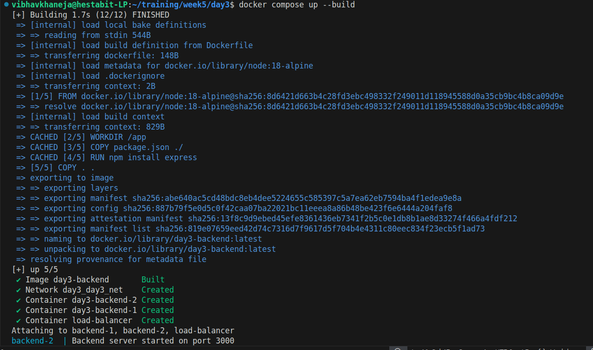
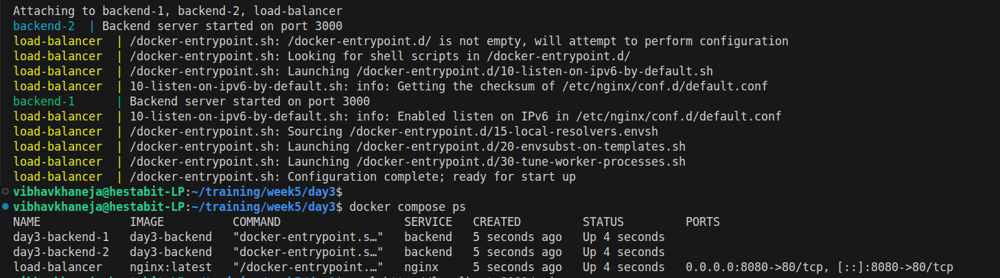
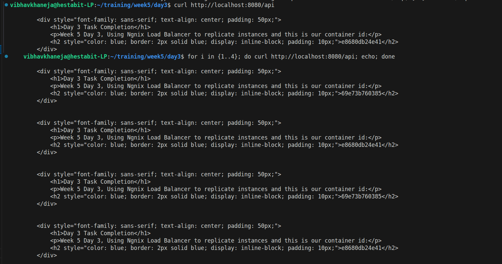
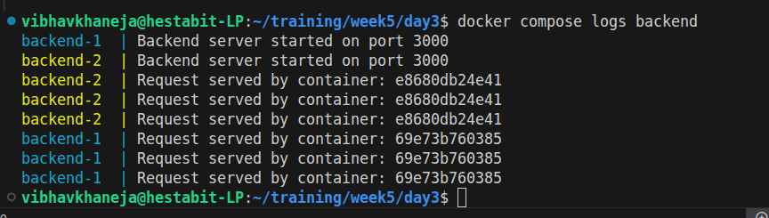
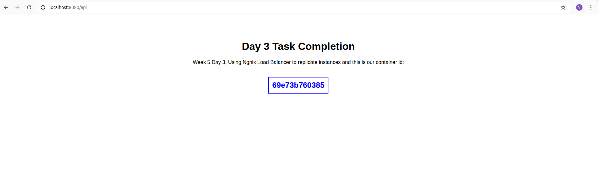

# Week 5 — Day 3: NGINX Reverse Proxy + Load Balancing

This is our Day 3 in the Docker and DevOps week and today we our going to learn about load bbalancing, routing internal contianers and simulating load balacing through multiple instances replicas.

## Objectives

1) Scale Up: We will run 2 copies (replicas) of your Node.js backend.
2) Traffic Control: We will place NGINX in front of them to act as the entry point.
3) Load Balancing: NGINX will distribute incoming user requests evenly between the two backends so no single server gets overwhelmed.

## NGINX

NGNIX is a high performance open source web server which acts as a layer between the user and the server. NGNIX basically has 2 main fucntions, It acts as a reverse proxy and enables Load Balancing.

**NGINX as a Reverse Proxy**

A Reverse Proxy acts on behalf of the server (hiding your backend).We have a Node.js app running on port 3000. You don't want users connecting directly to it because it's not great at handling thousands of open connections or SSL encryption.

We put NGINX in front. The user talks to NGINX (Port 80), and NGINX talks to Node.js (Port 3000). The user never knows Node.js exists.

**NGINX as a Load Balancer**

We have 2 copies (replicas) of your backend running to handle more traffic and this is one of the most important use cases of NGINX where can run thousands of replicas of the instances simultaneously. NGINX accepts the request and decides "I'll give this one to Copy A, and the next one to Copy B." This prevents any single server from crashing due to overload.

**Uses of NGNIX**

1) Speed: NGINX is event-driven and asynchronous. It can handle 10,000+ simultaneous connections with very little memory.
2) Security: It hides your internal network structure. Attackers see NGINX, not your actual database or backend logic.
3) Scalability: You can add 5 more backend replicas, and you only need to update the NGINX config (or let Docker handle it) without changing the frontend code.


3. Routing to Internal Containers

When you run containers in Docker Compose, they are placed on a private network. They cannot see the outside world, but they can see each other. DNS (Domain Name System) docker gives each service a hostname based on its service name in docker-compose.yml.
NGINX doesn't need to know the IP address of your backend (which changes every time you restart). NGINX just sends traffic to http://backend. Docker resolves that name to the correct internal IP addresses of your replicas automatically.

**ngnix.conf**

Ngnix conf is the file which has the logic and which enables nginx to act as a layer between the server and the client. 

```
events {}

http {
    upstream my_backend_app {
        server backend:3000;
    }

    server {
        listen 80;

        location / {
            proxy_pass http://my_backend_app;
            proxy_set_header Host $host;
            proxy_set_header X-Real-IP $remote_addr;
        }
    }
}
```

- upstream is the reason how we can enable load balancing in here; because it fetches your backend server. here its creating grouping the servers and giving it the name my_backend_app and listening on port 3000 which is given in the index.js file.
- then ngnix is inside its own container and its listening to port 80, which we will map later to 8080 in docker compose file.
- proxy_pass refers to fetch the my_backend_app group which contains all the servers up there. Hence when we go to localhost:8080 it directs us to NGNIX's container at 80 from where we redirect to our server at 3000 and its reponse is generated in the reverse order.

## Workflow

Here is the visual flow of what we are setting up today:

- User sends a request to localhost:80 (NGINX).
- NGINX receives it and looks at its list of backends.
- NGINX forwards the request to Backend Replica 1.
- Backend Replica 1 processes it and sends the answer back to NGINX.
- NGINX sends the final response to the User.
- Next user request goes to Backend Replica 2.





