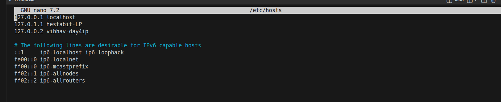
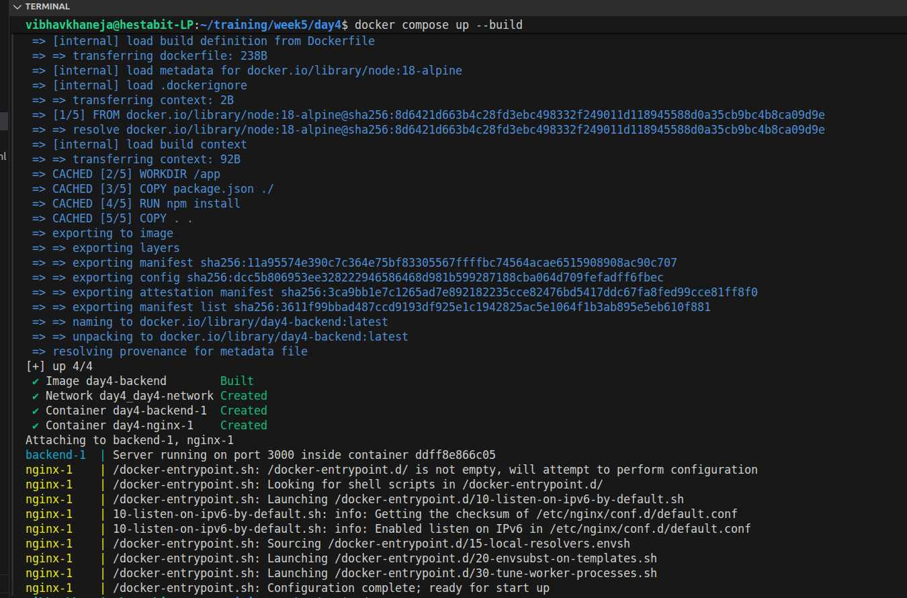
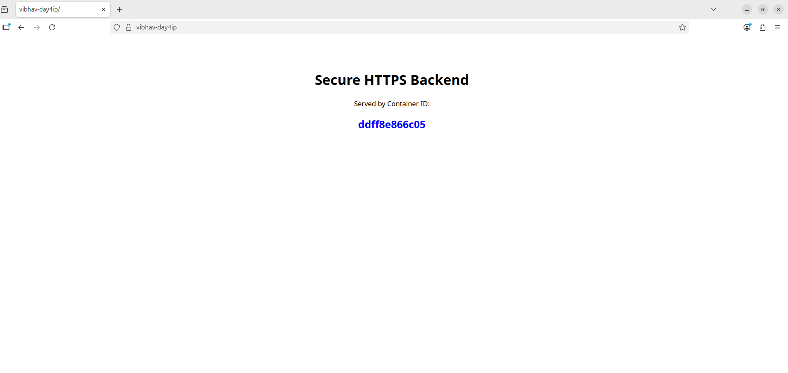

# SSL + Self-Signed + mkcert + HTTPS

Today we  are transitioning from standard HTTP: insecure, clear-text communication to HTTPS: secure, encrypted communication by implementing an SSL Termination Proxy. We use NGINX as the gatekeeper to handle the encryption/decryption process so our backend application doesn't have to.

To achieve this, we performed Lock Generation using a tool called mkcert, which acts as a local Certificate Authority (CA) to issue valid digital certificates for our custom domain. When a browser visits our site, it checks this certificate; if valid, it displays the Green Lock Icon, indicating that the connection is encrypted and the server's identity is verified. Without this lock (standard HTTP), all data sent between the user and the server is visible to attackers.

##  Architecture

**Domain:** `https://vibhav-day4ip`
**Proxy:** NGINX (Handles Port 80 & 443)
**Backend:** Node.js Express API (Internal Port 3000)
**Certificate Authority:** Locally trusted certificates via `mkcert`

**Traffic Flow:**

Browser (https://vibhav-day4ip) => NGINX (Port 443) => Decryption => Node Backend (Port 3000)

## Generate Local Certificates

Run this command in the project root to create trusted certificates for the custom domain

```
mkcert -key-file certs/vibhav-day4ip-key.pem -cert-file certs/vibhav-day4ip.pem vibhav-day4ip localhost
```

But before that we need to add a custom local DNS (Host File);i.e.; vibhav-day4ip, we are proceeding with a custom local DNS because while using the dafault localhost we need to either change the default port from 80 to an emoty port and change the browser address while calling it so that it get redirected to NGINX container and from there to safe HTTPS 443.

The issue with port 80 was that Apache2 keeps on running on it so we have to stop and disable apache2 to run it on port:80 otherwise we can move ahead with a custom ip or defined port on default localhost.




After completing the pre-requisties we will run our docker compose file that is we will run docker compose up --build command to run all our containers in services and enable the http to be secure.

**mkcert**: mkcert is a simple tool that creates a locally trusted Certificate Authority (CA) on your computer, allowing you to generate valid SSL certificates for development domains like localhost and vibhav-day4ip.



## NGINX Configuration (nginx.conf)

The key security features implemented:
- HTTP Redirect: Forces all Port 80 traffic to HTTPS (301 Redirect).
- SSL Termination: Uses the generated .pem files to encrypt traffic.
- Proxy Headers: Passes X-Forwarded-Proto so the backend knows the connection is secure.

## Docker Compose (docker-compose.yml)

- Services: nginx and backend.
- Volumes: Mounts the certs/ folder into the NGINX container so it can access the keys.

## Output





