# CI-Style Deployment Automation + Capstone

Today is our last day of our Week 5, where we are going combine and redisgn all our learnings of 5 weeks and containerize them in docker images, using theconcepts of docker images, containers, networks and volumes. We will be using NGINX as the load balancer and reverse proxy and also hosted our own custon domain for the project and hosted and generated secure certificates using mkcert.

Sneaker Hub is a full-stack e-commerce application designed for containerized deployment. It features a microservices-style architecture where the frontend, backend, database, and reverse proxy run as isolated services orchestrated by Docker Compose.

- In this project we combined the learning of HTML, CSS and Javscript to make our frontend of the website strong and also created few functions like sorting and sell your sneakers on the website and also used Local Storage which helped us in addToCart function so that our content persists even after reload of the website.
- While Local Storage handled client data, we used Docker Bind Mounts (a type of volume) for development. This allowed our code changes to update in real-time (hot reloading) without needing to rebuild the container. We also used Named Volumes for MongoDB to ensure our database records persisted even if the container crashed or was removed.
- All our containers were connected to one another using custom docker network. This enabled Service Discovery, allowing services to communicate using their names (e.g., backend, mongo) instead of IP addresses. We also implemented an Nginx Gateway as a reverse proxy to route external traffic securely to the correct internal services.
- in our backend we created seperate files for distinguished pruposes where startup.js was the filed called by Dockerfile which helps us to boot the entire backend, it helps in booting with the mongo db whose logic is covered in db.js and also picking up the express logic from app.js, and then routes to the business logic which is covered in the server.js file which schema details of the mongo databse.
- Server.js contains our sorting logic and the api query transaltions;i.e; the controller information which contains the HTTP level concerns as router helps us to route our application using API endpoints but controller helps to transalte those requests and move forward with apt responses. The server.js continued to fetch the data from the product.model.js which contains the product database schema.
- Database: MongoDB instance with persistent volume storage.
- Gateway: Nginx Reverse Proxy handling SSL termination (HTTPS) and routing traffic to the correct service.
- Created script/deploy.sh to automate our process of docker compsoe and we dont have to write the initialization commands repeteadly in our application.

## Workflow

1) Configure Environment
Ensure you have a `.env` file in the root directory. If not, create one:

```
MONGO_URL=mongodb://mongo:27017/sneaker-hub
PORT=3000
```

2) Generate Self Signed SSL certificates

```
mkdir certs
mkcert -key-file certs/day5-key.pem -cert-file certs/day5.pem sneaker-hub.local localhost
```

3) Build & Deploy

Launch the entire stack using the automated script:

```
./scripts/deploy.sh
```
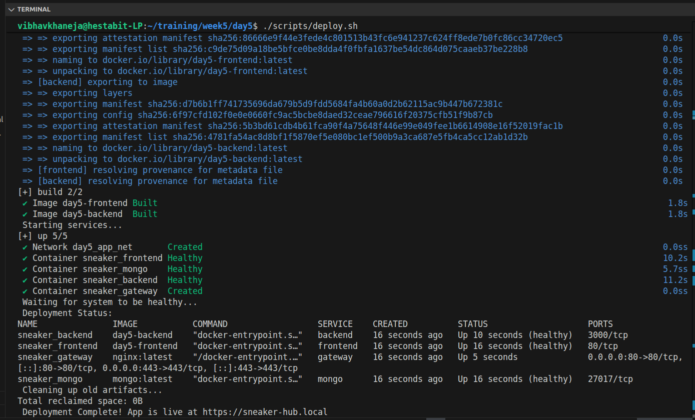

4) Verify Deployment

Check the health status of all containers:

```
docker compose ps
```

5) Access the Application

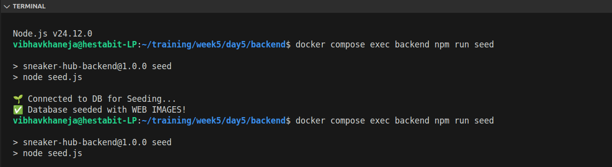
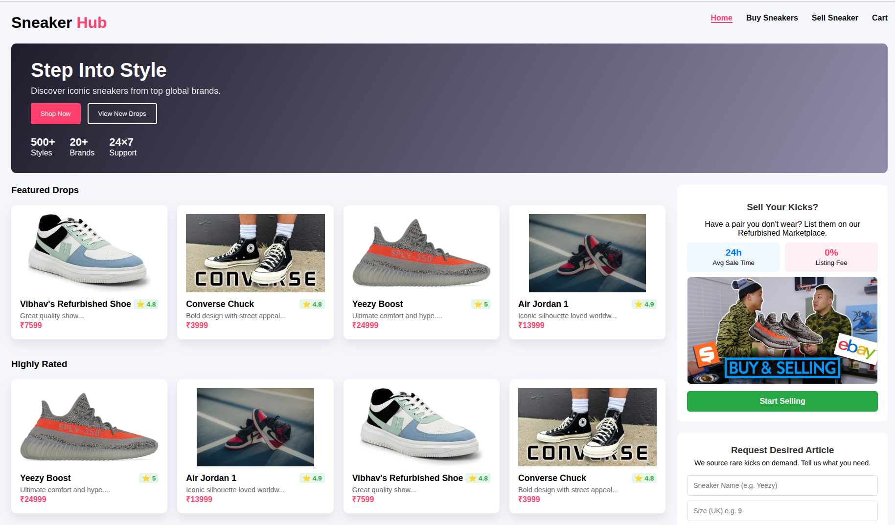
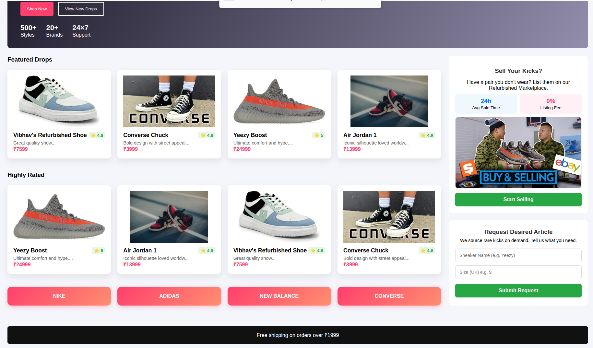
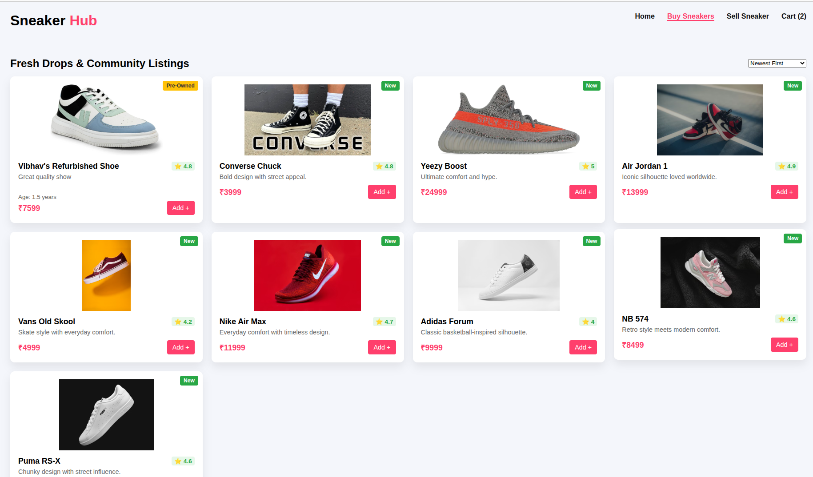
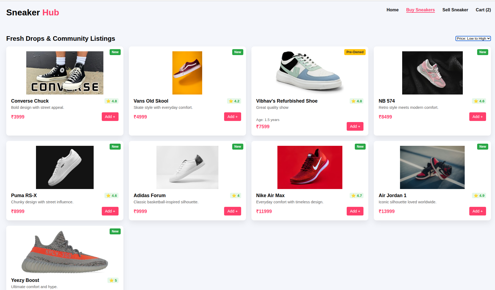
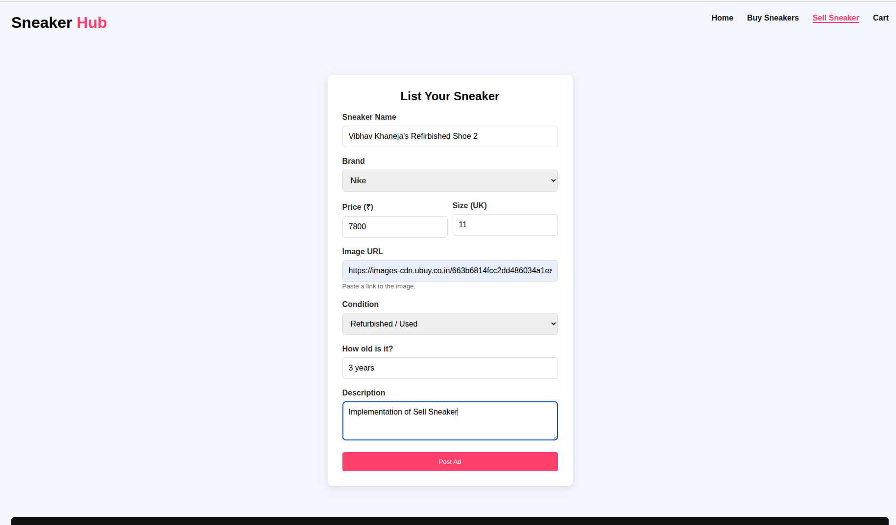
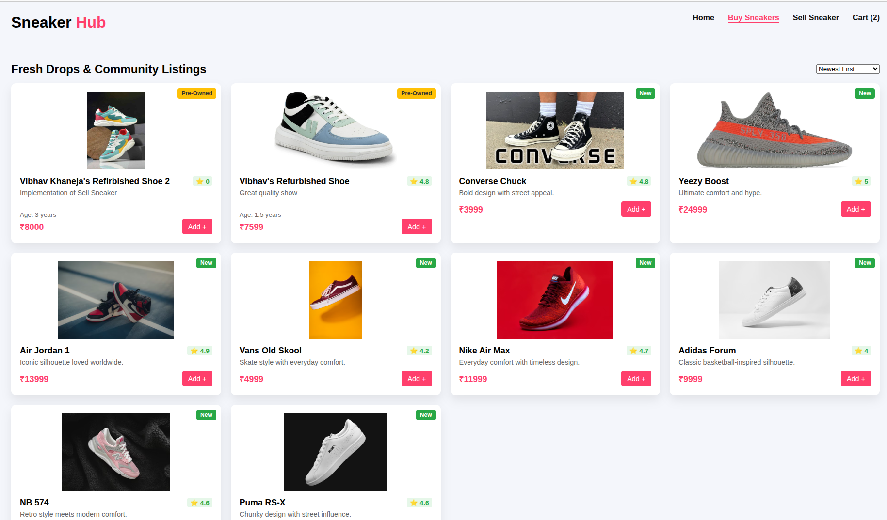

6) Postman for CRUD Operations

We used Postman to rigorously test our backend API endpoints before integrating them with the frontend. This allowed us to verify all CRUD (Create, Read, Update, Delete) operations—such as adding new sneakers, fetching product details, and managing inventory—ensuring reliable data handling and error management across the application.

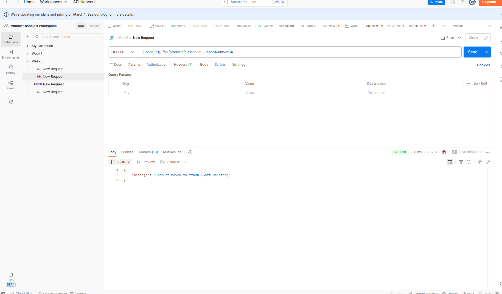
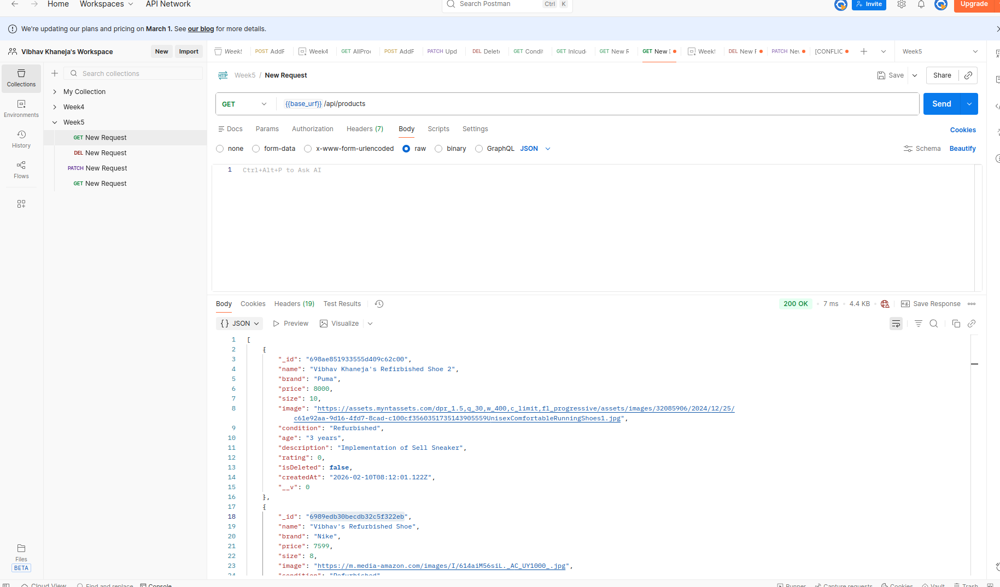
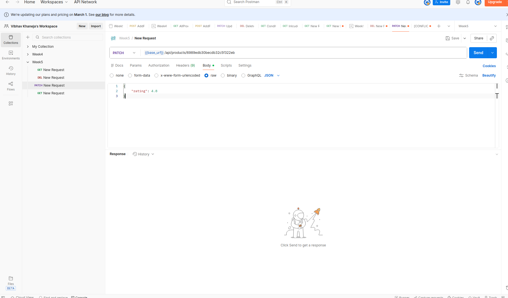

7) Service Details & Health Checks

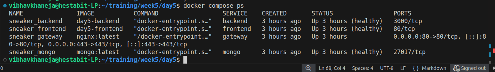

8) Logging & Monitoring

Effective logging is crucial for understanding application behavior and debugging issues in production.

1. View Real-Time Logs
To stream logs from all services simultaneously (useful for spotting interactions between services):
```
docker compose logs -f
```

2. View Specific Service Logs
If you need to isolate issues (e.g., why the API isn't responding), view logs for a single container:

- docker compose logs -f backend
- docker compose logs -f mongo
- docker compose logs -f gateway

3. Log Rotation Policy
To prevent disk exhaustion, all services are configured with the following log rotation policy:

- Driver: json-file
- Max Size: 10m (Rotates after 10 Megabytes)
- Max Files: 3 (Retains only the 3 most recent log files)

9) Troubleshooting

The website loads, but shows a white page with *502 Bad Gateway*, this is because Nginx is running, but it cannot connect to the backend or frontend container.

Check if backend is running: docker compose ps, If backend is running, restart Nginx to force a reconnection:

```
docker compose restart gateway
```

if *Code Changes Not Showing*, We edited server.js or index.html, but the live site looks the same. Docker containers run a copy of your code built into the image. We must rebuild the images to include your latest changes:

```
./scripts/deploy.sh

docker compose up -d --build
```