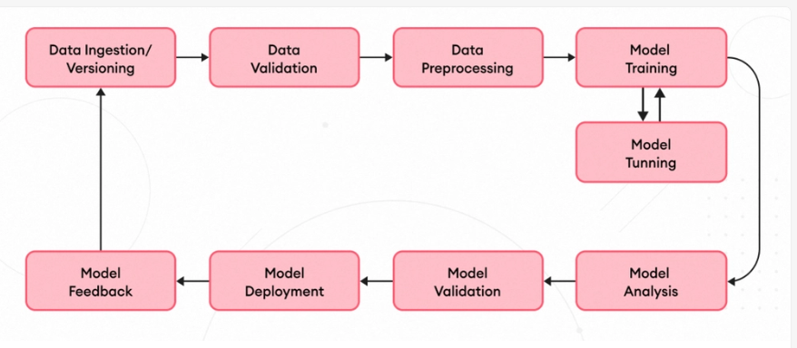

# Week 6 Day 1 — DATA PIPELINE + EDA + PROJECT ARCHITECTURE

Today is our beginning of ML journey where we will learn and build eevrything from the start and cover Pre-processing pipeline, EDA, and Project Architecture today.

Before moving with Day 1 we must understand the entire ML workflow pipeline so that we know which day is responsible for which stage of the pipeline

So today we are going to extensively work on the Data Ingetion and Versioning, Data Validation and Data Pre-Processing Part.

Lets go step by step and cover the learning objectives one by one so that we know excatly which stage is used for which purpose.

## Machine Learning Pipeline

1) Data Ingestion / Versioning: Raw data is collected from sources like files, databases, or APIs and stored in a versioned manner.  Versioning ensures reproducibility so every model can be traced back to the exact dataset used.

2) Data Validation: The dataset is checked for schema correctness, missing values, invalid ranges, and duplicates. This stage prevents bad or corrupted data from entering the ML pipeline.

3) Data Preprocessing: Data is cleaned by handling missing values, removing duplicates, and fixing inconsistencies and the goal is to produce a clean, reliable dataset for feature engineering and modeling.

4) Model Training: The model learns patterns from the training data by minimizing a loss function. This stage converts processed data into a trained predictive model.

5) Model Tuning: Hyperparameters are optimized to improve model performance and generalization. Techniques like Grid Search or Random Search are commonly used here.

6) Model Analysis:The trained model is analyzed to understand behavior, errors, and feature importance and helps in detecting overfitting, bias, or unexpected learning patterns.

7) Model Validation: Model performance is evaluated on unseen validation or test data. This ensures the model generalizes well beyond the training dataset.

8) Model Deployment: The validated model is packaged and exposed via APIs or batch systems for predictions. This is where the model starts delivering real business value.

9) Model Feedback: Real-world predictions and outcomes are monitored after deployment. This feedback loop helps detect data drift and triggers retraining when needed.

## Splitting: Breakdown of data into Train, Validate and Test

This stage is the breakdownm of our unproceesed raw data into 
- Train: Learn Parameter (for model) : 70-80%
- Validate: Tune Decision (for engineers): 10-15%
- Test: Final Judgement (for user base): 10-15%

Importance of Validate: The validation dataset is used to tune model hyperparameters and detect overfitting without touching the test data. This ensures that the test dataset remains a completely unseen and unbiased benchmark for final model evaluation. 

Validation dataset helps to:
- Choose the best model
- Tune hyperparameters
- Detect overfitting
- Decide when to stop training

## Data Imputation 

Data imputation is the process of filling missing values with meaningful substitutes so the dataset can be used for modeling without losing information.

There are multiple types, parameters of imputating data but firstly we need to understand the three different types of Missing Data

1) MCAR: Missing completely at Random: Missingness is independent of all variables, Example: Sensor failure, random data loss
2) MAR: Missing at Random: Missingness depends on other features, imputation must consider related features, Example: Salary missing depends on job role
3) MNAR: Missing Not At Random: Missingness depends on the missing value itself, Example: High-income users hide salary.

### MCAR

**Statistical Imputation**
1) Mean Impuation: Replace missing values with average, we use it when we have symmetric and numeric dataset, fails if skewness or outliers are present in our dataset.
2) Median Imputation: Replace with middle value Helps in both MCAR and MAR datasets and solves the outlier and skewness issues caused.
3) Mode Imputation: Replace with most frequent value, categorical features, discrete numeric features.

**Drop Rows**
If very low missing data (<2%) and there is no information loss then we move forward with drop rows imputation.

### MAR
This time missingness is not independent rather it depends on other variables

1) Median: Numeric Data, Examples Missing Income, Credit, Insurance
2) Mode: To integrate with categorial stability
3) KNN Imputation: Use similar rows to fill missing values whenn there are strong feature relationships and medium sized datsets. These are used to preserve relationships
4) Regression Imputation: Awareness is required and strong relationship and preidction of the model
5) MICE: multivariate data with mutliple fields, Examples: Medical and Healthcare

### MNAR
1) Constant Value Imputation: Replace with fixed value (e.g., 0, "Unknown")- missing itself carries meaning, business logic supports it. Oftenly used in Tree Models and examples consist missing form fields, optional fields.
2) Indicator + Median: What: Predict missing values using ML model.

### Time Series Data
Forward Backward Fill and Interpolation Fill using neighboring values: Time-series data, ordered observations when we have model trends and smooth changes.

## Outlier Detection

Outlier detection identifies extreme values that deviate significantly from the majority of the data. These values can distort statistical measures and negatively affect model training if not handled carefully.

### Z-score

Z-score detects outliers by measuring how many standard deviations a value is from the mean. It is suitable only for approximately normally distributed data and is sensitive to extreme values.

### IQR

IQR detects outliers using percentile-based boundaries derived from the middle 50% of the data. It is robust to skewed distributions and is preferred for real-world, non-normal datasets.

## Data Scaling
Data scaling standardizes the range of numerical features so that all features contribute equally to model training. It is essential for distance-based and gradient-based algorithms.

### StandardScaler
StandardScaler transforms data to have zero mean and unit variance. It works best when features are normally distributed and helps optimization algorithms converge faster.

### MinMaxScaler
MinMaxScaler rescales features to a fixed range, usually between 0 and 1. It is useful when feature boundaries are important or when working with models sensitive to input magnitude.

## Class Imbalance

Class imbalance occurs when one class significantly outnumbers others, causing models to favor the majority class. This leads to poor performance on rare but important classes.

### Class Weights
Class weights increase the penalty for misclassifying minority-class samples. This forces the model to treat minority errors as more costly during training.

### SMOTE
SMOTE creates synthetic samples for the minority class to balance the dataset. It can improve recall but may introduce noise if not applied carefully.

## Dataset Versioning

Dataset versioning tracks changes in data over time to ensure reproducibility. It allows every model to be linked to the exact dataset used for training.

### DVC
DVC manages dataset versions alongside code by storing data references instead of raw files. It enables experiment tracking and easy rollback.

### Folder Hashing
Folder hashing creates unique dataset versions based on content changes. Any modification to the dataset results in a new hash, ensuring traceability.

## EDA
Exploratory Data Analysis (EDA) is the process of understanding a dataset before building any machine learning model. It involves examining the structure, quality, patterns, and relationships in the data to identify issues like missing values, outliers, skewness, and feature relevance.

1. Dataset Overview: This step focuses on understanding the structure of the dataset, including the number of rows, columns, and data types. It helps identify numerical, categorical, and incorrectly typed features.

2. Data Quality Checks: Data quality checks involve identifying missing values, duplicate records, and invalid or inconsistent entries. This ensures the dataset is reliable before further preprocessing and modeling.

3. Target Variable Analysis: The target variable is analyzed to determine the type of problem (classification or regression) and to check for class imbalance. This step guides metric selection and modeling strategy.

4. Feature Distributions: Each feature is examined individually to understand its distribution, skewness, and presence of outliers. These insights help determine appropriate scaling, transformation, and outlier-handling methods.

5. Feature–Target Relationships: This step evaluates how features relate to the target variable to identify meaningful predictors. Features with little or no relationship to the target may be dropped or transformed.

6. Correlation Analysis: Correlation analysis is used to detect relationships and redundancy among features. Highly correlated features can cause multicollinearity and are often removed or combined.

7. EDA-Driven Decisions: All insights from EDA are translated into concrete preprocessing and modeling decisions. EDA is considered complete only when it leads to clear, actionable outcomes.