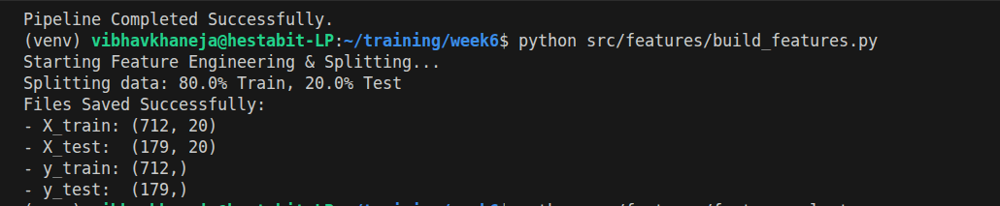
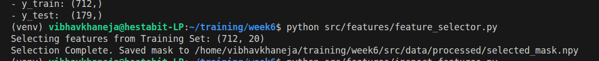
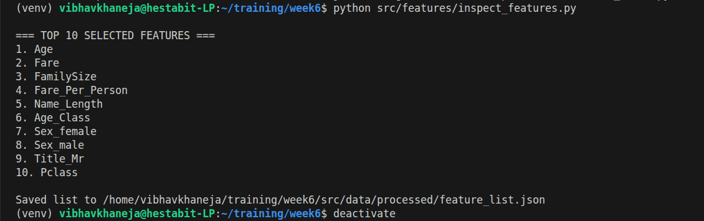

# Feature Engineering 

Feature Engineering is the process of transforming raw data into numerical representation that expose useful patterns for a machine learning model.

Basically, it is to Numerically represent data and to form useful pattern of our data.
This step is required after we run our preprocessing pipeline and we get our final.csv

To find meaningful features from that data and how to get measurable, numeric signals to predict the target because model cannot infer anything implicitly.

A feature is designed to achieve these 3 aims:
1) No leakage
2) Predictive Relevance
3) Stability

## Encoding Strategies

Encoding refers to conversion of our string data into numeric data which is understandable by Machine Learning Models.

### Label Encoding

Label Encoding is a mechanical transformation that assigns an arbitrary integer to each unique category, without preserving any real-world order or meaning. There is no explicit ordering/ranking for label encoding and any category can be given any number.

### Oridnal Encoding

Ordinal Encoding is an intentional mapping of categories to integers that preserves a true, domain-defined order among the categories. When there is a clear order and ranking in our categories and data, then we move forward with Ordinal Encoding.

### One-Hot Encoding

One-Hot Encoding transforms each category into a separate binary feature, indicating the presence or absence of that category;i.e.; we create a new binary (0/1) column for every unique category/ unique single record.

### Target Encoding

One-Hot Encoding transforms each category into a separate binary feature, indicating the presence or absence of that category. It is mostly used when there is high cardinality and too many categories so we replace the target value with the avergae for the category.

## Numerical Feature Transformations

Raw numerical features often have skewed distributions or extreme values that make learning difficult. Transformations help stabilize scale and improve model learning. Therefore to squash the outliers and make the data look like a bell curve we proceed with numerical transformation of the data.

**Log Transformation**

- Compresses large values
- Reduces right skew and outlier impact
- Commonly used for prices, fares, income, and counts
- Typically applied as ln(x + 1) to handle zeros

**Square Root Transformation**

- Milder alternative to log
- Reduces skew while preserving more relative differences
- Useful for count-based or moderately skewed data

**Power Transformation**

- Automatically find a transformation to make data more normally distributed
- Box-Cox works only for positive values
- Yeo-Johnson works with zero and negative values
- Mostly useful for linear models 

## Date and Time Feature Extraction

Models do not understand timestamps or calendars. A raw date does not expose patterns like seasonality or weekly behavior.

### Basic Decomposition:

1) Year (long-term trend)
2) Month (seasonality)
3) Day of week (weekday vs weekend behavior)
4) Hour (daily activity patterns)
5) Is_weekend (binary behavioral shift)

### Clock Problem 

Although Hour 23 an Hour 0 there is a difference of 1 hour only but ML Model infers it as 23 hours therefor to deal with them we use trigonometric functions and make Hour_Sin and Hour_Cos functions.

### Time Deltas

Time deltas are used to determine the duration of the categories;i.e.; End Date - Start Date which we have also used in my dataset to calculate the age of people and find our the minors and Seniors in our dataset.

## Text Vectorization

Text is unstructured and variable in length. Models require fixed-length numerical representations. It is the process of converting text into numbers so ML models can process it.

**TF-IDF**

- Represents word importance based on frequency and rarity
- Produces sparse, interpretable vectors
- Best suited for small to medium datasets and classical ML models

Firstly we calculate the frequency of the word/term and it is calculated at the TF using the formula: Count term in Doc/ Count the total number of terms. Then to calculate the IDF we calculate log(Total number of Docs/ Total number of Docs with our term).

Score is calculated by getting the product of TF and IDF.

if the word if common then it has Low Score while a rare word has High Score.

**Embeddings**

- Represent text as dense vectors capturing semantic meaning
- Similar meanings produce similar vectors
- Preferred for large datasets, deep learning, and semantic tasks
- Less interpretable than TF-IDF
- Words having similar meaning are placed together 

Key Takeaway

These techniques expose scale, time-based patterns, and textual information in a form that machine-learning models can learn from effectively.

## Feature Selection

Feature selection is the process of removing irrelevant or redundant features so that the model learns from useful signals only. It helps reduce overfitting, improve generalization, and simplify models.

### Correlation Threshold

- Used to remove highly correlated numerical features
- If two features have correlation above a chosen threshold (e.g., 0.9), one of them is dropped
- Purpose is to remove redundant information
- Especially important for linear models

Key idea: Highly correlated features carry similar information and can confuse the model.

### Mutual Information

- Measures how much information a feature provides about the target
- Captures both linear and non-linear relationships
- Model-independent technique

**Interpretation**
1. High mutual information → feature is strongly related to the target
2. Low mutual information → feature adds little predictive value
3. Often used as a filter method before model training.

### Recursive Feature Elimination (RFE)

- Model-based feature selection technique
- Works by repeatedly training a model and removing the least important features
- Continues until a desired number of features is reached

**Key properties:**

- Uses model’s feature importance
- Considers feature interactions
- Computationally expensive for large datasets
- RFE is typically applied after feature engineering and scaling.

## Feature Engineering & Data Preparation

- Learned how to convert raw data into meaningful, model-ready features using domain logic.
- Created new informative features such as:
1. Family-based features (FamilySize, IsAlone)
2. Wealth and interaction features (Fare_Per_Person, Age_Class)
3. Age-based indicators (Is_Child, Is_Senior)
4. Text-derived features (Title extraction, Name_Length)

- Understood how feature interactions and derived attributes can capture patterns that raw columns cannot.
- Built a robust preprocessing pipeline using:
- StandardScaler for numerical normalization
- OneHotEncoder for categorical encoding

- ColumnTransformer to handle mixed feature types cleanly
- Separate features (X) and target (y)
- Perform train–test split
- Persist processed datasets and feature metadata for reproducibility

## Feature Selection using RFE

1) Learned why feature selection is critical to:
2) Reduce noise
3) Improve generalization
4) Prevent overfitting
5) Applied Recursive Feature Elimination (RFE) to automatically select the most important features.
6) Used Random Forest as the base estimator to capture non-linear feature importance.

**Understood how RFE:**

- Iteratively removes less important features
- Retains only the top n most predictive features
- Learned best practice by performing feature selection only on training data to avoid data leakage.

## Feature List Extraction & Reusability

- Learned how to map selected feature indices back to human-readable feature names.
- Generated a clean list of the top 10 selected features for:
- Model interpretation
- Created a reusable feature_list.json, enabling
- Transparency in feature selection

