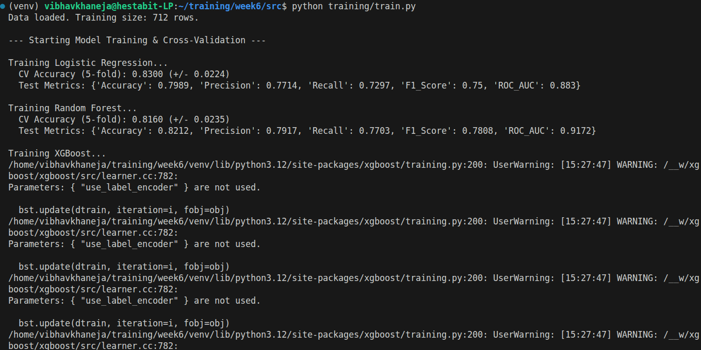
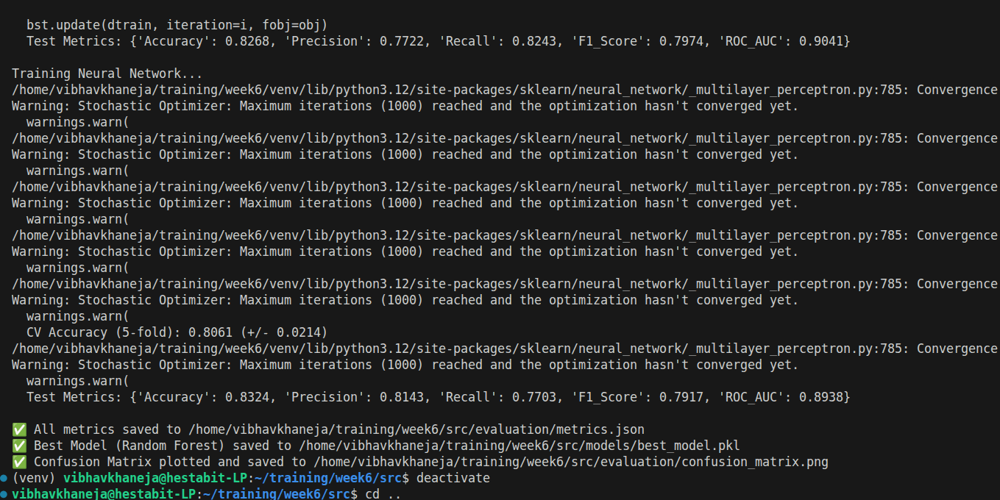
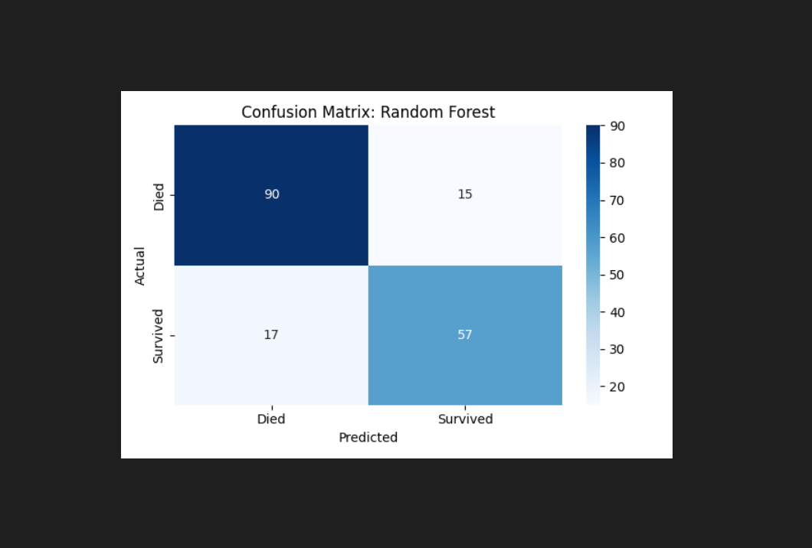

# Day 3: Model Comparison Report

## Topic 1: Underfitting vs Overfitting

1. Overfitting (High Variance) 
The model tries too hard and is over-thinking about the problem. It memorizes the training data perfectly, including the random noise, errors and outliers.
In this scenario it performs really well on training data but poorly on test data which marks as the final test as it memorizes the data instead of learning patterns. 

Issues:
- Training Accuracy: Very High
- Test Accuracy: Low
- Gap: Huge gap between Training and Test scores.

Results: High Variance and Low Bias

1) Model is too complex
2) Too many features (columns) compared to rows of data.
3) Not enough Training Data.
4) No regularization

Solution:

1) Simplify: Reduce tree depth (max_depth), remove useless features.
2) Regularize: Increase penalties (L1/L2).
3) More Data: Get more rows so the model is forced to generalize.

2. Underfitting (High Bias)
The model is too lazy and is under-thinking the problem. It fails to capture the underlying trend of the data. It assumes everything is simple when it's actually complex as it doesnt compares the underlying patterns and performs poorly on both training as well as testing data.

Issues:
- Training Accuracy: Low
- Test Accuracy: Low
- Gap: Tiny gap (both are bad).

Results: 

1) Model is too simple
2) Too much Regularization
3) Not enough Features

Solution:

1) Complicate: Switch to a non-linear model.
2) Feature Engineering: Create new features.
3) Relax: Decrease regularization penalties.

## Cross-Validation

Cross-validation is a technique to test how stable our model is. Instead of training the model once on one set of data, we split the data into *K equal parts*. 
- We train the model 5 separate times, each time using a different part as the "Test Set" and the rest as "Training."We end up with 5 different scores. 
- We look at two things:
1) Mean (Average Score): How accurate is it generally
2) Standard Deviation (SD): How much does the score "wobble" or vary

### Results
**Case A: Low Accuracy**: 

Mean Score = 60%, 
Diagnosis: Underfitting (High Bias).

Result: The model is too simple. It failed to learn the patterns in the data irrespective of which fold it looked at.
Solution: Use a more complex model (Random Forest instead of Logistic Regression) or add more features.

**Case B: High Accuracy + High Standard Deviation (High SD)**

Mean Score = 90% (+/- 10%). (Scores: 99%, 80%, 95%, 75%, 98%).
Diagnosis: Overfitting (High Variance).

Result: The model is unstable. It memorized the specific noise in some folds (getting 99%) but failed miserably on others (getting 75%)and it is not reliable.
Solution: Apply Regularization.

**Case C: High Accuracy + Low Standard Deviation (Low SD)**

Mean Score = 90% (+/- 1%). (Scores: 90%, 91%, 89%, 90%, 90%).
Diagnosis: Good Fit (Robust).

Result: The model learned the true patterns. It performs consistently well regardless of which slice of data it sees. Noe the model is deployable.

## Regularization

A technique used to Overfitting in models as it adds a Penalty to the model's loss function to punish it for having large, complex weights. It forces the model to simplify.

**Loss = Error + Penalty.**

Two types of Regularization:

1) L1 Regularization (Lasso)
Adds the Absolute Value of weights:w as the penalty.
Result: It shrinks less important feature weights all the way to Zero.
Best For: Feature Selection. It literally deletes useless columns from our model.
Use Case: When we have 100 features but suspect only 10 are actually useful.

2) L2 Regularization (Ridge)
Adds the Squared Value of weights:w as the penalty.
Result: It shrinks all weights to be very small, but rarely zero.
Best For: Stability. It prevents any single feature from dominating the prediction.
Use Case: The default choice. Good when most features are somewhat useful and we just want a stable model.

## Models

### Logistic Regression

1) It is the simplest classification algorithm that predicts the probability of an outcome (between 0 and 1) rather than a direct "Yes" or "No."
2) It works by drawing a linear boundary (a straight line or plane) through the data to separate the two classes.
3) The core mechanism is the Sigmoid Function, an S-shaped curve that squashes any input number into a probability value.
4) It is highly interpretable because we can see the exact weight (coefficient) assigned to each feature, telling us if it increases or decreases the chance of the outcome.
5) However, it often underperforms on complex datasets because it assumes a linear relationship and cannot capture intricate patterns without manual feature engineering.

### Random Forest

1) This is an Ensemble method that builds hundreds of independent Decision Trees during training and merges them together.
2) It uses a technique called Bagging (Bootstrap Aggregation), where each tree is trained on a random subset of the data and a random subset of features.
3) To make a final prediction, all the trees vote, and the class with the majority of votes wins.
4) This "wisdom of the crowd" approach drastically reduces variance and prevents the model from overfitting to noise in the training data.
5) It is robust to outliers and handles missing values well, making it the most reliable default algorithm for tabular data.

### XGBoost (Extreme Gradient Boosting)

1) This is also an Ensemble method, but it builds trees sequentially (one after another) rather than in parallel.
2) It uses a technique called Boosting, where each new tree focuses specifically on correcting the errors made by the previous trees.
3) It minimizes a loss function using Gradient Descent, making it incredibly precise and capable of capturing complex, non-linear patterns.
4) It includes built-in regularization (L1 and L2) to control model complexity, which helps prevent overfitting if tuned correctly.
5) It is often the winning algorithm in competitions because it prioritizes accuracy above all else, though it is harder to tune than Random Forest.

### Neural Network

1) It is inspired by the human brain, consisting of layers of artificial "neurons" connected by weights.
2) Data flows through an Input Layer, passes through Hidden Layers where it is transformed by non-linear Activation Functions (like ReLU), and exits the Output Layer.
3) It learns through a process called Backpropagation, where the model calculates its error and adjusts the internal weights backwards to minimize it.
4) It is a "Universal Approximator," theoretically capable of learning any function or pattern given enough data and computing power.
5) However, it is often overkill for simple tabular data like the Titanic dataset, requiring massive amounts of data to converge and being difficult to interpret ("Black Box").

##  Metrics

### Accuracy

- It is the most intuitive metric, simply calculating the percentage of total predictions that were correct (both True Positives and True Negatives).
- However, it is extremely misleading when dealing with imbalanced datasets (e.g., 99% healthy, 1% sick), because a model can just guess the majority class every time and still get a 99% score.
- It treats all errors equally, not distinguishing between a "False Alarm" and a "Missed Detection."
- Use it only when our classes are evenly balanced (e.g., 50/50) and both types of errors are equally bad.

### Precision

- It measures the quality of our positive predictions: "Out of all the times the model said 'Yes', how many were actually 'Yes'?"
- It is obsessed with minimizing False Positives.
- A high precision score means the model is "conservative"—it rarely makes a prediction unless it is very confident.
- Use it when the cost of a false alarm is high, such as in Spam Detection or YouTube Recommendations.
- If we optimize only for Precision, we might miss a lot of real cases (Low Recall).

### Recall (Sensitivity)

- It measures the completeness of our positive predictions: "Out of all the actual 'Yes' cases in the real world, how many did the model find?"
- It is obsessed with minimizing False Negatives.
- A high recall score means the model is "aggressive"—it tries to catch every single positive case, even if it triggers some false alarms.
- Use it when missing a case is dangerous or fatal, such as in Cancer Diagnosis (better to test a healthy person than miss a sick one) or Fraud Detection.
- If we optimize only for Recall, our precision will drop because we will catch too much "noise."

### F1-Score

- It is the Harmonic Mean of Precision and Recall, creating a single score that balances both metrics.
- Unlike a simple average, it punishes extreme values—if either Precision or Recall is very low, the F1-Score will tank.
- Use it when we have an imbalanced dataset (like the Titanic, where more died than survived) and need to compare models fairly.
- A high F1-Score guarantees that our model is both capturing enough positives (Recall) and not making too many mistakes (Precision).

### ROC-AUC (Area Under the Curve)

- This metric evaluates how well the model can distinguish between the two classes (Positive vs. Negative) across all possible probability thresholds.
- It plots the True Positive Rate against the False Positive Rate; a score of 0.5 is random guessing, while 1.0 is a perfect model.
- It is "threshold-invariant," meaning it tells us if the model is fundamentally smart, regardless of whether we cut the probability at 50%, 10%, or 90%.
- Use it when we need to rank different models (e.g., Random Forest vs. XGBoost) to see which one has the best raw predictive power.
- It is the gold standard for model comparison because it isn't affected by the specific business decision (threshold) we make later.

## Correlation Matrix Analysis

Before training, we analyzed the relationships between features using a Correlation Matrix.
A heatmap showing how strongly numerical variables are related (-1 to +1).

### Key Findings from Titanic Data:
- Survival vs. Sex: Strong positive correlation (Female passengers had a much higher survival rate).
- Survival vs. Pclass: Negative correlation (1st Class was safer; 3rd Class had lower survival).
- Fare vs. Pclass: Strong negative correlation (Better class = Higher Fare).
- Multicollinearity Check: We confirmed that no two features were identical (e.g., correlation > 0.95), meaning all features added unique value to the model.

### Confusion Matrix Analysis (Random Forest)

We visualized the performance of our best model using the Confusion Matrix image.

- True Negatives (90): The model correctly predicted "Died" for 90 people. (Top Left)
- True Positives (57): The model correctly predicted "Survived" for 57 people. (Bottom Right)
- False Positives (15): The model predicted "Survived," but they actually died. (Top Right - Type I Error)
- False Negatives (17): The model predicted "Died," but they actually survived. (Bottom Left - Type II Error)

Verdict: The model is well-balanced. It does not heavily favor one side, making errors roughly equally in both directions (15 vs. 17).

### Model Leaderboard

We trained 4 models and evaluated them on the unseen Test Set.
1) **Random Forest (The Chosen One):**
Why it won: It achieved the highest ROC-AUC (0.9172). This means it is the best at distinguishing between "Died" and "Survived" across all probability thresholds, making it the most robust model for deployment.

2) XGBoost:
It had the highest Recall (82.43%), meaning it was the best at finding survivors.
But its Precision (77.22%) was lower, meaning it raised more "False Alarms" (False Positives).

3) Neural Network:
It achieved the highest raw Accuracy (83.24%) and Precision (81.43%).
But Its lower ROC-AUC (0.8938) suggests it might be slightly "brittle" or overfitted to specific thresholds compared to the stable Random Forest.

4) Logistic Regression:
Served as a solid baseline (~80% accuracy) but failed to capture the complex non-linear patterns found by the tree-based models.

### Cross-Validation (CV) Results

To ensure our Test Results weren't just "luck," we performed 5-Fold Cross-Validation during training.
- The Process: We split the training data into 5 chunks. We trained on 4 and tested on 1, rotating 5 times.
- The Result: The models showed Low Standard Deviation across the 5 folds.
- This confirms that our high accuracy scores (82-83%) are real and reproducible, not just a result of a lucky data split.

The Random Forest consistently hovered around ~82% accuracy across all 5 folds, proving it is Stable (Low Variance).

Final Selected Model: RandomForestClassifier, while Neural Network had slightly higher accuracy, Random Forest offered the best balance of Reliability (AUC) and Interpretability. It is robust to outliers and requires less tuning than XGBoost.

