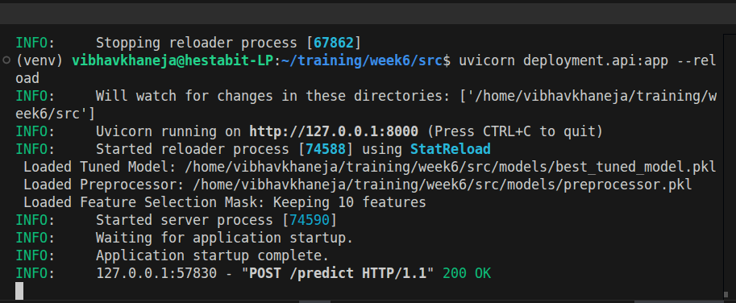
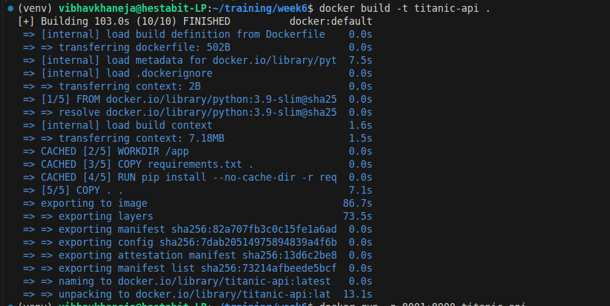
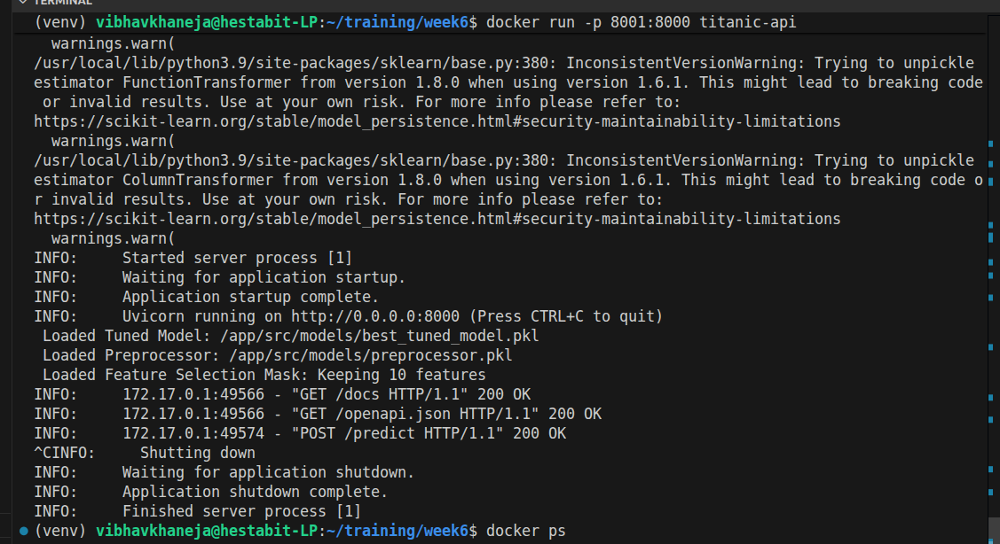
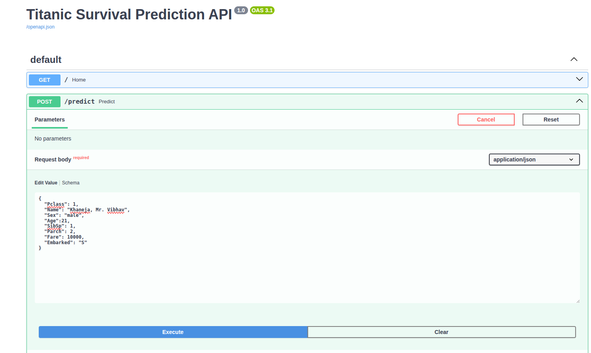
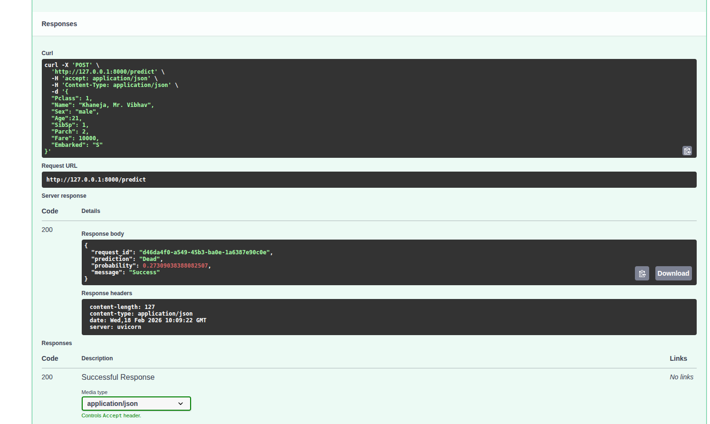
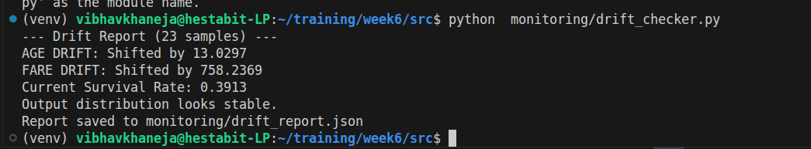
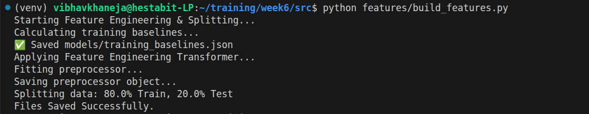
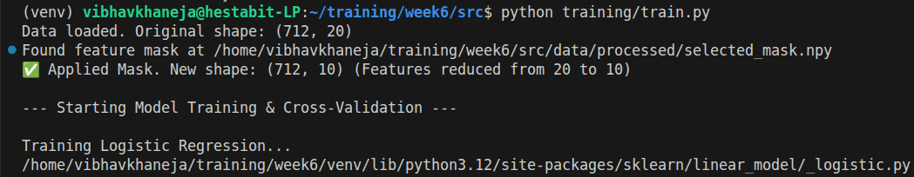
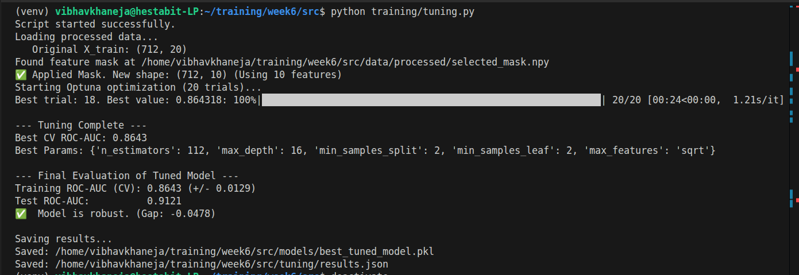

# Week 6 Day 5 Capstone Report

This project transforms a machine learning model into a production-ready REST API. It serves predictions for the Titanic dataset using FastAPI and is containerized using Docker.

The system includes a robust pipeline that handles:

1) Input Validation: Pydantic schemas ensure data integrity.
2) Automated Feature Engineering: Raw user input is transformed (e.g., Title extraction, Family Size calculation) using a custom TitanicFeatureEngineer transformer.
3) Preprocessing & Selection: Scales data and applies a feature selection mask to use only the top 10 most important features.
4) Monitoring: Logs all requests to prediction_logs.csv for drift detection.

## Project Structure
```
week6/
├── Dockerfile                  # Instructions to build the image
├── requirements.txt            # Python dependencies
├── src/
│   ├── deployment/
│   │   └── api.py              # Main FastAPI application
│   ├── features/
│   │   └── transformers.py     # Shared Feature Engineering Logic
│   ├── models/
│   │   ├── best_tuned_model.pkl # The trained Random Forest
│   │   ├── preprocessor.pkl     # Scaling & Encoding rules
│   │   └── training_baselines.json
│   ├── data/
│   │   └── processed/
│   │       └── selected_mask.npy # Feature Selection Mask (10 features)
│   └── monitoring/
│       └── drift_checker.py      # Script to analyze logs
└── prediction_logs.csv           # Live logs (generated at runtime)
```

## Workflow

### Prerequisites

```
pandas
numpy
matplotlib
seaborn
scikit-learn
dvc  # For dataset versioning
joblib
python-dotenv
notebook
fastapi
uvicorn
pydantic
```

These are our requirements.txt which must be run first because in the day5 we added them with fastapi for handling the api requests, uvicorn and pydantic which are essential for creating and running the web server.

```
pip install -r requirements.txt
```

### Start the API

```
uvicorn src.deployment.api:app --reload
```



- API URL: http://127.0.0.1:8000
- Docs (Swagger UI): http://127.0.0.1:8000/docs

### Running Docker

To simulate a production deployment, use the Docker container.

1. Build Docker Image

```
docker build -t titanic-api .
```


2. Run the container

```
docker run -p 8001:8000 titanic-api
```


### API Endpoints

**POST /predict:** Generates a survival prediction for a passenger.

Request Json:
```
{
  "Pclass": 1,
  "Name": "Khaneja, Mr. Vibhav",
  "Sex": "male",
  "Age":21,
  "SibSp": 1,
  "Parch": 2,
  "Fare": 10000,
  "Embarked": "S"
}
```

Response Json:
```
{
  "request_id": "d46da4f0-a549-45b3-ba0e-1a6387e90c0e",
  "prediction": "Dead",
  "probability": 0.27309038388082507,
  "message": "Success"
}
```





### Monitoring & MLOps

Prediction Logging: Every request made to the API is logged automatically to src/prediction_logs.csv. This file contains:

1) Timestamp
2) Request ID
3) Input Features
4) Model Prediction & Probability

### Drift Detection

To check if the live data has drifted away from the training data distribution, run the drift checker script:

```
python monitoring/drift_checker.py
```



This will compare prediction_logs.csv against the training baseline and alert you if significant drift is detected.


## Artifact Pipeline

This project follows a strict Training => Artifact Generation => Deployment pipeline. 
Each script is responsible for creating specific files that the API needs.

1. Feature Engineering & Preprocessing

```
python src/features/build_features.py
```


- Input: Raw CSV data.
- Action: Applies TitanicFeatureEngineer logic and fits StandardScaler and OneHotEncoder.
- Output:  
1. models/preprocessor.pkl (The scaling/encoding rules). 
2. data/processed/X_train.npy (The 23-feature dataset).

2. Feature Selection 

```
python src/features/select_features.py
```

- Input: X_train.npy (23 features).
- Action: Runs Recursive Feature Elimination (RFE).Identifies the Top 10 most important features.
- Output: data/processed/selected_mask.npy (Boolean mask: True=Keep, False=Drop).

3. Model Training (Baseline)

```
python src/training/train.py
```



- Input: X_train.npy + selected_mask.npy.
- Action: Applies the mask to drop 13 weak features.Trains a Random Forest on the best 10 features.
- Output:  models/best_model.pkl (The baseline model).

4. Hyperparameter Tuning (Optimization)

```
python src/training/tuning.py
```



- Input: X_train.npy + selected_mask.npy.
- Action: Uses Optuna to find the perfect hyperparameters for the 10 selected features.
- Output: models/best_tuned_model.pkl (The final, optimized model).

5. Final Deployment (The Assembler)

```
src/deployment/api.py
```

- Action: It loads ALL the artifacts generated above to process a single user request.

