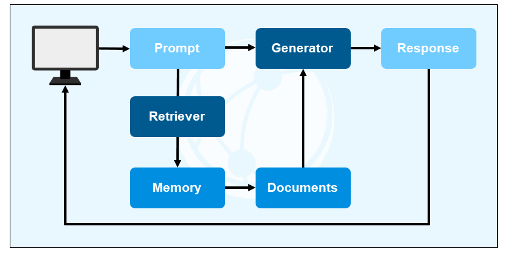
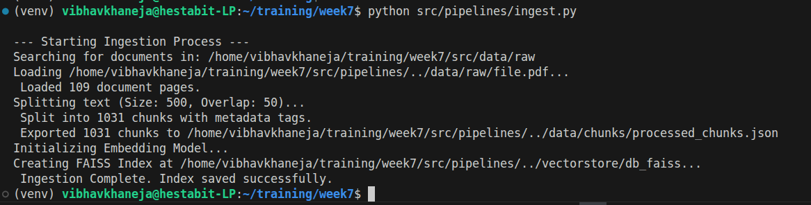
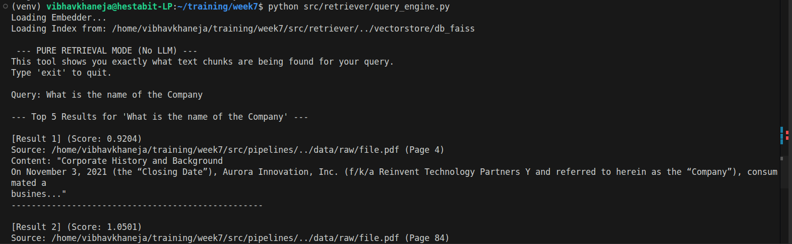
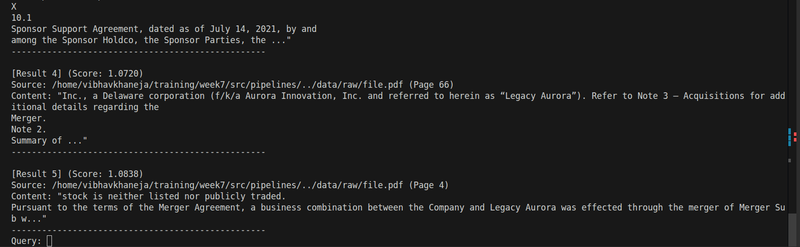

# Local RAG System Architecture

Today we are starting with week 7 and in this week we will be covering Gen AI and Multimodal RAG and today we will cover the Local RAG and Pipeline architure where we go through the processes of Ingestion, Embedding, FAISS and Retrieval of adeqaute chunks.

## 1. Ingestion: The Intake Valve

Ingestion is the process of bringing outside data into our local environment. In our project, this is handled by PyPDFLoader.

The Core Learning: In an enterprise setting, ingestion isn't just about reading. It’s about **standardization**. Whether the input is a PDF, CSV, or TXT, the ingestion layer must turn it into a unified Document Object that contains the raw text and its associated metadata.

### Metadata Tagging

The practice of attaching contextual key-value pairs (like `source_file`, `page_number`, `author`, or `creation_date`) to every individual text chunk during the ingestion phase.

A vector database only stores the text and its mathematical representation. Without metadata, an LLM might generate a correct answer but will be completely incapable of proving where it got the information.

**Source Attribution:** Metadata allows the RAG system to provide citations. This builds user trust and solves the hallucination verification problem.
**Pre-Filtering:** Metadata allows we to narrow down a search before doing expensive vector math, we can tell the retriever: Only perform similarity search on chunks where `category == 'HR_Policy'` and `year == 2024`.

## 2. Chunking: The Precision Slicer

Once we have the text, we can't feed a whole book to the AI at once, we must perform Chunking.
The Core Learning: We are balancing Precision vs. Context.
- If we slice too thin (small chunks), we lose the meaning of the sentence.
- If we slice too thick (large chunks), the "mathematical fingerprint" becomes blurry.

A token is not a word, and it's not a character. It is a piece of a word. 1 token is approximateky 4 characters in English (or roughly 3/4 of a word).

Perfect scenario: Chunk Size: 300 to 800 tokens (1000 to 3000 characters).
This fits perfectly within the Embedding model's limits and provides just enough context for the LLM to write a solid answer without slowing down the system.

### Chunk Overlap Strategy

The Strategy: Using **RecursiveCharacterTextSplitter** with an Overlap ensures that the end of one chunk and the start of the next share some text, preventing important information from being cut in half. 

Chunk overlap is a sliding window approach where the end of one text chunk is duplicated at the beginning of the next chunk. When a text splitter cuts a document purely by character count (e.g., exactly at 500 characters), it will inevitably slice through the middle of a sentence, a word, or a core idea. 

A standard overlap is typically **10% to 20%** of the total chunk size (e.g., `chunk_size=500`, `chunk_overlap=50`)

## 3. Vectors & Embeddings: The Mathematical Fingerprint

This is the most critical conceptual jump.
1) The Embedding: Think of an Embedding as a **translation**. It is a model that looks at a chunk of text and assigns it a set of coordinates based on its meaning, not its letters.
2) The Vector: The Vector is the actual list of numbers.
The word Apple and Banana will have vectors that are geographically close to each other in a **384-dimensional space** while apple and Apple (iphone) will be far apart because their embeddings/meanings are different.

### Embedding Pipelines

The pipeline that translates human language (text chunks) into machine-readable math (high-dimensional vectors). 
Standard database searches rely on exact keyword matches (e.g., searching for compensation will miss documents that only say salary).Embedding models map text to a numerical space based on **semantic meaning**. 

**The Translation:** Models like `all-MiniLM-L6-v2` read a text chunk and output a fixed-length array of numbers. Words with similar meanings are plotted physically closer together in this mathematical space.
**The Golden Rule:** The exact same embedding model used to ingest and store the documents must be used to embed the user's query. If we use a different model, the mathematical coordinates will not align, and the search will fail.

## 4. FAISS: The High-Speed Library

Once we have 1,000+ vectors, we need a way to find the right one instantly which is done using FAISS. FAISS is a Local Vector Database. Unlike a traditional database that searches for exact, FAISS searches for Distance.

How it works: When we ask a question, our query is turned into a vector. FAISS looks through its "map" of document vectors and pulls the 3 or 5 dots that are physically closest to our query's dot. This is called Semantic Search.

FAISS takes in our vectors and embeddings and creates a dual file structure and stores it locally using vectorstore.save_local so that it doesnt have to re-read, re-split and then re-generate the files again and it gets saved in the local FAISS directory.

We get 2 FAISS Files:

### 1. index.faiss — The Mathematical Map

- This is a binary file that stores the spatial coordinates of our data. It is the part of the system that understands distance but has no idea what the actual words are.
- The Vectors: It contains a massive list of numerical arrays. In our project, each chunk of text was converted into a list of 384 numbers.
- The Search Structure: It stores the Index Structure (Flat index/HNSW graph). This structure allows FAISS to quickly calculate which dot" in the 384-dimensional space are closest to our query's dot.
- Anonymized Data: If we opened this file in a text editor, it would look like gibberish. It does not contain English words; it only contains the floating-point numbers that represent the meaning of those words.

### 2. index.pkl — The Memory Map (Pickle File)

- Because the .faiss file only stores numbers, we need a translation key to map those numbers back to the original text and its source. This is a Python Pickle file.
- The Docstore: This is a dictionary that maps a unique ID to the actual Text Content we saw in our PDF.
- Metadata: This stores all the extra info we added during ingestion, such as the filename, page number, category, and timestamp.
- The Bridge: It keeps an index_to_docstore_id mapping. When FAISS says, "The closest match is Vector 500," this file tells the system, "Vector 500 corresponds to Page 12 of file.pdf."

## Query Workflow

1) Our Query: "What is the form about?"
2) Conversion: Embedder turned that sentence into a vector;i.e.; a list of 384 numbers.
3) The Search (index.faiss): FAISS looked at our query vector and found the top 3 closest vectors in its mathematical map. It returned the IDs of those vectors.
4) The Lookup (index.pkl): The system went to the pickle file and asked, "What text and metadata belong to IDs 101, 550, and 900?"
5) The Result: The system printed the Content and Source we saw on our screen.

## Vector Index Semantic Searching

Searching through 1,000 chunks is easy. Searching through 10,000,000 is hard. FAISS uses specific structures to handle this:

### Flat Index

This is what we are likely using now. It is an **Exhaustive Search**. It compares the query vector to every single vector in the database. It is 100% accurate but slow for huge data.

### IVF (Inverted File Index):

It clusters the vectors into **neighborhoods**. The search first finds the right neighborhood and then only searches within it.

### HNSW (Hierarchical Navigable Small Worlds): 

This is the current **Gold Standard**. It creates a multi-layered graph where the search starts at the top (broad jumps/broad connections) and zooms in to the bottom (fine-grained matches/dense connections), much like how a GPS zooms from a country view down to a street view.

## The RAG Pipeline: 

**Phase 1: Data Preparation**

1) Ingestion: Standardized loading of data
2) Chunking: Breaking large data into smaller chunks
3) Enrichment: Enhancement with meta data
4) Embedding: TRansaltion of raw data into vectors

**Phase 2: Storage & Persistence**

5) Indexing: Organizing vector for search 
6) Persistence: Creating index.faiss and index.pkl files for math and text

**Phase 3: Retrieval**

7) Boot-up: loading up local stored faiss and embedding files
8) Query Translation: transaltion of query using embedding
9) Search: finding out minimum coordiante distance

### Results

