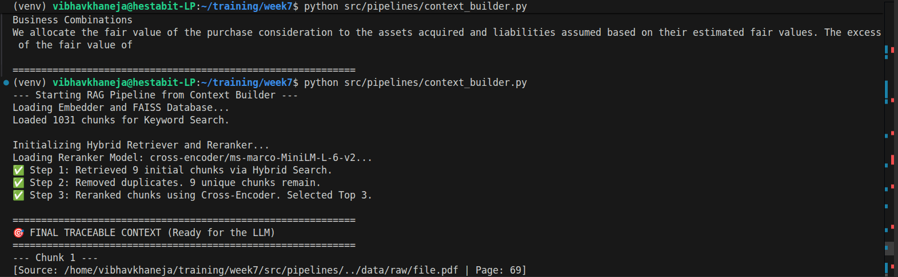
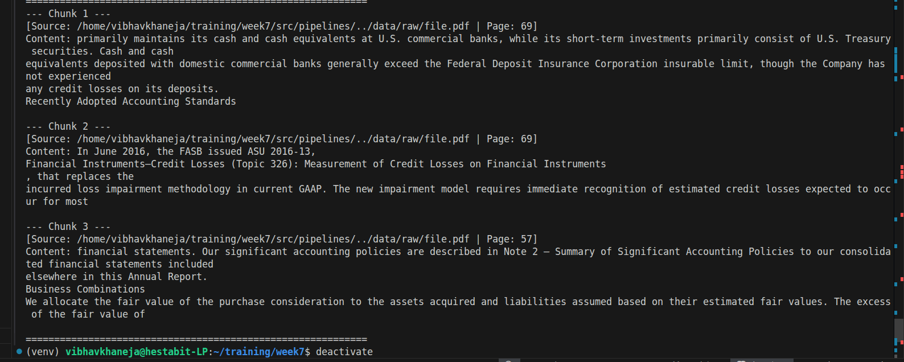

# ADVANCED RETRIEVAL + CONTEXT ENGINEERING

Today we are going to enhance our retrieval techniques and implement it with new features and functions.

## Hybrid Search: BM25 + Embeddings

Vector embeddings (dense retrieval) are amazing at understanding the meaning of a query, but they are notoriously terrible at finding exact matches for things like part numbers, acronyms, or specific names. If we search for ID-9942, an embedding model might return ID-9943 because they are mathematically similar.

Hybrid Search combines two entirely different search engines:

**1. Embeddings (Dense Search - FAISS)**: Finds concepts. It understands that salary and compensation mean the same thing.

**2. BM25 (Sparse Search - Keyword)**: Finds exact words. It uses an algorithm called Term Frequency-Inverse Document Frequency (TF-IDF) to score chunks based on how many times our exact search words appear.

The EnsembleRetriever executes sparse (BM25) and dense (FAISS) searches simultaneously. Instead of attempting to normalize their raw math scores, it uses Reciprocal Rank Fusion (RRF) to combine the results based purely on their ranked leaderboard positions and assigned weights. This safely guarantees the best of both worlds: deep semantic understanding and precise exact-keyword matching.

## Reranking (Cross-Encoder / Cosine)

Initial retrieval (like FAISS) needs to search millions of documents instantly. To do this, it uses a Bi-Encoder: it converts our query into a vector, and measures the Cosine Similarity (the angle) against the document vectors. It is incredibly fast, but slightly shallow in its understanding.

A Cross-Encoder (Reranker): Instead of comparing two pre-calculated math coordinates, a Cross-Encoder takes the User Query and the Document Chunk and feeds them together into a Transformer neural network.

The AI reads both texts simultaneously, comparing every word in the query to every word in the document, outputting a highly accurate relevance score from 0.0 to 1.0.

Cross-Encoders are very slow and computationally expensive. We cannot run a Cross-Encoder on a million documents. We use the fast FAISS search to get the Top 20, and then use the slow, highly accurate Cross-Encoder to strictly rerank and find the true Top 3.

## Max Marginal Relevance (MMR)

If we ask a vector database for the top 5 chunks about credit limits, it might return 5 chunks from the exact same page of a policy document because they are all mathematically closest to our query. The LLM receives redundant information and misses out on other important context.

MMR is an algorithm designed to balance Relevance with Diversity.

1) Fetch: It first grabs a larger pool of results (e.g., fetch_k = 20).
2) Select: It picks the absolute most relevant chunk and adds it to the final list.
3) Penalize: For the next selection, it calculates the relevance to the query, but subtracts points if the chunk is too similar to the one already selected.
4) Result: we get a final k = 5 list that covers the topic from multiple different angles rather than repeating the same sentence five times.

4. Chunk Deduplication

In a complex pipeline, we might end up with identical text chunks. This often happens because:

1) We are using Chunk Overlap, which inherently duplicates text.
2) Hybrid search might pull the exact same chunk from the BM25 index and the FAISS index.
A programmatic filter that uses a Python set() or hashes the text to instantly drop identical strings.

Use case: Passing duplicate text to an LLM wastes expensive tokens, slows down generation time, and can confuse the model's attention mechanism.

5. Optimizing the Context Window for LLMs

An LLM's Context Window is its short-term memory (e.g., 8,000 tokens for older models, up to 1-2 million for newer ones). Just because we can fit 50 document chunks into the prompt doesn't mean we should.

Context Engineering is the approach which we must follow.

1. The **Lost in the Middle** Phenomenon: Research proves that if we stuff an LLM's prompt with too much text, its reasoning degrades. It heavily focuses on the very first chunk and the very last chunk, completely ignoring the middle.
2. Strict Filtering: This is why we set top_k=3 or 5. We only pass the highest-signal, lowest-noise data.
3. Formatting: Wrapping the text in clear structural tags like [Source: document.pdf] trains the LLM to cite its answers, vastly reducing hallucinations.

## Goals of the Day 

### Improve Retrieval Accuracy

1. Hybrid Search & MMR 

- BM25Retriever.from_documents: This takes our raw text and builds an exact-keyword index on the fly. We tell it to grab the top 5 matches (k=5). search_type="mmr".
- fetch_k=20: First, FAISS does a fast mathematical search to grab the 20 closest vectors, k=5: Then, the MMR algorithm penalizes duplicates among those 20 and returns the 5 most diverse, relevant chunks.
- EnsembleRetriever: This is the LangChain wrapper that takes the 5 keyword chunks and the 5 semantic chunks, applies the Reciprocal Rank Fusion (RRF) algorithm to their leaderboard positions, and outputs a single combined list. The weights=[0.5, 0.5] means we assign equal mathematical value to the rank positions from both search engines.

2. Reranking

- pairs = [[query, text]]: This is the core of a Cross-Encoder. Unlike Day 1 where we just embedded the query alone, here we are physically pairing the user's question with the retrieved text into a single array.
- self.model.predict(pairs): The ms-marco AI model reads both sentences together and outputs a raw relevance score for each pair.
- [:top_k]: This slices the sorted list, acting as the strict bouncer that only lets the top 3 or 5 results through.

### Reduce Hallucination

An LLM hallucinates (lies) when it gets confused, overwhelmed, or lacks explicit instructions. our pipeline completely neutralizes this.

1. Optimizing the Context Window (top_k=3) 

- By strictly limiting the data to only the 3 best chunks, we prevent the LLM from getting lost in the middle. A focused AI is an honest AI.

2. Chunk Deduplication

- seen_texts = set(): In Python, a set is a data structure that physically cannot hold duplicate values, and looking up items inside it is instantly fast.
- We loop through the chunks. If the exact text string isn't in the set yet, we add it to the set and keep the document. If it is in the set, the if statement fails, and the duplicate is silently dropped.

3. Traceable Formatting

This is the most important one. By wrapping our chunks in [Source: file.pdf | Page: 69], we are explicitly giving the LLM an anchor to reality.

