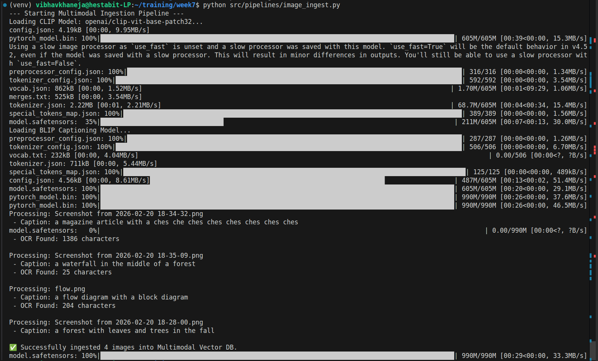
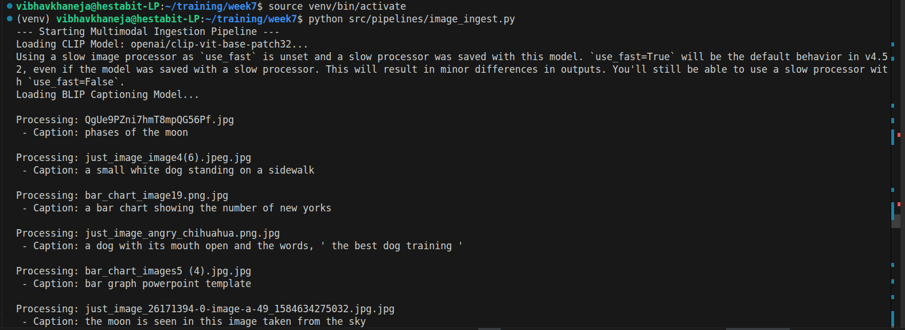
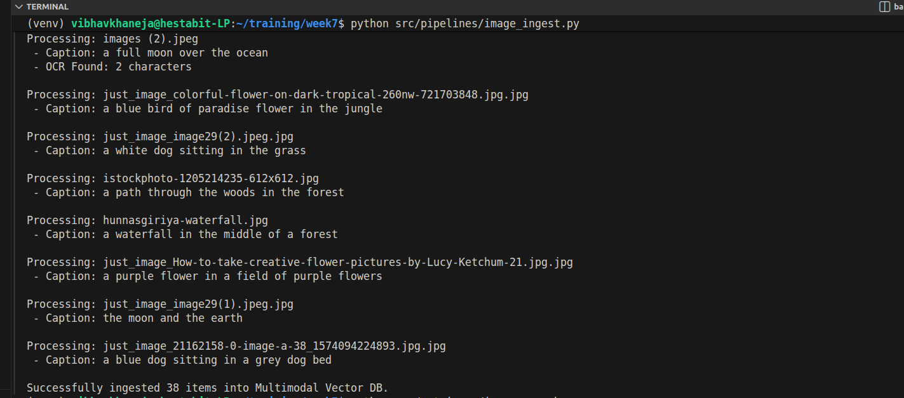
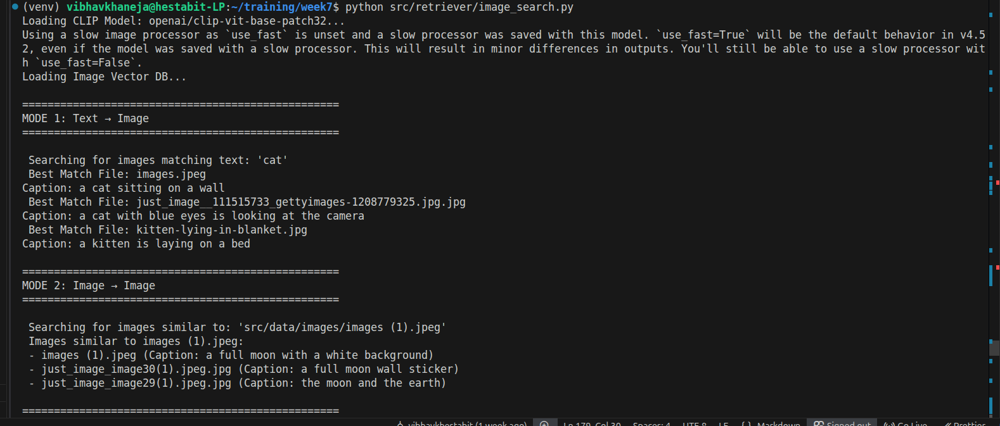
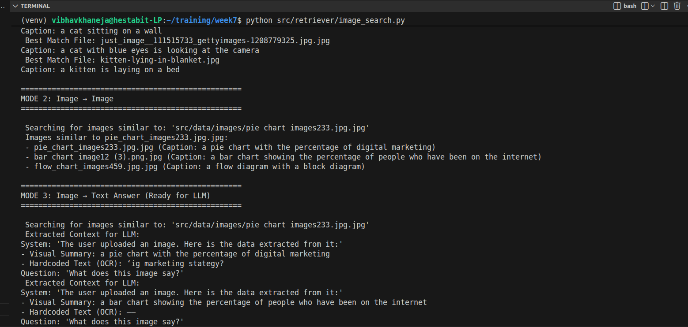

# IMAGE-RAG (MULTIMODAL RAG)

## 1. CLIP Embeddings (The Multimodal Bridge)

CLIP (Contrastive Language-Image Pre-training) by OpenAI is the absolute backbone of Multimodal RAG. Before CLIP, AI treated text and images as completely separate universes.

CLIP uses a Dual-Encoder Architecture. It has two separate "brains": a Vision Transformer (ViT) to process images, and a Text Transformer to process words.

- Push and Pull: The model takes an image of a dog and the text "a dog." It mathematically "pulls" their vectors closer together in a shared, high-dimensional space. Simultaneously, it mathematically "pushes" the image of the dog away from the text "a cat."
- The Result: Text and images now live on the exact same mathematical map. This is why our search_by_text and search_by_image functions can use the exact same FAISS database. A text query and an image query are just coordinates pointing to the same neighborhood.

## 2. Caption Generation using BLIP

If CLIP already understands images, why do we need BLIP (Bootstrapping Language-Image Pre-training)?

- CLIP is an Encoder only. It can tell we if an image and a text string match, but it is physically incapable of writing a sentence. It cannot generate text.
- BLIP is an Encoder-Decoder. It looks at an image, processes the visual features, and then actively writes a human-readable sentence explaining what it sees.

Pure visual math is sometimes vague. BLIP forces the visual data into explicit, semantic text. When we pass data to an LLM later in the RAG pipeline, the LLM cannot see the FAISS vectors. It needs the BLIP caption to understand the visual context.

## 3. OCR Extraction using Tesseract

Optical Character Recognition (OCR) is our hard-coded ground truth.

Tesseract uses traditional computer vision combined with Long Short-Term Memory neural networks to recognize character patterns line by line.

Dense vectors (CLIP) are terrible at exact keyword matching. If we have an engineering diagram with the serial number RX-782, CLIP will embed the general vibe of an engineering diagram, but it will completely lose the specific serial number. Tesseract extracts that hard text so we can use it as a metadata filter or pass it directly to the LLM for precise Q&A.

## 4. Multimodal Vector DB Design

A Multimodal Vector Database isn't just a pile of numbers; it requires a specific architectural design to serve RAG applications effectively.

1) The Index (FAISS): This only stores the dense float32 vectors (the CLIP embeddings). It is optimized purely for blazing-fast mathematical distance calculations (Cosine Similarity/Inner Product).
2) The Document Store (Pickle/JSON): This stores the payload (Filenames, BLIP Captions, OCR Text).

When a query comes in, FAISS finds the nearest mathematical neighbors (the IDs). The system then uses those IDs to retrieve the rich metadata payload from the Document Store. This payload is what is finally injected into the LLM's prompt.

## Data Ingestion Pipeline

When a new visual asset (PNG, JPG, scanned PDF) enters the system, it undergoes a three-step processing phase before being stored:

1.  **Semantic Embedding:** The raw image is passed through the CLIP vision encoder to generate a high-dimensional vector representing its conceptual meaning.
2.  **Visual Captioning:** The image is passed through BLIP to generate a textual description of the scene or diagram.
3.  **Data Extraction:** The image is scanned by Tesseract to extract raw text (OCR).
4.  **Storage:** The CLIP vector is saved to the FAISS index. The BLIP caption, OCR text, and file path are saved as attached metadata.

### 1. Text => Image
**Mechanism:** The user inputs a natural language query
**Execution:** The text is embedded using the CLIP text encoder. FAISS calculates the Cosine Similarity between the text vector and the stored image vectors, returning the closest visual match.

### 2. Image => Image
**Mechanism:** The user uploads an image.
**Execution:** The image is embedded using the CLIP vision encoder. FAISS calculates the distance between this vector and other stored image vectors, returning visually or conceptually similar files.

### 3. Image => Text Answer
**Mechanism:** The user uploads an image and asks a question about it.
**Execution:** The system retrieves the image and extracts its attached metadata (the BLIP caption and the Tesseract OCR data). These two text strings are structured into a clean context prompt, allowing a standard text-based LLM to "read" the image and answer the user's question with high precision.

