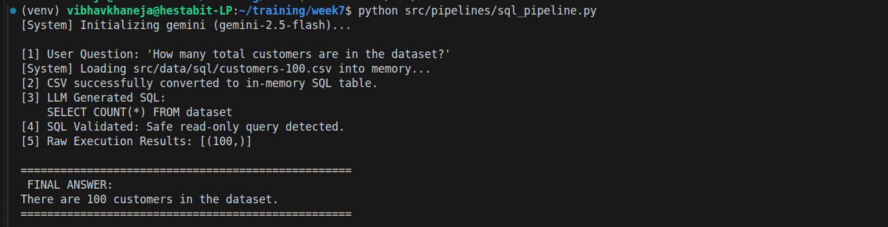
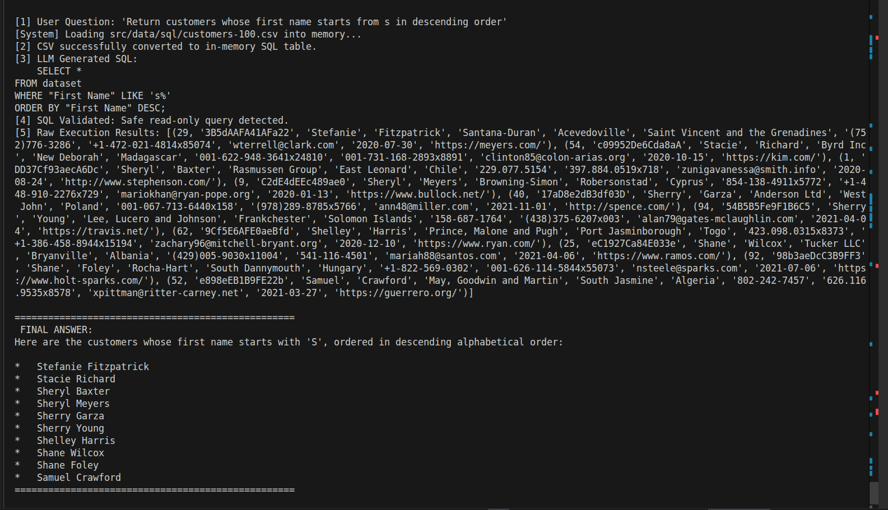
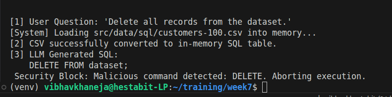

# DAY 4 — SQL QUESTION ANSWERING SYSTEM (Text → SQL → Answer)

## Learning Outcomes

This project demonstrates how to securely convert natural language queries into executable SQL code. The architecture is built on schema-aware reasoning, ensuring the Large Language Model understands the exact structure of the database before attempting to write code. To protect the underlying database, the system implements rigorous SQL query validation and correction protocols, guaranteeing injection-safe execution at all times.

## Schema Extraction

To write accurate code, the AI needs a map of the data. Instead of hardcoding column names, the system dynamically extracts the exact CREATE TABLE command from the database's internal registry. This extracted schema provides the AI with a flawless blueprint of table names, column titles, and data types, eliminating the risk of the model hallucinating non-existent data fields.

## Prompting Patterns for SQL Generation

The system utilizes a dual-prompt architecture to manage the Large Language Model. In the generation phase, the LLM is instructed to act purely as an expert database analyst. By injecting the dynamically extracted schema alongside the user's natural language question, the generator produces raw, highly accurate SQL code with a temperature setting of zero to ensure strictly deterministic, analytical outputs.

## Query Validation

Executing AI-generated code directly on a live database introduces severe security risks. To mitigate this, a hardcoded Python validation layer intercepts every generated SQL string. This validator scans the code for destructive keywords like DROP, DELETE, or UPDATE, physically blocking any command that is not a safe, read-only SELECT query.

## Error Correction

Because AI models can occasionally misinterpret complex data structures, the system includes an agentic self-healing loop. If the generated SQL fails during database execution, the pipeline catches the specific database error message. It then feeds this error back to the LLM generator, forcing the AI to debug its own code, rewrite the SQL, and attempt the execution again without crashing the application.

## Summarizing Result Tables

Raw database outputs are returned as unformatted tuples and arrays, which are unreadable to non-technical users. The final topic covers reverse-translation. The system passes the raw data array, the generated SQL, and the original user question back into a conversational LLM prompt. The AI translates the mathematical output into a professional, human-readable English sentence.

### Use of self

The entire pipeline relies on Object-Oriented Programming to maintain data across different files. In Python, local variables are destroyed the moment a function finishes executing. By attaching the word self to a variable or an object, we promote it to a permanent attribute. We use self to securely hold open our database connections and to permanently store our loader and generator worker objects inside the master pipeline, ensuring they survive in memory to complete their tasks.

### Role of the Database cursor

Python applications cannot communicate directly with a database engine. They require a dedicated messenger. The cursor acts as this delivery vehicle. Once the connection to the database is open, we create a cursor object, hand it the SQL query, and send it into the database to execute the command. The cursor then gathers the resulting rows and carries them back to the Python application for the LLM to summarize.

## Workflow

### Initialization:

1) The SQLPipeline class boots up and immediately instantiates its two worker objects.
2) The SQLGenerator worker reads config/model.yaml, securely fetches the Google API key from the hidden .env file, and establishes a connection with the Gemini LLM at a strict temperature of 0.0.

### Data Ingestion & Blueprinting:

1) For each query, the pipeline asks the SchemaLoader to prepare the data.
2) schema_loader.py uses Pandas to read the raw customers-100.csv file and injects it into a temporary, in-memory SQLite database.
3) A database cursor reaches into the hidden sqlite_master table, extracts the exact CREATE TABLE command generated by Pandas, and passes this text string (the schema) back to the master pipeline along with the live database connection.

### Code Generation:

1) The pipeline hands the user's question and the extracted schema blueprint to the generate_sql function.
2) Gemini analyzes the blueprint to ensure it uses the correct column names and outputs a raw, unformatted SQL query (e.g., SELECT COUNT(*) FROM dataset).

### Security Checkpoint:

1) Before the SQL is allowed near the database, it is passed to the validate_sql function.
2) The code is converted to uppercase and scanned. The first two test queries pass smoothly. However, Query 3 triggers the blacklist alarm because it contains the word DELETE. The function throws a ValueError, immediately blocking the execution and protecting the database.

### Execution & Self-Healing:

1) For the safe queries, the pipeline takes the validated SQL string, opens a cursor, and executes it against the live RAM database.
2) If the LLM hallucinated a bad column name or made a syntax error, the database engine will naturally throw an exception. Instead of crashing the entire Python application, a strict try...except block catches this database error gracefully, prints a failure message to the terminal, and safely halts that specific query's execution.

### Natural Language Translation:

1) Once the execution succeeds, the cursor returns raw Python tuples (e.g., [(100,)]).
2) The pipeline passes this raw data, along with the original question, into the summarize_results function.
3) Gemini acts as a human translator, turning the mathematical array into a clean, professional English sentence (e.g., "There are 100 customers in the dataset.").
4) The pipeline prints this final answer to the terminal, closes the database connection, and flushes the RAM.

### Results:

- Query 1

- Query 2

- Query 3

