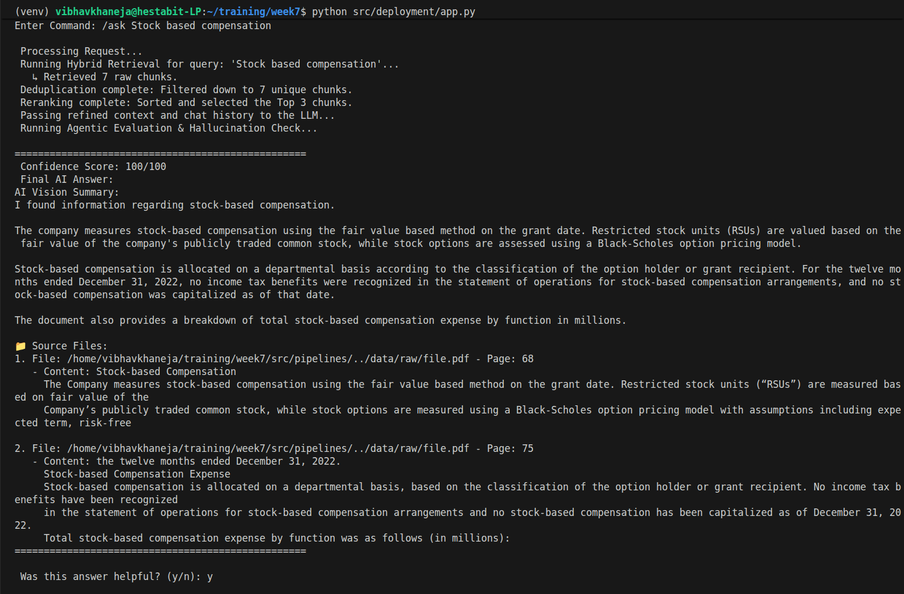
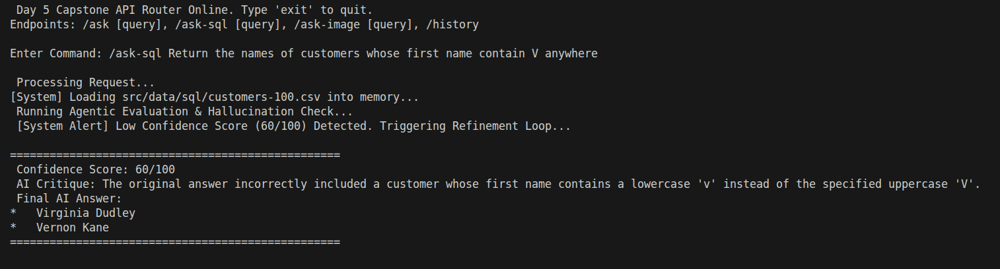
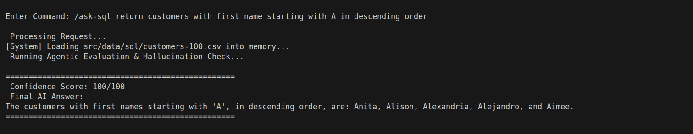
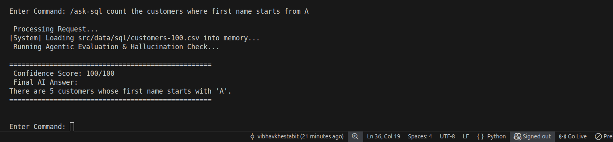
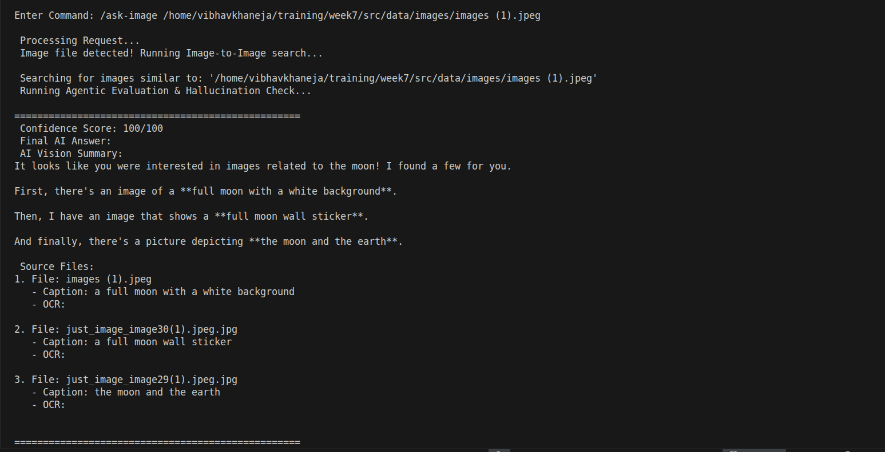
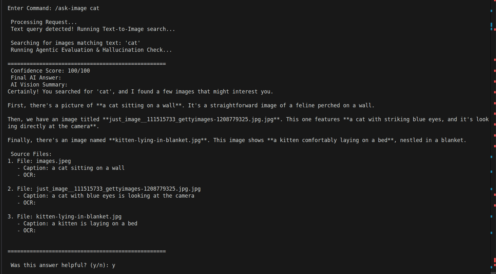
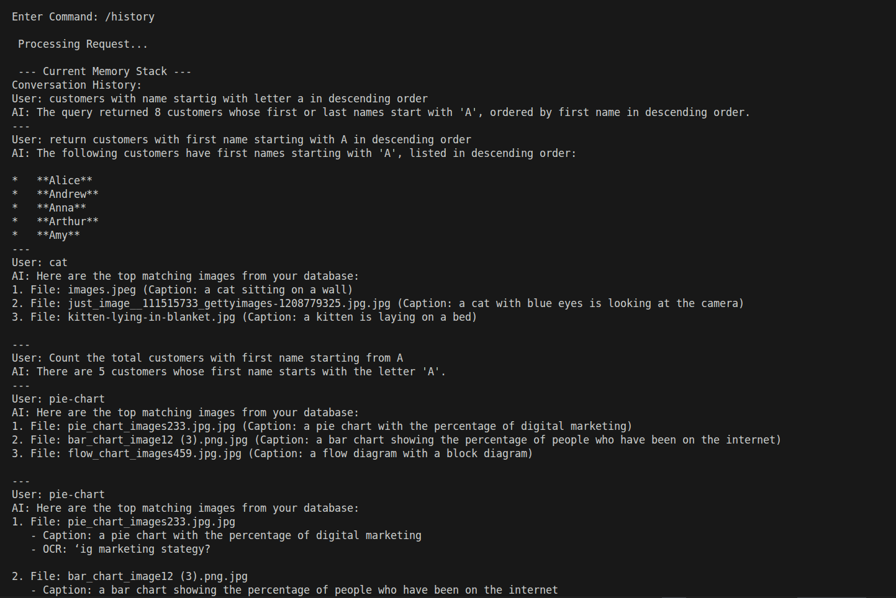

# ADVANCED RAG + MEMORY +EVALUATION (CAPSTONE)

This system is a Production-Ready Multi-Agent Orchestrator. It doesn't just retrieve data; it evaluates its own performance, critiques its own mistakes, and refines its answers before the user ever sees them.

## Core Architecture & Endpoints

1. /ask — The Hybrid Text RAG Intelligence

This is the Deep Knowledge engine designed to handle unstructured data (PDFs, documentation, articles). It utilizes a multi-stage retrieval process to ensure high-precision answers.

- The Hybrid Engine: Unlike standard search, this combines Semantic Search/Vector embeddings with Keyword Search (BM25). This ensures that if we search for a specific term like Revenue Report 2024, the system finds the exact document even if the semantic embedding is slightly broader.
- The Processing Layer:
1. Deduplication: Prevents the LLM from processing redundant information, significantly reducing token costs.
2. Reranking: This acts as the Brain of the retrieval. It takes the top 10 raw results and uses a cross-encoder model to re-sort them based on how well they actually answer the specific user query.
- Conversational Awareness: The system injects the last 5 messages from the MemoryStore into the prompt. This enables the AI to handle follow-up questions maintaining a consistent context window.

2. /ask-sql (Deterministic Data)

This endpoint is built for **Zero-Hallucination** data retrieval from structured databases. When dealing with numbers, names, and lists, the system prioritizes code over creativity.
- NL-to-SQL Translation: The LLM acts as a database architect. It analyzes the database schema (table structures, constraints, and column types) and translates the user's natural language into a raw SQL query.
- Safety & Execution: The generated SQL is executed against a local SQLite database. If the query fails, the system catches the error and triggers a self-correction loop to rewrite the SQL before returning a result.
- Result Summarization: Instead of returning a raw, unreadable table, a Summarizer Agent takes the database rows and converts them into a human-readable narrative (e.g., I found 15 customers; the most recent registration was Vernon Kane).

3. /ask-image (Multimodal Vision)

This route bridges the gap between **visual assets and natural language conversation**, allowing users to talk to their image library.

- Multimodal Vector Search: Utilizing CLIP/SigLIP embeddings, the system maps images and text into the same mathematical space. This allows us to find an image of a dog even if the filename is cat_123.png.
- Feature Extraction (OCR + Captions):
- Visual Captions: Describes the scene (e.g., A golden retriever in a park).
- OCR: Reads physical text inside the image (e.g., text on a receipt or a billboard).
- The Writer Agent: Unlike a search engine that just returns a list of files, this route uses an LLM to read the captions and OCR of all results. It then synthesizes a conversational report explaining exactly what was found and why it matches the query.

4. /history (Memory Audit)

In complex AI systems, managing state is critical. This endpoint acts as the System Monitor for the conversational memory stack.
- Sliding Window Logic: To maintain speed and accuracy, the system uses a 5-message sliding window. This prevents **context drift** where the AI becomes confused by old, irrelevant parts of the conversation.
- Memory Auditing: Running /history allows developers to inspect the MemoryStore in real-time. It reveals exactly what the AI remembers, making it easy to debug why a specific follow-up question was answered in a certain way.
- Log Synchronization: It confirms that the live session is correctly syncing with the CHAT-LOGS.json file, ensuring that metrics like confidence scores are being recorded for every turn.

## Memory Storage (Vector + Redis + Local File)

A production RAG system must handle memory across different scales. Our architecture uses a tiered approach to ensure the AI maintains context without losing performance.
- Local File (JSON): Used for persistent, long-term session logging (e.g., CHAT-LOGS.json). This acts as the permanent audit trail of every interaction.
- Short-Term Window (MemoryStore): Implements a Sliding Window of the last 5 messages. This is injected into every /ask and /ask-image prompt to allow for seamless follow-up questions.
- Vector Memory (Future Scalability): While we currently use a sliding window, the architecture is designed to allow long-term memories to be embedded and retrieved via FAISS, enabling the AI to remember facts from weeks ago.

## Self-Critique for Improving Answers

This is the core of our Multi-Agent approach. Instead of a single model answering blindly, we use a Double-Check workflow:
- The Writer Agent: Generates the initial draft answer based on the retrieved data.
- The Auditor Agent: Specifically instructed to find flaws, missing data, or logical inconsistencies in that draft.
- The Refinement Loop: If the Auditor finds a mistake, it generates a Critique. This critique is fed back to the Writer, who then produces a Revised Answer. This process ensures the user never sees a first draft.

## Context Match Score

The Context Match Score measures the technical relevance between the user's query and the documents found by the retriever.
- How it works: We use Cosine Similarity or LLM-based grading to determine if the retrieved chunks (the Context) actually contain the answer to the Question.
- Purpose: If the Context Match Score is low, the system can proactively warn the user: I found some information, but it may not perfectly answer our specific question.

## Faithfulness Scoring (Hallucination Detection)

Faithfulness is the ultimate guardrail against Hallucinations. It measures how much of the AI's answer is actually supported by the source data.
- The Logic: The Auditor Agent breaks the AI's answer into individual claims and checks each one against the Context.
- The Score (0-100): Every sentence is backed by a source.
- < 80: The AI has likely hallucinated or added outside knowledge not found in our database.
- Action: Low faithfulness scores automatically trigger a system alert in the terminal and a refinement loop.

## Human Feedback Logging

No automated metric is as valuable as the actual user's opinion. This feature closes the Reinforcement Learning Loop.
- Direct Capture: After every response, the CLI prompts the user: Was this answer helpful? (y/n).
- Data Enrichment: This feedback is saved directly into CHAT-LOGS.json alongside the AI's internal Confidence Scores.
- The Value: By comparing AI Confidence vs. Human Feedback, developers can identify blind spots, cases where the AI thinks it did a great job (100/100) but the user was actually unsatisfied.

## Advanced Features

1) **Self-Reflection & Refinement Loops**

If the Auditor Agent detects a problem, it doesn't just fail. It triggers a Refinement Loop.
- Auditor: Grades the draft answer (0-100).
- Trigger: If Score < 80, the Editor Agent is woken up.
- Refinement: The Editor writes a **Critique** explaining what was wrong (e.g., The SQL query missed a case-sensitivity constraint) and provides a Revised Answer.

2) **Hallucination Detection & Faithfulness**

We use Constitutional AI principles to ensure the model stays grounded. The Auditor compares the Final Answer against the Raw Context. If the LLM makes up a fact not present in the context, the score drops, and the user is alerted via the system logs.

3) **Production Logging & Human Feedback**

Every single interaction is saved to CHAT-LOGS.json with the following enterprise metrics:
- Confidence Score: The Auditor's 0-100 grade.
- Faithfulness Status: A label (Faithful/Unfaithful) based on the score.
- AI Critique: The thought process of the correction.
- Human Feedback: A direct Positive/Negative rating from the user (y/n).

4) **Configuration & Deployment**

Model Centralization: All model names are managed via src/config/model.yaml. This allows for instant upgrades (e.g., switching from gemini-2.5-flash to gemini-2.5-flash-lite) without touching Python code.

- Environment: Secured via .env for API keys.
- Dependencies: langchain, langchain-google-genai, faiss-cpu, pyyaml, pandas.

### Steps to run:

1. Ensure model.yaml is in src/config/.
2. Run python src/deployment/app.py.
3. Interact via the CLI and provide feedback for each answer to build the evaluation dataset.