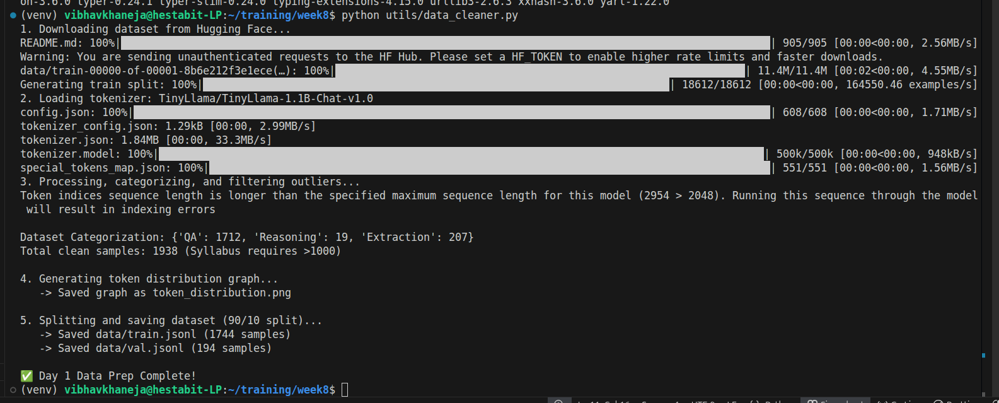

# LLM ARCHITECTURE + DATA PREP FOR FINE-TUNING

## Transformer: The Core Anatomy of an LLM

Underneath the hood, an LLM is a massive mathematical engine called a Transformer. It doesn't think; it calculates probabilities.
1) **Transformer Blocks (The Assembly Line)**: A model is made up of **dozens of identical layers** called Transformer Blocks stacked on top of each other. A word goes into Layer 1, gets processed, passes to Layer 2, and so on, until the final layer predicts the next word.
2) **Attention Mechanism (The Context Engine)**: This is the breakthrough that made LLMs possible. When the model reads the word bank, Attention looks at all the surrounding words to figure out if we mean a river bank or a financial bank. It assigns mathematical **weights** connecting words to each other across a sentence.
3) **Feed-Forward Networks - FFN** (The Memory/Logic): After the Attention mechanism figures out the context of the words, the FFN processes that context. We can think of the FFN as the model's internal database of facts and logic learned during its initial training.
4) **Parameter Count vs. Performance**: Parameters are the actual numbers (weights and biases) inside the Attention and FFN layers. A 7B model has 7 billion parameters. More parameters mean the model can understand deeper nuances and hold more knowledge, but it requires exponentially more RAM to run.

## Tokenization: How the Model Reads

Tokenization & Vocab Strategy: As we saw with the AutoTokenizer in our script, LLMs don't read words. They read tokens mapped to numbers.
Coding might be one token: [8432] but Unbelievable might be split into three: un believ able [23, 442, 98]. A model's Vocabulary is its fixed dictionary of these chunks (usually around 32,000 to 100,000 unique tokens).

## Shaping the Model's Behavior

We structured our data as instruction, input, and output.

1) Pretraining vs. Instruction Tuning: * Pretraining: Google or Meta feeds terabytes of raw internet text into an empty Transformer. It learns grammar, facts, and logic just by trying to predict the next word. Result: A Base model.
2) Instruction Tuning: Base models suck at chatting. If we say Write a Python script, a base model might just output Write a Java script because it's mimicking internet lists. Instruction tuning feeds the model thousands of specific Q&A pairs so it learns the pattern of being a helpful assistant.

**Importance of Fine-Tuning:** We are not teaching the model new facts. We are slightly adjusting the parameters so the model changes its style and format to match our dataset.

### Prompt-Completion vs. Chat Format 
Older models just took a string of text and completed it. Modern models use a strict Chat Format (System Prompt => User Message => Assistant Response) to keep the AI bounded to a specific persona.

## LoRA & PEFT Fundamentals: Doing It on a Budget

LoRA & PEFT Fundamentals: Normally, fine-tuning a 7B model requires updating 7 billion parameters—which takes massive server farms. 

- PEFT (Parameter-Efficient Fine-Tuning) is the cheat code. 
- LoRA (Low-Rank Adaptation) freezes the original 7 billion parameters and just tapes a tiny, 1% cheat sheet of new parameters to the side of the model. This allows us to train an LLM on a free Colab GPU.

## Output

