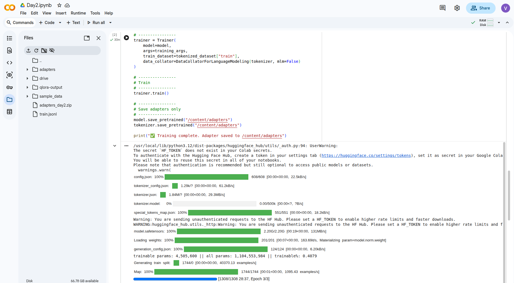
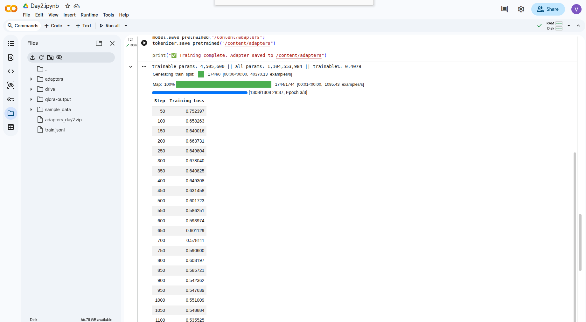
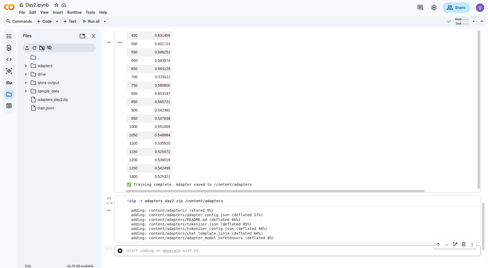

# PARAMETER-EFFICIENT FINE-TUNING (LoRA / QLoRA)

## 1. Parameter-Efficient Fine-Tuning (PEFT) & Quantization

PEFT is a methodology designed to mitigate the computational and memory overhead of fine-tuning Large Language Models. Instead of updating all parameters in the network (Full Fine-Tuning), PEFT freezes the original pre-trained weights and introduces a minimal number of trainable parameters.

This process is facilitated by the BitsAndBytes library, which provides the underlying quantization algorithms. It allows the loading of massive models into constrained GPU VRAM by compressing the base model weights into a highly optimized 4-bit NormalFloat (NF4) format.

## 2. LoRA vs. QLoRA: Architecture and Precision Mechanics

Understanding the precision lifecycle during training is critical to differentiating standard LoRA from QLoRA:

- Standard LoRA: Loads the frozen base model in 16-bit precision (FP16/BF16) and injects trainable low-rank matrices (adapters), also in 16-bit. This still requires substantial VRAM to hold the 16-bit base model during the forward and backward passes.
- QLoRA (Quantized LoRA): Optimizes memory footprint by loading the frozen base model in 4-bit precision (NF4), while simultaneously initializing the tiny, trainable LoRA adapters in 16-bit precision (FP16 or BF16).
- The Dequantization Step: During the forward and backward training passes, the required 4-bit base model weights are temporarily dequantized back to 16-bit precision. The matrix multiplication occurs in 16-bit alongside the 16-bit adapters. After the operation, the base weights are discarded from temporary memory, reverting to 4-bit storage.
- Final Output: Because the adapters must capture microscopic gradient updates, they remain in 16-bit precision throughout the entire training loop. The final saved adapter file (adapter_model.safetensors) is exported in pure 16-bit.

## 3. LoRA Hyperparameter Configuration

The architecture of the injected LoRA adapters is governed by three primary hyperparameters:

### Rank (r=16): 
Defines the intrinsic dimension of the low-rank matrices. A rank of 16 provides sufficient representational capacity for the model to learn complex, domain-specific syntax (like Python coding) while maintaining a minimal parameter footprint.

### Alpha (lora_alpha=32): 
The scaling factor applied to the LoRA adapter outputs. It dictates the magnitude of the adapter's influence on the base model's original activations. The industry standard dictates setting alpha to exactly twice the value of r to ensure stable gradient scaling.

### Dropout (lora_dropout=0.05): 
A neural network regularization technique. By randomly zeroing out 5% of the adapter's activations during each training step, it prevents the model from overfitting or purely memorizing the training dataset, forcing it to generalize the underlying logic.

## 4. Colab VRAM Optimization Techniques

To prevent Out of Memory (OOM) exceptions on hardware with limited VRAM, two advanced engineering techniques are required:

1) **Gradient Checkpointing:** A technique that trades compute time for memory efficiency. Instead of storing all intermediate activation states during the forward pass (which consumes massive VRAM), it drops them and dynamically recomputes them during the backward pass. This extends training time but dramatically reduces peak memory usage.

2) **Mixed Precision Training (fp16 or bf16):** Accelerates training by utilizing fast, memory-efficient 16-bit floating-point numbers for standard matrix multiplications, while preserving 32-bit floating-point precision (FP32) for master weights and gradient accumulations to maintain strict numerical stability.

## 5. Training Loop Hyperparameters

The execution of the optimization algorithm is controlled by the following configurations:

- **Learning Rate (lr = 2e-4):** Dictates the step size the AdamW optimizer takes when updating the adapter weights during gradient descent. A value of 2* 10^-4 times provides an optimal balance, preventing the model from overshooting the local minima while ensuring the convergence rate is not excessively slow.
- **Batch Size (per_device_train_batch_size = 4):** Defines the number of training sequences processed concurrently in a single forward/backward pass before the weights are updated.
- **Epochs (num_train_epochs = 3):** Specifies the number of complete, iterative passes over the entire training dataset. Three epochs ensure the model internalizes the instruction-following behavior without over-indexing on specific data points.

## 6. Expected Training Outputs

Upon successful execution of the training loop, the system validates the architecture by generating three key indicators:

1) Trainable Parameter Verification: The terminal logs will confirm that the trainable parameters constitute approximately ~1% (e.g., ~10M to 20M parameters) of the total model architecture, verifying that the PEFT freeze was successful.
2) Training Loss Optimization: The validation logs will demonstrate a consistently decreasing "Loss" metric across the epochs, mathematically confirming that the error rate is dropping and the model's predictive accuracy is improving.
3) Artifact Generation: The script concludes by isolating the newly updated 16-bit LoRA matrices from VRAM and saving them to the disk as persistent adapter weights (e.g., /adapters/adapter_model.safetensors).

## Output

