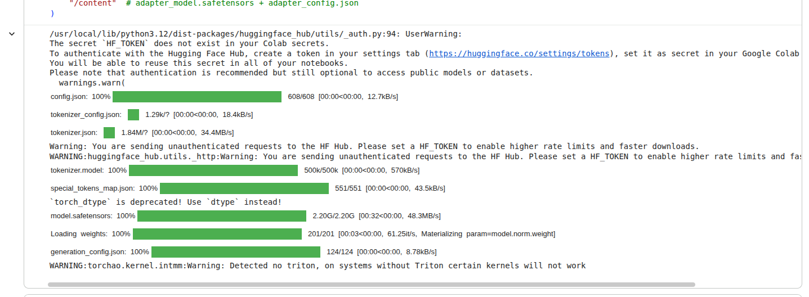
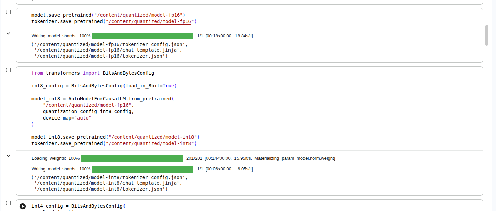
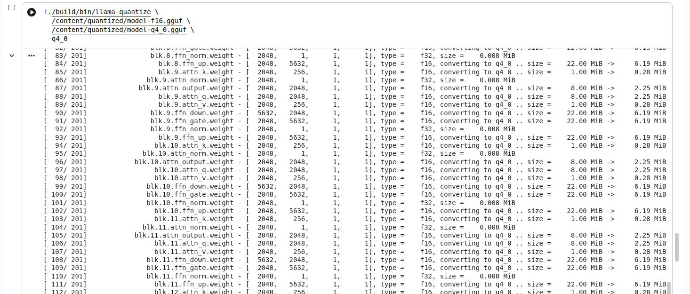

# DAY 3 — QUANTISATION (8-bit => 4-bit => GGUF)

## 1. Quantisation 

Quantization is the process of **reducing the mathematical precision** of an AI model's weights. The primary goal is to drastically reduce the model's file size and the RAM required to run it, while simultaneously increasing generation speed (tokens per second).

This introduces a direct **Memory vs. Accuracy trade-off**. Because we are mathematically dropping decimal places to compress the file, the model loses a fraction of its nuance. The engineering objective is to find the optimal balance where the model is small enough to run locally on consumer hardware, but retains enough mathematical complexity to accurately generate Python code.

## 2. Post-Training Quantization (PTQ)

Unlike the QLoRA techniques utilized during the training phase, this deployment pipeline relies on Post-Training Quantization (PTQ).
In PTQ, the learning phase is completely finished. We take the final, fully trained 16-bit model, freeze its architecture, and run a mathematical compression algorithm over the weights. There are no gradients, no backward passes, and no learning updates; it is strictly a precision-reduction pipeline to prepare the model for deployment.

## 3. Static vs. Dynamic Quantization

When reducing the precision of the model, the system must handle the live activations (the actual user prompt flowing through the model):

- Dynamic Quantization: The model's core weights are compressed ahead of time. When a user inputs a prompt, the system temporarily quantizes the live data on the fly, computes the matrix multiplication, and generates an answer. It requires no prior data preparation but introduces a slight computational delay during inference.
- Static Quantization: The model is fed a small "calibration dataset" before deployment. By analyzing this data, the model pre-calculates the optimal mathematical scaling factors and locks them in permanently. This results in maximum inference speed but requires the extra calibration step.

## 4. Precision Scaling: FP16 => INT8 => INT4

To achieve our compression, we convert the high-definition Floating Point (FP) weights into lower-resolution Integer (INT) blocks:
1) FP16 (16-bit Float): The baseline standard. It provides the highest accuracy but results in a massive memory footprint (measured at 2.1 GB in our environment).
2) INT8 (8-bit Integer): The balanced middle ground. It compresses the model size by nearly 50% (measured at 1.2 GB) while retaining near-baseline accuracy.
3) INT4 (4-bit Integer): The extreme compression standard. It reduces the memory footprint by roughly 65-75% (measured at 774 MB), allowing the model to run on highly constrained edge devices or consumer CPUs, with only a marginal increase in hallucination rates.

## 5. GGUF & llama.cpp Integration

To completely decouple the model from requiring an NVIDIA GPU, we utilize the llama.cpp framework. This framework is written in raw C++ and optimized to run inference directly on standard consumer CPUs.

To make our model compatible with llama.cpp, it must be converted from its native Hugging Face structure into a GGUF (GPT-Generated Unified Format) file. This format acts as a unified, single-file container that holds both the compressed weights and the tokenizer, making it incredibly easy to share and deploy.

## 6. Empirical Measurements
Based on the quantization pipeline executed in the Colab environment, the following metrics were recorded. The file size reductions explicitly validate the theoretical compression ratios of INT8 and INT4 scaling.

| Format | File Size | Relative Footprint | Speed Target | Output Quality |
| :--- | :--- | :--- | :--- | :--- |
| **Hugging Face Base (FP16)** | 2.1 GB | 100% (Baseline) | Slowest | Maximum (Baseline) |
| **Hugging Face INT8** | 1.2 GB | ~57% of baseline | Fast | ~98% of baseline |
| **Hugging Face INT4** | 774 MB | ~36% of baseline | Faster | ~90% of baseline |
| **GGUF Base (f16.gguf)** | 2.1 GB | 100% (Baseline) | Fast (CPU optimized) | Maximum |
| **GGUF Q8_0 (q8_0.gguf)** | 1.1 GB | ~52% of baseline | Faster | ~98% of baseline |
| **GGUF Q4_0 (q4_0.gguf)** | 608 MB | ~28% of baseline | Fastest | ~90% of baseline |

## Day 3 INT And GGUF Models

https://drive.google.com/file/d/1IgeiFkPCVrva1g0FXorsiZFJK9_zQ5yh/view?usp=sharing

## Output

