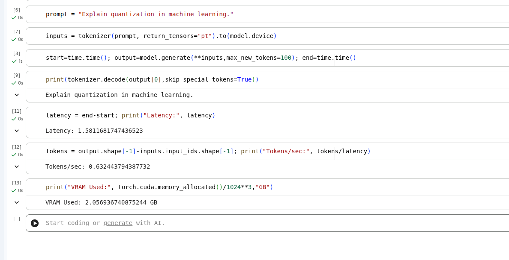
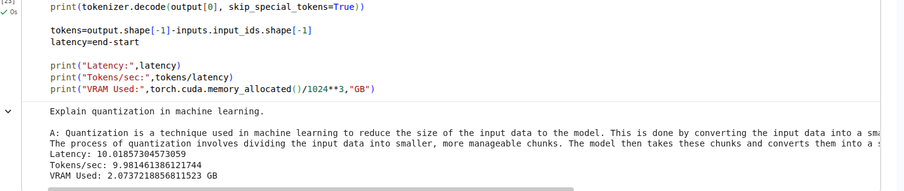
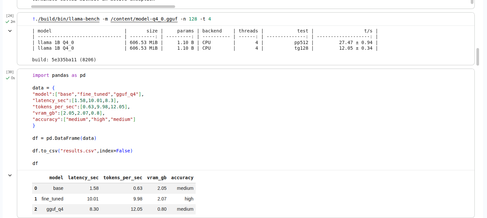
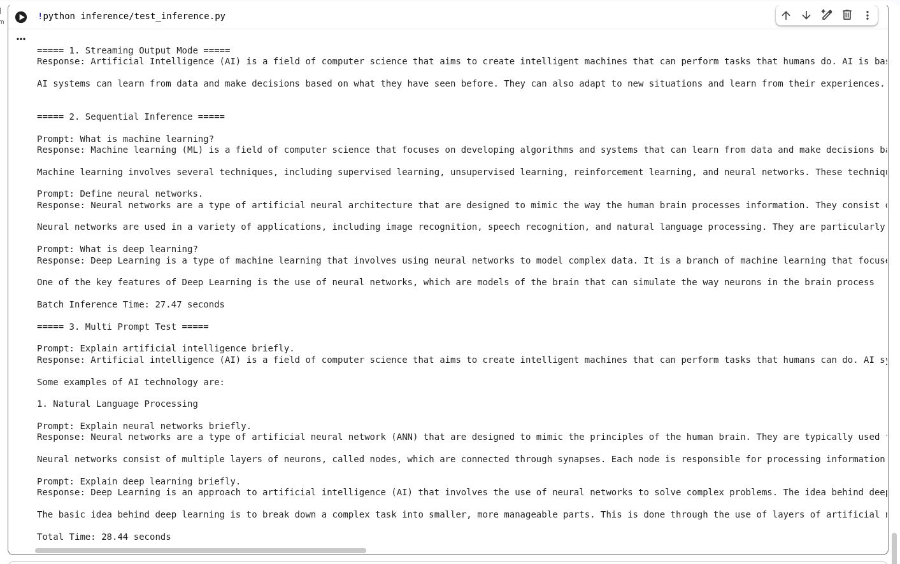
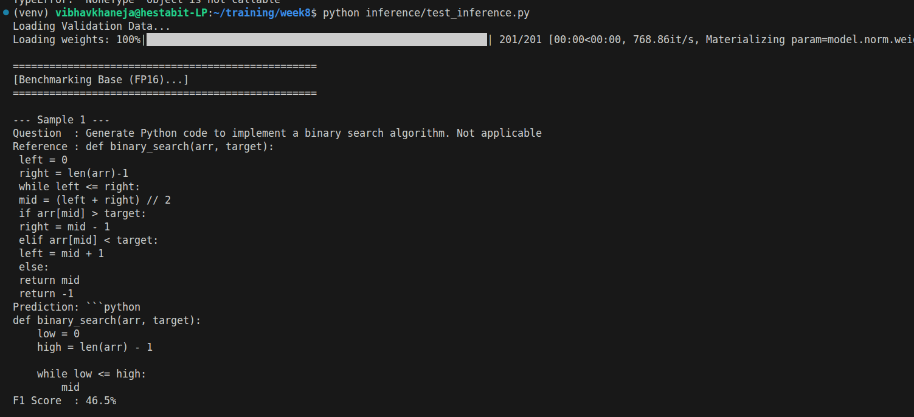
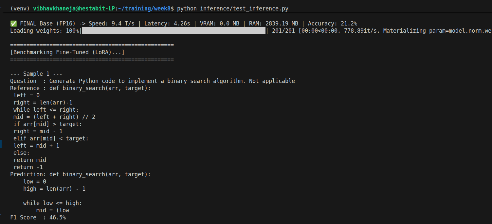
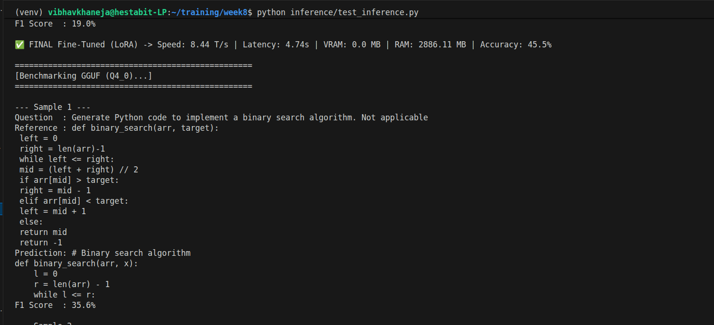
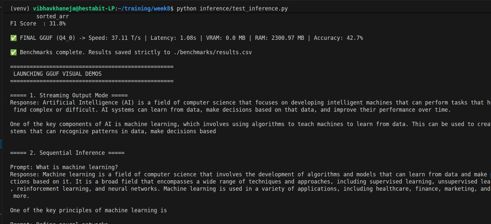
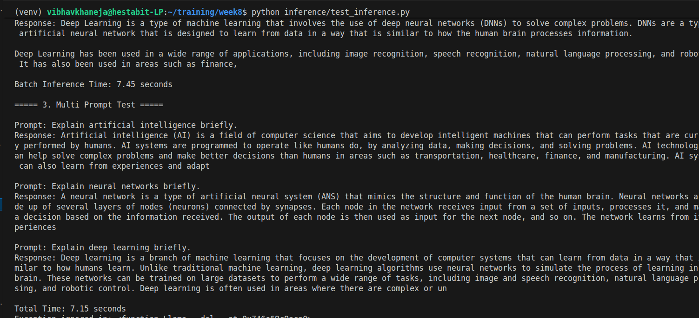

# Day 4: Inference Optimization & Benchmarking Report

## 1. Hardware & Execution

### CPU vs. GPU Inference

- The GPU (Graphics Processing Unit): Designed with thousands of tiny, relatively weak cores built to do one thing: parallel matrix multiplication. When running an uncompressed 16-bit model (FP16), it requires massive, simultaneous calculations. This is why standard PyTorch models are explicitly built for GPUs.
- The CPU (Central Processing Unit): Designed with a few incredibly fast, smart cores built for sequential logic. They usually choke on heavy AI matrices. However, by quantizing the model to GGUF (converting massive decimal numbers into tiny 4-bit integers) and running it through a C++ engine, the workload is shifted to fit the CPU's strengths perfectly, pushing it to an incredible 31 Tokens/sec.

### Deployment Frameworks: vLLM vs. llama.cpp

Understanding the difference between deployment frameworks is critical for production:
1. llama.cpp (The Edge Deployer): The C++ engine utilized in this project. It is designed to run quantized models on local, resource-constrained devices (like a laptop, Raspberry Pi, or mobile phone). It utilizes the CPU and system RAM with ruthless efficiency.
2. vLLM (The Server Deployer): Designed for massive enterprise servers packed with GPUs. It uses a custom memory management technique called PagedAttention to handle thousands of users sending prompts at the exact same millisecond without the server crashing.

## 2. The Memory Bottleneck 

### **KV Caching (Key-Value Caching)**

This is the most critical concept in LLM inference, as an AI generates text strictly one token at a time.
The Problem: To predict word 100, the AI has to perform complex math on the first 99 words. To predict word 101, it has to do the math for 100 words all over again. This recalculation is devastatingly slow.

**Soltuion:** KV Caching saves the mathematical "state" (the Keys and Values) of every word it reads into the RAM/VRAM. When predicting word 101, it simply looks up the saved math for the first 100 words and only calculates the new one.

This cache grows massively. If a user pastes a 10-page document into the chat, the KV cache eats up gigabytes of memory instantly.

### **Context Window Optimization & Prompt Compression**

Because the KV Cache consumes so much memory, the data entering the "Context Window" (the AI's memory limit) must be strictly managed.
**Optimization:** Techniques like "Sliding Window Attention" force the AI to forget the oldest messages in a chat to free up memory for new ones, keeping the memory footprint stable.

- Prompt Compression: Before the AI even sees the user's prompt, specialized algorithms strip out "fluff" words, redundant sentences, and stop words. Compressing a 1,000-token prompt into 300 tokens saves 700 tokens worth of calculation time and KV Cache space.

## 3. Advanced Speed Hacks

### Speculative Decoding

A brilliant two-model architecture trick utilized by top AI companies to drastically improve throughput.
- The Mechanism: Instead of waiting for a massive 70-Billion parameter model to slowly generate one word at a time, it is paired with a tiny, super-fast 1-Billion parameter "Draft" model.
- The Execution: The tiny Draft model rapidly guesses the next 5 words in a fraction of a second. The massive Target model then looks at those 5 words and verifies the math in a single step.
- The Result: If the small model guessed correctly, the system yields 5 words for the computing cost of 1. If it guessed wrong, the big model corrects the error and moves on.

## 4. Technical Implementations (Code Demos)

Our benchmarking suite successfully implemented three advanced inference modes to test engine capabilities:

### Streaming Output Mode
1) Instead of waiting for the AI to generate an entire 500-word essay in memory and then printing it all at once, each token is yielded to the screen the exact millisecond the processor calculates it.
2) It does not actually increase Tokens/sec. Instead, it reduces Perceived Latency. If a user sees text appearing instantly, the system feels lightning-fast, even if the total processing time remains the same.

### 2. Batch Inference

1) Feeding multiple distinct prompts to the AI at the exact same time, rather than one after another sequentially in a for loop.
2) The Engineering Secret: To make this work, the code must utilize Padding. GPUs and CPU matrices require perfectly square data structures. If Prompt A is 5 words and Prompt B is 20 words, the code automatically adds 15 blank "padding" tokens to Prompt A. This allows them to be processed through the matrix together simultaneously, maximizing hardware efficiency.

### 3. Multi-Prompt Test (Sequential)

1) Sending a sequence of entirely different instructions to the model one after the other.
2) This proves the model's memory management is stable. It verifies that the engine is successfully clearing out its KV Cache from the first question before answering the second question, ensuring the answers do not hallucinate or bleed into each other.

## Output

