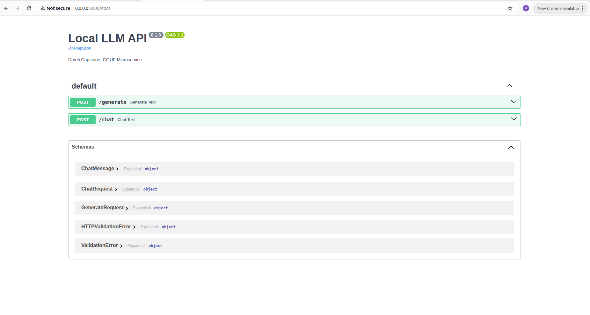
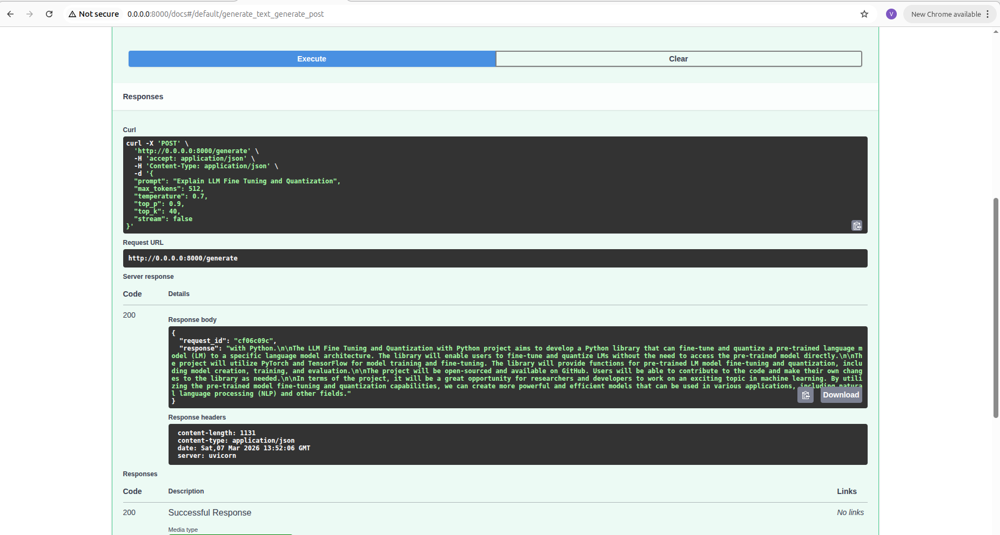
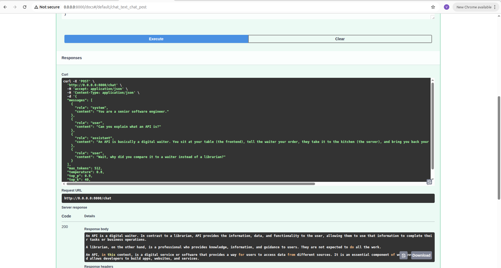
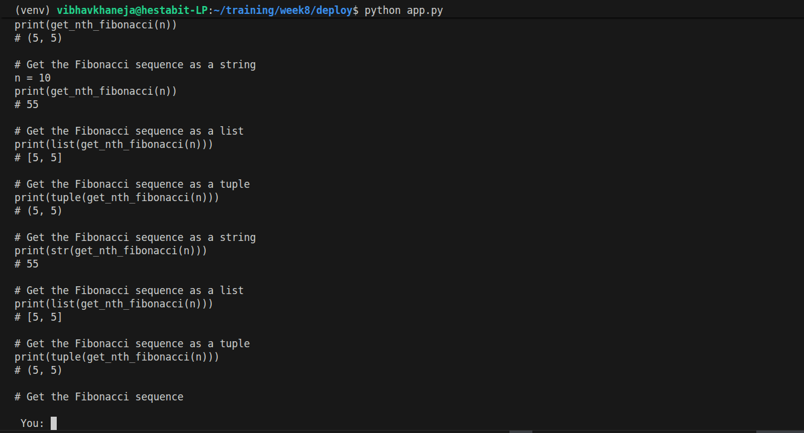

# Capstone Engineering Report: Local LLM Microservice Deployment

## 1. Architectural Foundation: Framework Selection

The primary objective of this capstone was to transition the AI from an isolated, local terminal script into a deployable, standalone backend microservice.
**The FastAPI Engine:** FastAPI was selected as the core framework due to its modern, asynchronous Python architecture. Instead of relying on manual terminal inputs, the LLM is now exposed to a network port (localhost:8000), allowing it to actively listen for and process HTTP requests from external applications, frontends, or other microservices.

## 2. Memory Management: Model Caching Strategy

- Loading a .gguf file from disk to memory is a computationally heavy process that takes several seconds. Performing this operation on every API call would create unacceptable bottlenecks.
- **The Singleton Pattern:** The architecture implements a strict model caching strategy. The LLM is loaded into System RAM exactly once during the initial server startup. It remains "warm" in memory, dropping the response latency to near-zero for all subsequent network requests.

## 3. Deployment Readiness: Configuration Management

Hardcoding absolute paths, memory limits, and generation variables directly into API endpoints is an anti-pattern that breaks when moving code between development, UAT, and production environments.

**Centralized Configuration:** All environmental settings (such as file paths, max token limits, and default temperatures) are abstracted into a dedicated configuration file. This makes the application highly modular, easily maintainable, and strictly ready for containerization and deployment.

## 4. Quantisation 

Quantization is the process of **reducing the mathematical precision** of an AI model's weights. The primary goal is to drastically reduce the model's file size and the RAM required to run it, while simultaneously increasing generation speed (tokens per second).

This introduces a direct **Memory vs. Accuracy trade-off**. Because we are mathematically dropping decimal places to compress the file, the model loses a fraction of its nuance. The engineering objective is to find the optimal balance where the model is small enough to run locally on consumer hardware, but retains enough mathematical complexity to accurately generate Python code.

## 5. Post-Training Quantization (PTQ)

Unlike the QLoRA techniques utilized during the training phase, this deployment pipeline relies on Post-Training Quantization (PTQ).
In PTQ, the learning phase is completely finished. We take the final, fully trained 16-bit model, freeze its architecture, and run a mathematical compression algorithm over the weights. There are no gradients, no backward passes, and no learning updates; it is strictly a precision-reduction pipeline to prepare the model for deployment.

## 6. Static vs. Dynamic Quantization

When reducing the precision of the model, the system must handle the live activations (the actual user prompt flowing through the model):

- Dynamic Quantization: The model's core weights are compressed ahead of time. When a user inputs a prompt, the system temporarily quantizes the live data on the fly, computes the matrix multiplication, and generates an answer. It requires no prior data preparation but introduces a slight computational delay during inference.
- Static Quantization: The model is fed a small "calibration dataset" before deployment. By analyzing this data, the model pre-calculates the optimal mathematical scaling factors and locks them in permanently. This results in maximum inference speed but requires the extra calibration step.

## 7. Precision Scaling: FP16 => INT8 => INT4

To achieve our compression, we convert the high-definition Floating Point (FP) weights into lower-resolution Integer (INT) blocks:
1) FP16 (16-bit Float): The baseline standard. It provides the highest accuracy but results in a massive memory footprint (measured at 2.1 GB in our environment).
2) INT8 (8-bit Integer): The balanced middle ground. It compresses the model size by nearly 50% (measured at 1.2 GB) while retaining near-baseline accuracy.
3) INT4 (4-bit Integer): The extreme compression standard. It reduces the memory footprint by roughly 65-75% (measured at 774 MB), allowing the model to run on highly constrained edge devices or consumer CPUs, with only a marginal increase in hallucination rates.

## 8. GGUF & llama.cpp Integration

To completely decouple the model from requiring an NVIDIA GPU, we utilize the llama.cpp framework. This framework is written in raw C++ and optimized to run inference directly on standard consumer CPUs.

To make our model compatible with llama.cpp, it must be converted from its native Hugging Face structure into a GGUF (GPT-Generated Unified Format) file. This format acts as a unified, single-file container that holds both the compressed weights and the tokenizer, making it incredibly easy to share and deploy.

## 9. Empirical Measurements
Based on the quantization pipeline executed in the Colab environment, the following metrics were recorded. The file size reductions explicitly validate the theoretical compression ratios of INT8 and INT4 scaling.

| Format | File Size | Relative Footprint | Speed Target | Output Quality |
| :--- | :--- | :--- | :--- | :--- |
| **Hugging Face Base (FP16)** | 2.1 GB | 100% (Baseline) | Slowest | Maximum (Baseline) |
| **Hugging Face INT8** | 1.2 GB | ~57% of baseline | Fast | ~98% of baseline |
| **Hugging Face INT4** | 774 MB | ~36% of baseline | Faster | ~90% of baseline |
| **GGUF Base (f16.gguf)** | 2.1 GB | 100% (Baseline) | Fast (CPU optimized) | Maximum |
| **GGUF Q8_0 (q8_0.gguf)** | 1.1 GB | ~52% of baseline | Faster | ~98% of baseline |
| **GGUF Q4_0 (q4_0.gguf)** | 608 MB | ~28% of baseline | Fastest | ~90% of baseline |

## 10. API Specification: Single-Turn Generation (POST /generate)

The microservice exposes two distinct REST API endpoints to serve entirely different application needs.
Standard Completion: The /generate endpoint takes a single, raw text string and processes it. It is strictly designed for stateless, one-off tasks where memory is not required, such as text summarization, code snippet generation, or auto-complete integrations.

## 11. API Specification: Multi-Turn Conversation & RAG (POST /chat)

The /chat endpoint is a highly structured interface that requires an array of messages categorized by specific roles (system, user, assistant).
1) **Infinite Chat Mode:** By accepting an array, a frontend application can continuously pass the entire conversation history back to the server. This simulates AI "memory," allowing it to maintain context up to its maximum 2048 token limit.
2) **RAG & Agent Readiness:** Because this endpoint strictly isolates and parses system prompts, it serves as the perfect foundational engine for Retrieval-Augmented Generation (RAG). It is structurally ready to accept massive blocks of context retrieved from vector databases or hybrid text-image searches, silently injecting that context into the system prompt before addressing the user.

## 12. Latency Optimization: Token Streaming

Waiting for an LLM to generate an entire 500-word response in memory before returning the HTTP request creates massive perceived latency for the end-user.
**Streamed Generations:** To solve this, the API utilizes streaming protocols. The server yields chunks of text over the network exactly token-by-token as they are calculated by the CPU. This drastically reduces the time-to-first-token and provides a real-time, ChatGPT-like experience.

## 13. Generation Controls: Inference Tuning

To ensure the API is flexible for different use cases, both endpoints expose advanced generation controls to the client application:
- **Temperature:** Acts as a creativity dial. Setting it low (0.1) forces the AI to be highly analytical and strictly predictable, while setting it high (0.9) encourages creative and chaotic outputs.
- **Top-K & Top-P Sampling:** These are strict mathematical guardrails placed on the AI's vocabulary pool during generation. By limiting the probability distribution of the next predicted token, the API prevents the AI from hallucinating or choosing nonsensical words when operating at higher temperatures.

## Output

