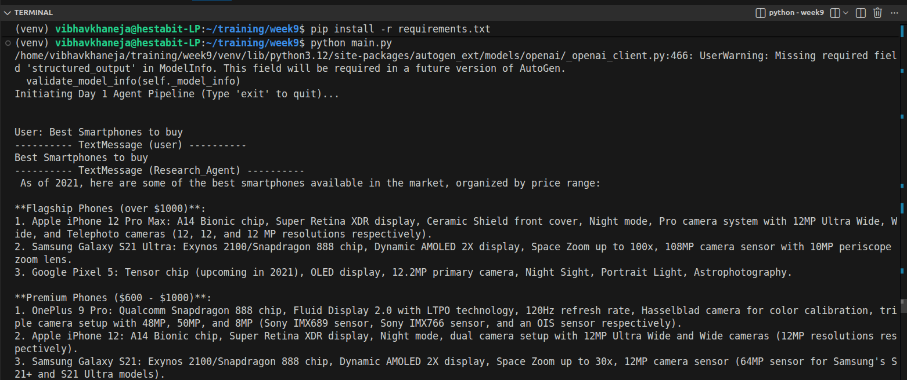
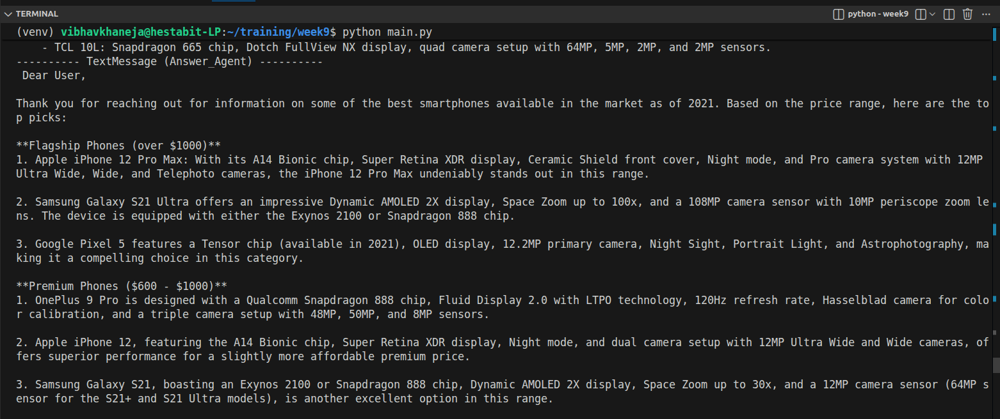
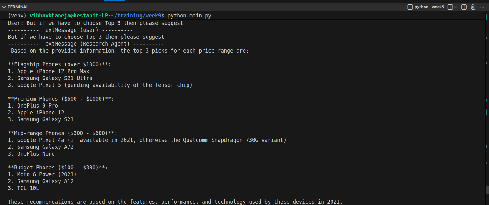
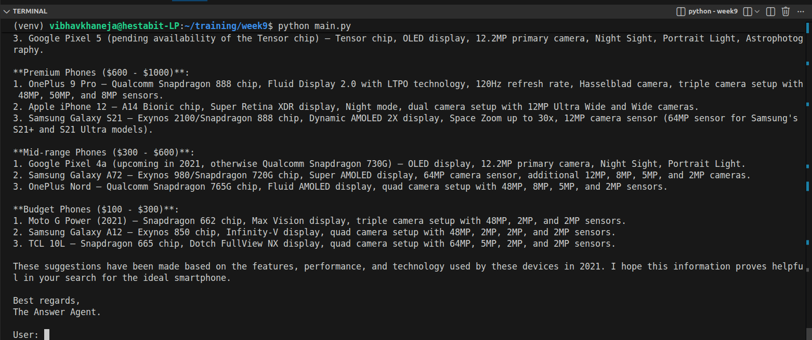

# Agent Foundations & Message-Based Communication

## 1. Agent vs. Chatbot vs. Pipeline

1) **The Chatbot (Reactive & Stateless):** A system that maps an input prompt to an output string. It has no autonomy. If it makes a mistake, the human must prompt it to fix it.
2) **The Pipeline (Rigid & Linear):** A hardcoded sequence of operations (Step A → Step B → Step C). It is automated but not autonomous. If Step B encounters an unexpected error, the pipeline crashes.
3) **The AI Agent (Autonomous & Stateful):** An entity that perceives its environment, reasons about its goal, and takes independent actions to achieve that goal. It maintains an internal state, remembers past actions, and can correct its own course when encountering errors.

## 2. The ReAct Pattern (Reason + Act): The Agent's Brain

The ReAct pattern is the exact mechanism that turns a standard text-generator into an autonomous worker. 
Normally, if you ask a Large Language Model a question it doesn't know, it will try to predict the answer anyway, resulting in a **hallucination**. ReAct fixes this by forcing the AI to maintain an internal monologue—interleaving "thinking" with "doing."

Instead of just spitting out an answer, the agent executes a continuous loop:
### 1. Perception (The Input): The agent reads and processes its current state. It ingests the user's request ("What is the current weather in Noida?"), reviews its strict system prompt constraints, and scans the JSON schemas of the tools it has been provided.

### 2. Reasoning (The Thought): Based on what it just perceived, the agent analyzes the gap in its knowledge. It writes a hidden internal thought: "I see the user wants the live weather. I do not have real-time data in my weights. I need to trigger the get_weather tool."

### 3. Action (The Act): The agent halts normal conversational text generation. Instead, it generates a structured command (in AutoGen 0.7.5, this is emitted as a ToolCallRequestEvent).

### 4.Observation (The Feedback): The AutoGen framework intercepts that command, executes the actual Python function on your machine, and feeds the raw result (32°C) back into the agent's context window (a ToolCallExecutionEvent).

By forcing the model to explain its reasoning before taking an action, we drastically reduce errors and allow the agent to correct itself if a tool fails.

## 3. Role Isolation & System Prompts

Open-weight models like Mistral or Phi-3 are incredibly powerful but suffer from "attention dilution" if given complex, multi-step instructions.
**Role isolation** solves this by breaking a massive task into micro-agents. 
* Instead of one agent trying to research, summarize, and write an email, we build three distinct agents. 
* Each agent receives a hyper-focused **System Prompt** defining a singular, strict boundary (e.g., "You are the Summarizer Agent. Your strict role is to condense raw data into bullet points. Do not add external facts."). This prevents hallucination and keeps the logic clean.

## 4. LLM as a Tool Executor
In an agentic system, the Large Language Model is not just a text generator; it is the reasoning engine that routes execution. By defining tools (like a Python executor or a database query function), the LLM learns to output structured JSON to trigger local code. 

## 5. Message Protocol Systems (AutoGen 0.7.5)
In the modern AutoGen `0.7.5` architecture, agents communicate via an asynchronous, event-driven **Message Protocol**.
1) Data is passed as structured objects, not just raw strings.
2) In our Day 1 architecture, we use a `RoundRobinGroupChat` to enforce a strict, linear message protocol: `User → Researcher → Summarizer → Answerer`. 

## 6. State Management & The Memory Window
To prevent the system from exhausting its context limit or getting confused by old data, we implement strict state management. 
* By utilizing `BufferedChatCompletionContext(buffer_size=10)`, we enforce a strict memory window of exactly 10 memory prompts. 
* This ensures the agent only focuses on the most immediate, relevant context, acting as a highly efficient short-term working memory for local open models.

## Output

