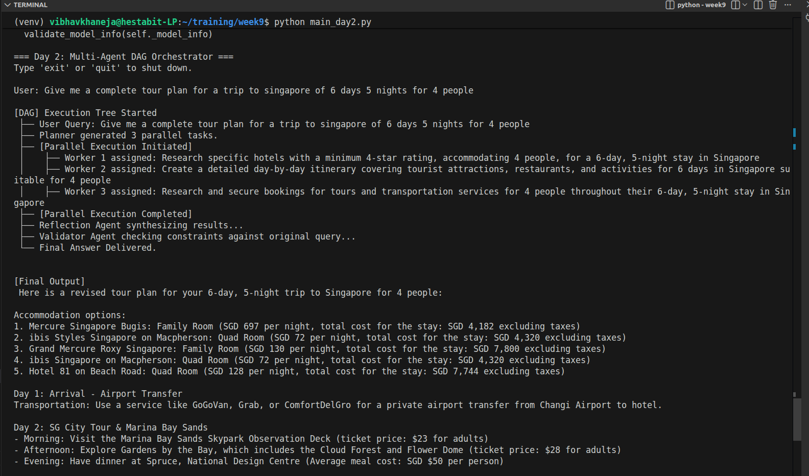
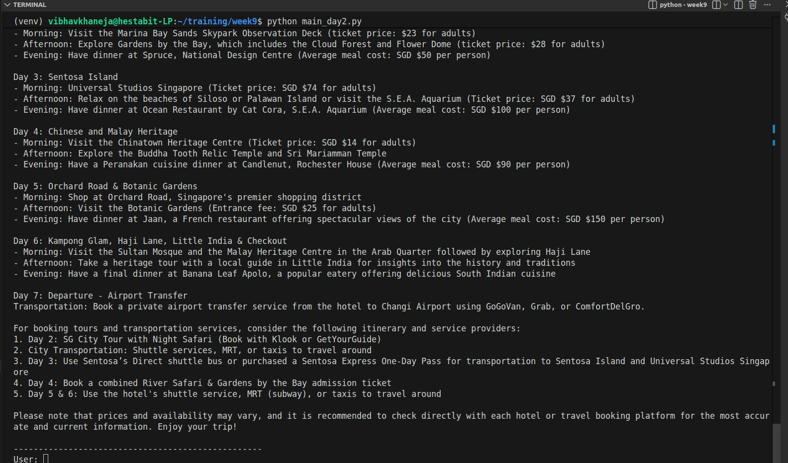

# MULTI-AGENT ORCHESTRATION (PLANNER → WORKERS → VALIDATOR)

## Designing Agent Hierarchies

Instead of throwing multiple AI agents into a single chatroom and hoping they figure it out (a "flat" structure), we design strict vertical layers. You have management layers (Orchestrators/Planners) and labor layers (Workers). This hierarchy prevents agents from talking over each other, getting confused about their roles, or repeating work.

## Task Planning

Before a single piece of data is gathered, the system must pause and think. Task planning is the process of using an LLM strictly to analyze a large, complex prompt and decompose it into bite-sized, independent missions.

## Delegation Logic

Once a plan is created, the system needs logic to assign it. Delegation is how the Orchestrator routes specific strings of text to specific Worker agents. In your code, this was the Python loop that took the parsed Task 1|Task 2 string and spun up isolated workers for each distinct piece.

## Chain-of-Command Structure

Workers do not talk to Workers. If the Hotel Worker and the Transport Worker converse directly, they risk entering an infinite loop of hallucinations. A strict chain-of-command ensures Workers only report their findings back up to the Orchestrator, which then passes the data to the Synthesizer (Reflection Agent).

## Planner–Executor Architecture

This is the industry standard for reducing AI hallucinations.
- The Planner (The Brain): Highly capable of logic and breaking down constraints, but it is forbidden from actually answering the user's prompt.
- The Executors (The Hands): Highly focused agents that only know about their specific subtask. They execute blindly and report back.
By separating the "thinking" from the "doing," the overall system becomes highly reliable.

## DAG-Based Execution (Directed Acyclic Graph)

A DAG is a data pipeline that moves in one direction (Acyclic) but can split and merge (Graph).

Directed: The workflow only moves forward (User -> Planner -> Workers -> Reflection -> Validator). It never loops backward indefinitely.

Graph: It supports parallel execution. The Orchestrator "fans out" the workload to multiple Workers simultaneously and "fans in" the results to the Reflection agent, saving massive amounts of processing time compared to doing it sequentially.


```
                              [ USER QUERY ]
                                    │
                                    ▼
                             ┌─────────────┐
(Sequential Execution)       │   Planner   │──► Reads query & generates subtasks
                             └──────┬──────┘
                                    │
                          [ "Task 1 | Task 2 | Task 3" ]
                        [ Parsed dynamically by Python ]
                                    │
                      (Parallel Execution Fan-Out)
                ┌───────────────────┼───────────────────┐
                ▼                   ▼                   ▼
         ┌────────────┐      ┌────────────┐      ┌────────────┐
         │  Worker 1  │      │  Worker 2  │      │  Worker 3  │
         │  (Hotels)  │      │(Itinerary) │      │(Transport) │
         └──────┬─────┘      └──────┬─────┘      └──────┬─────┘
           (Parallel)          (Parallel)          (Parallel)
                │                   │                   │
                └───────────────────┼───────────────────┘
                                    │
                        (Join / Fan-In Execution)
                   [ Orchestrator awaits all branches ]
                   [ Payload: Worker 1 + 2 + 3 combined ]
                                    │
                                    ▼
                          ┌──────────────────┐
(Sequential Execution)    │ Reflection Agent │──► Synthesizes disconnected data
                          └─────────┬────────┘
                                    │
                          [ Output: Draft Response ]
                  [ Payload: Original Query + Draft Response ]
                                    │
                                    ▼
                          ┌──────────────────┐
(Sequential Execution)    │ Validator Agent  │──► Enforces numerical constraints
                          └─────────┬────────┘
                                    │
                                    ▼
                            [ FINAL ANSWER ]
```

## Task Graph Generation
A static pipeline always runs the same three steps. A dynamic Task Graph builds itself at runtime. Because your Planner agent dynamically decided to generate either 2, 3, or 4 subtasks based on the user's prompt, the Python Orchestrator had to generate a unique execution graph on the fly to match that specific plan.

## Agent Registry Pattern
When building dynamic DAGs, you cannot hardcode exactly three Worker agents at the top of your script, because you don't know how many tasks the Planner will create. The Agent Registry Pattern (which we implemented via the get_worker_agent() factory function) allows the system to spin up, register, and assign newly minted agents on demand, scaling perfectly to the size of the task.


## Our Working Model

## 1. Agent Archetypes & Responsibilities

### The Planner Agent (The Strategist)
1) **Role:** Task Decomposition and Delegation.
2) **Function:** The Planner is the only agent that looks at the entire scope of the user's initial query. It does not attempt to solve the problem. Instead, it acts as a project manager, breaking the overarching goal into `N` distinct, hyper-specific subtasks. 
3) **Output:** A strict, machine-readable format (e.g., a delimited string) containing the individual task assignments, ensuring every constraint from the original prompt is passed down.

### The Worker Agents (The Executors)
1) **Role:** Focused, Parallel Execution.
2) **Function:** Workers are dynamically instantiated based on the Planner's output. Each Worker receives exactly one subtask and is completely blind to the overarching goal and to the existence of the other Workers. This strict isolation forces the model to focus 100% of its attention on executing a single, narrow objective.
3) **Output:** Raw, highly detailed data or logic specific to their assigned subtask.

### The Reflection Agent (The Synthesizer)
1) **Role:** Data Aggregation and Narrative Formulation.
2) **Function:** Operating as the "Reducer" in a Map-Reduce paradigm, the Reflection Agent waits for all parallel Workers to finish. It then ingests their disjointed outputs simultaneously. Its sole job is to resolve overlaps, establish logical transitions, and weave the fragmented data into a single, cohesive draft.
3) **Output:** A unified, structured draft response.

### The Validator Agent (The QA Gatekeeper)
1) **Role:** Constraint Verification and Error Correction.
2) **Function:** The Validator acts as the final safety mechanism before the user sees the output. It is fed both the *Original User Query* and the *Reflection Agent's Draft*. It cross-references the draft against the original prompt to ensure no numerical, logical, or formatting constraints were dropped during the synthesis phase. If it detects a missing element, it self-corrects the draft.
3) **Output:** The final, polished, and verified answer delivered to the user.

### 2. The Execution Pipeline (Data Flow)

The system operates in a strict, four-phase chronological loop, utilizing both sequential and parallel processing:

1. **Phase 1: Ingestion & Decomposition (Sequential)**
   * The system receives the user query.
   * The Planner evaluates the query and generates an execution graph of subtasks.
   * The underlying Orchestrator (Python) dynamically parses this plan.

2. **Phase 2: Fan-Out Execution (Parallel)**
   * The Orchestrator spins up the required number of Worker agents.
   * Tasks are dispatched simultaneously (Fan-Out). All Workers process their unique prompts concurrently, drastically reducing overall system latency.

3. **Phase 3: Fan-In Synthesis (Sequential)**
   * The system pauses until the slowest Worker completes its task.
   * The Orchestrator gathers all Worker outputs (Fan-In) and concatenates them into a single payload.
   * The Reflection Agent processes this massive context block and drafts the unified response.

4. **Phase 4: Quality Assurance (Sequential)**
   * The Orchestrator packages the original query alongside the draft.
   * The Validator performs a strict compliance check, applies any necessary patches, and returns the final output.



