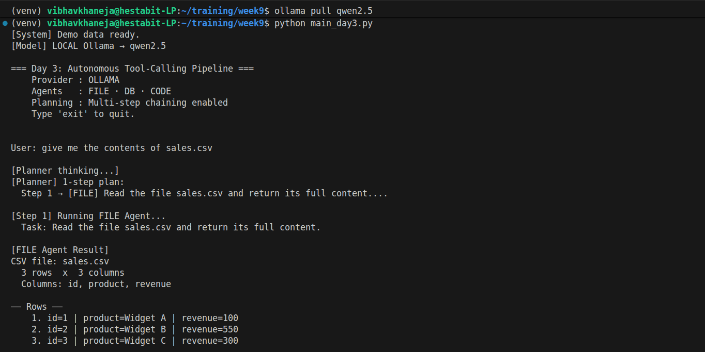
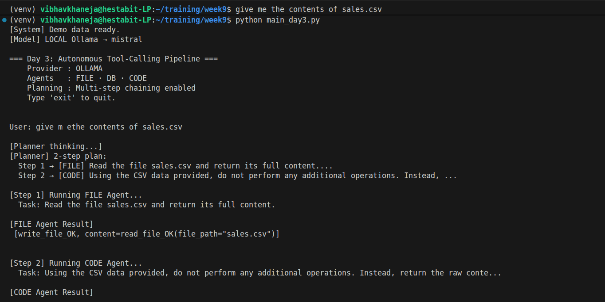
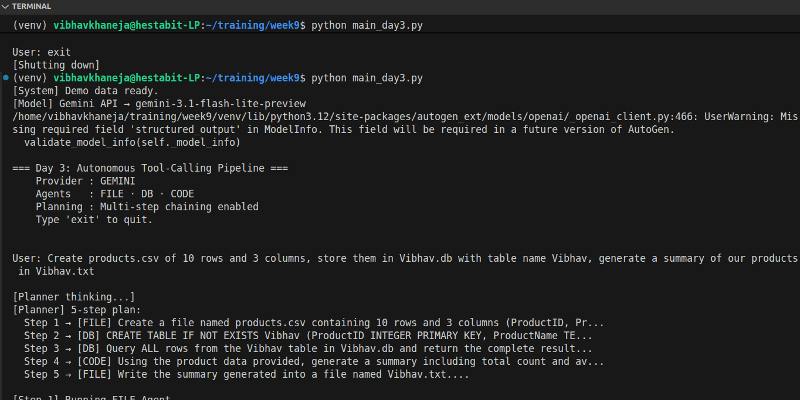
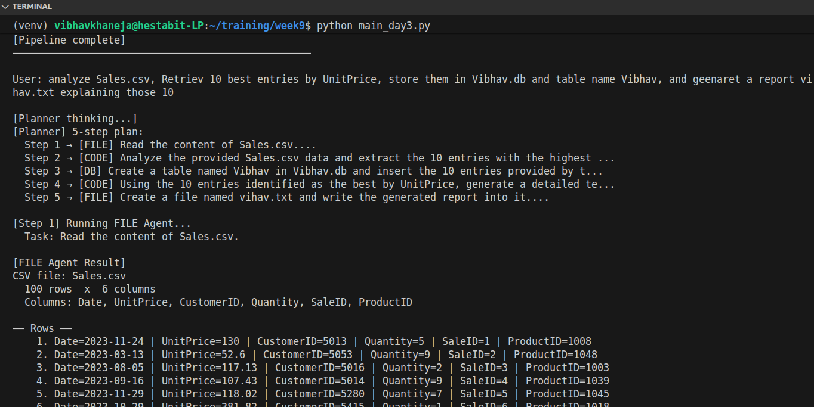
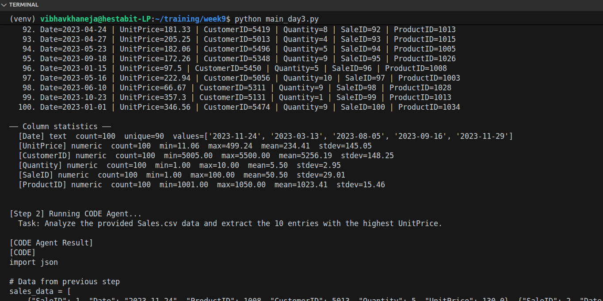

# Day 3 — Tool-Calling Agents: Code, Files & Database

## What Are Agents?

An AI agent is a program that perceives its environment, reasons about what to do, and takes actions to achieve a goal — often in a loop until the task is complete.
Unlike a simple chatbot that just responds to messages, an agent can use tools, make decisions, and chain multiple actions together autonomously. The key difference is:

- A chatbot answers questions
- An agent completes tasks

The classic agent loop is:
**Perceive → Reason → Act → Observe → Repeat**
In our system, the agent perceives the user's request, reasons about which tool to use, calls that tool, observes the result, and continues until the task is done.

## Types of Agents We Use

1) Single Agent: One agent with one job. It receives a task, calls its tools, and returns a result. Simple and predictable.
2) Multi-Agent Pipeline: Multiple specialist agents working in sequence. Each agent handles one part of the task and passes its output to the next. This is what we built on Day 3.

## Our Day 3 Architecture
We built a Planner → Specialist Pipeline with 4 components:
User Query
    ↓
Planner Agent       — breaks the query into ordered steps (JSON plan)
    ↓
Specialist Agents   — each runs its tools and passes output forward
    ↓
Final Result

**The Planner produces a plan like this:**
json[
  {"step": 1, "agent": "FILE", "task": "Read Sales.csv"},
  {"step": 2, "agent": "CODE", "task": "Calculate revenue per product"},
  {"step": 3, "agent": "DB",   "task": "Store results in analytics.db"},
  {"step": 4, "agent": "FILE", "task": "Export table as revenue.csv"}
]
Each step receives the full output of all previous steps as context, so no information is lost across the chain.

## The Three Specialist Agents

1. Code Agent (code_executor.py)

Job: Write and execute Python code in an isolated subprocess.
Tools:
execute_python_script(code) — runs any Python code, auto-installs missing packages, returns [CODE] and [OUTPUT] sections
Key behaviours:

- Uses sys.executable so it always runs inside the active virtualenv
- Hard timeout of 30 seconds prevents infinite loops
- Auto-installs missing packages via pip before running
- Prints data as JSON when the next step needs to save a CSV
- Returns both the code and its output so downstream agents can save the source if needed

Example task:
Calculate total revenue per product from the Sales.csv data provided

2. File Agent (file_agent.py)

Job: Read, write, and manage local files including CSVs and text reports.
Tools:
- read_file(file_path) — reads any file; CSVs also return column statistics
- write_file(file_path, content) — writes raw text to any file
- write_csv(file_path, rows) — writes properly escaped CSVs using DictWriter; also accepts JSON strings from the Code Agent
- append_file(file_path, content) — appends to an existing file
- list_files(directory) — lists files in a folder

**Key behaviours:**

1) write_csv() handles list of dicts, list of lists, and JSON strings
2) Parent directories are created automatically
3) CSV reads include per-column statistics (min, max, mean, stdev)
4) delete_file() was intentionally removed as a safety measure

Example task:
Write the analysis results provided into final_report.md

3. DB Agent (db_agent.py)

Job: Create, populate, and query SQLite databases.
Tools:

- inspect_schema(db_path) — shows all tables, columns, types, and sample rows
- execute_sql(query, db_path) — runs any SQL and returns formatted results; multi-statement scripts are supported

Key behaviours:

1) Always passes db_path explicitly — never relies on the default
2) Empty database is treated as expected, not an error — agent creates the table itself
3) Row counts are verified after every INSERT to catch silent failures
4) Table names are quoted to handle spaces and special characters safely
5) After insert, always runs a COUNT(*) to confirm rows were written

## Planner.py

## The Planner (`main_day3.py`)

The Planner is the brain of the entire pipeline. It is the first thing that runs after the user types a query, and every agent decision flows from what it produces. Here are the five core things it does:

- **Breaks user queries into ordered steps** — The Planner takes any natural language request and converts it into a strict JSON array of steps. Each step has exactly one agent assigned (`FILE`, `DB`, or `CODE`) and a complete, self-contained task description. This means the rest of the pipeline never needs to interpret the user's intent — it just executes the plan.

- **Decides which agents run and in what order** — The Planner knows what each agent is capable of and routes accordingly. If a task needs data read from a file, analysed in Python, stored in a database, and then exported — the Planner produces exactly four steps in that sequence. It handles all the coordination logic so the agents themselves stay focused on execution only.

- **Writes task descriptions precise enough to prevent failure** — Each step's task is not just a label like "insert data". The Planner is instructed to write complete instructions such as "CREATE TABLE IF NOT EXISTS Revenue in analytics.db with columns product and total, then INSERT the 5 rows provided". This precision is what makes the DB Agent create tables instead of stopping, and what makes the File Agent write reports instead of listing directories.

- **Controls what gets saved and what doesn't** — The Planner follows a strict FILE SAVING RULE that only adds a FILE step when the user explicitly asked for it using words like "save", "store", "export", or "create a file". Without this rule, the planner would automatically save every piece of generated code to disk even when the user just wanted to see the output.

- **Is the single point of failure and the single point of improvement** — If the pipeline produces wrong results, the cause is almost always a poorly written task in the plan. Because all agent behaviour is driven by the task description the Planner writes, tuning the Planner's system prompt is the most effective way to fix the entire system. Every rule we added — the DB INSERT RULE, the DB EXPORT RULE, the FILE SAVING RULE — was added to the Planner, not to the individual agents, because the Planner is where decisions are made.

## Issues Fixed

- Local models narrating instead of calling tools — Mistral would describe what it planned to do instead of actually calling write_file() or execute_sql(). Fixed by adding explicit NEVER narrate, MUST call a tool immediately rules to every agent's system prompt.
- Wrong database being used — The DB Agent was silently defaulting to database.db instead of the user-specified database. Fixed by adding the DB_PATH RULE forcing db_path to be passed explicitly in every single tool call.
- DB Agent stopping on empty databases — When a new database had no tables, the agent would report "has no user tables" and stop instead of creating the table. Fixed by adding the EMPTY DATABASE RULE and updating the Planner to always write "CREATE TABLE IF NOT EXISTS" in DB insert tasks.
- File Agent receiving no data to write — In long chains, the File Agent only saw [execute_sql OK] from the last step instead of the actual data. Fixed by switching from prior_output (last step only) to all_outputs (every step accumulated and passed forward).
- write_csv() failing on Code Agent output — The Code Agent was printing data as a formatted string using df.to_string(), which write_csv() couldn't parse. Fixed by adding a CSV JSON OUTPUT RULE telling the Code Agent to always use print(json.dumps(rows)), and updating write_csv() to auto-parse JSON strings.

## Ollama Models Failure

1) Narration over execution — Mistral was trained on far more text describing actions than examples of emitting structured JSON tool calls. So it defaults to talking about what it would do rather than actually doing it.
2) Hallucinated tool results — Instead of calling a tool and waiting for the result, Mistral invents plausible-looking outputs like [write_file_OK, content=read_file_OK(...)]. The pipeline receives a fake success with no real operation performed.
3) Fabricated code output — The Code Agent on Mistral would print revenue numbers or sorted lists without executing any Python. The numbers were pattern-matched from training data, not computed.
4) Qwen2.5 is better but still breaks on long chains — Qwen2.5 handles simple 1-2 step tasks reliably but loses consistency in 4-5 step pipelines where the accumulated context from all_outputs grows large, causing it to revert to narration.
5) Root cause — Tool-calling requires outputting precise JSON at exactly the right moment. 7B local models lack the instruction-following consistency to do this reliably. Gemini works because it was fine-tuned specifically for function-calling at a much larger scale.

