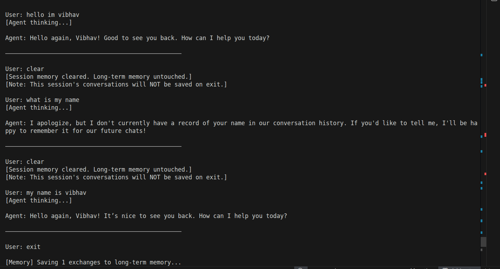
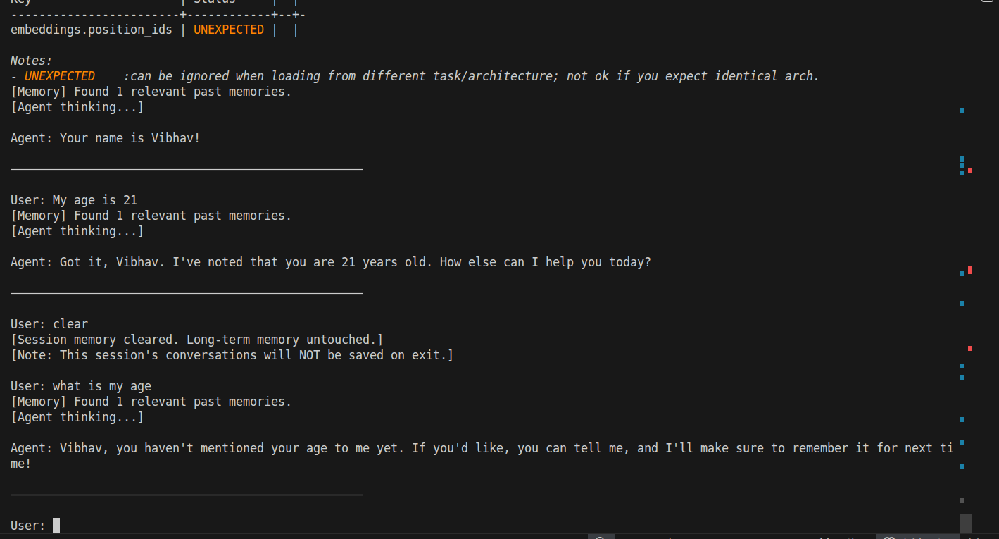
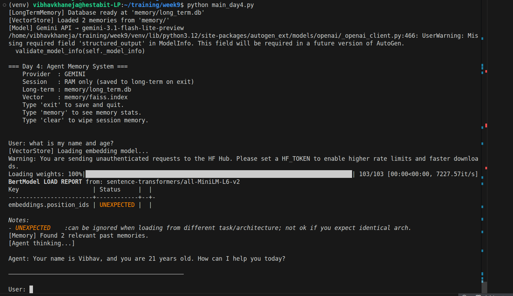
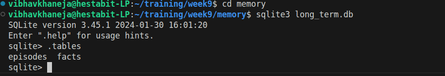
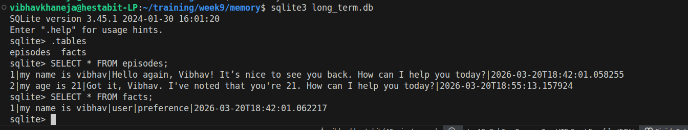

# Day 4 — Memory Systems: Short-Term, Long-Term & Vector Memory

## What is Agent Memory?

In Day 3, our agents had no memory — every conversation started completely fresh. The agent had no idea who you were, what you discussed before, or any context from previous sessions.
Agent memory solves this by giving the agent the ability to store, retrieve, and reason over past information. Just like a human uses short-term memory for the current conversation and long-term memory for things learned over time, an AI agent needs multiple memory layers to behave intelligently across sessions.

## Types of Memory

1) Short-Term Memory (Session Memory)

Stores only the current conversation in RAM. It is fast, temporary, and disappears when the session ends or when clear is called. Its job is to give the agent a conversation window — so it remembers what was said 2-3 messages ago without needing to query a database.

2) Long-Term Memory (Persistent Memory)

Stores important facts and full conversation episodes in a SQLite database on disk. It survives across sessions — so the agent remembers your name, preferences, and past conversations even after you restart the program. It is written only intentionally, not after every message.

3) Vector Memory (Semantic Memory)

Stores conversations as mathematical vectors using embeddings. Instead of searching by keyword, it searches by meaning — finding the most relevant past context even if the exact words are different. For example, asking "what do I do for work?" will retrieve a memory where you said "I am a software engineer" even though the words don't match.

### Episodic vs Semantic Memory

Episodic memory — specific events and conversations ("User said they are 21 years old on Jan 5th")
Semantic memory — general facts and knowledge ("Vibhav is 21 years old")

Our system implements both — episodes table for episodic, facts table for semantic.

## Topics Covered

- Short-term session memory using Python lists in RAM
- Long-term persistent memory using SQLite
- Vector memory using FAISS and sentence-transformers
- Episodic vs semantic memory distinction
- Memory injection into agent prompts
- Controlling when memory gets saved (Option 2 — save only on exit)


## Architecture
```
User Query
    ↓
Search FAISS (vector)     → find semantically similar past context
    ↓
Fetch SQLite (long-term)  → load past episodes + stored facts
    ↓
Fetch RAM (session)       → load recent conversation turns
    ↓
Combine all into one enriched prompt
    ↓
Agent generates response using full memory context
    ↓
Store reply in session RAM + session_log
    ↓
On EXIT only → save session_log to SQLite + FAISS
```

## Workflow
1) memory/session_memory.py — Short-Term RAM Store

Pure Python list in memory. Stores every message sent and received during the current session. Wiped on clear or when the program exits. Has no connection to any file or database — it exists only in RAM.

**Key functions:**
* add_message(role, content) — adds a message to the session
* get_recent(n) — returns the last n messages
* format_for_prompt(n) — formats recent messages for prompt injection
* clear() — wipes the session
* session_stats() — returns message counts and timestamps

2) memory/long_term_memory.py — Persistent SQLite Store

Creates and manages memory/long_term.db with two tables:
facts table — stores important things the user says (name, age, preferences). Searched by category or keyword.
episodes table — stores complete conversation turns (user message + agent reply). Retrieved in chronological order.

**Key functions:**
* init_db() — creates the database and tables on startup
* store_fact(content, source, category) — saves an important fact
* store_episode(user_msg, agent_reply) — saves a conversation turn
* get_facts(category) — retrieves facts by category
* get_recent_episodes(n) — retrieves last n conversations
* format_facts_for_prompt() — formats facts for prompt injection
* format_episodes_for_prompt() — formats episodes for prompt injection
* memory_stats() — shows counts of facts and episodes

3) memory/vector_store.py — FAISS Semantic Search

Converts every conversation into a 384-dimension vector using the all-MiniLM-L6-v2 sentence transformer model. Stores these vectors in a FAISS index in RAM. On exit, saves the index to memory/faiss.index and metadata to memory/metadata.json.
When a new query arrives, it converts the query to a vector and finds the 3 most similar past conversations by mathematical distance — not keyword matching.

**Key functions:**
* add_memory(text, metadata) — embeds text and adds to FAISS index
* search(query, k) — finds k most similar past memories
* format_results(results) — formats results for prompt injection
* save(directory) — writes index and metadata to disk
* load(directory) — loads saved index from disk
* count() — returns number of stored memories

4) main_day4.py — Main Orchestrator

The only file that contains the AutoGen AssistantAgent. Coordinates all three memory layers in a loop. Handles all special commands.
Memory flow per message:

1.  User types a message
2. Store in session RAM
3. Search FAISS for similar past context
4. Fetch episodes and facts from SQLite
5. Fetch recent messages from session RAM
6. Combine all into one enriched prompt
7. Send to agent → receive reply
8. Store reply in session RAM and session_log

## On exit:

* Loop through session_log
* Save every exchange as an episode in SQLite
* Save fact-containing messages to SQLite facts table
* Save every exchange as a vector in FAISS
* Write FAISS index to disk

## Role of Commands

clear: Wipes session RAM, session_log, and recreates the agent to clear AutoGen's internal buffer. Long-term memory untouched.
memory: Shows stats for all three memory layers
exit: Saves session to long-term memory then shuts down
reset: Wipes all memory layers completely (optional command)

### Key Design Decision — Save Only on Exit

We deliberately chose to save to long-term memory only when the user types exit, not after every message. This creates clean separation between the three layers:

During session — only RAM is used. Fast, no disk I/O.
On clear — session wiped, long-term untouched.
On exit — everything saved permanently.

This means clear truly resets the conversation. After clearing, the agent has no knowledge of what was said in that session — not from RAM, not from SQLite, not from FAISS. It can only recall things from previous sessions that were properly saved.

## Output





