# NEXUS AI
### Autonomous Multi-Agent AI System — Week 9 Day 5 Capstone

---

## What is NEXUS AI?

NEXUS AI is a fully autonomous multi-agent system that can plan, research, write code, analyse data, reflect on quality, and generate reports — all without human intervention between steps.

It was built as the capstone of Week 9, combining everything from the week into one system:
- **Day 3** — Tool-calling agents (Code, File, Database)
- **Day 4** — Three-layer memory system (Session, SQLite, FAISS)
- **Day 5** — Full orchestration with 11 specialist agents, self-reflection, web search, logging, and a Streamlit UI

---

## Quickstart

```bash
# 1. Install dependencies
pip install autogen-agentchat autogen-ext faiss-cpu sentence-transformers
pip install python-dotenv ddgs streamlit

# 2. Add your Gemini API key
echo "GEMINI_API_KEY=your_key_here" > .env

# 3. Run in terminal
python nexus_ai/main.py

# 4. Or run in browser
streamlit run streamlit_app.py
```

---

## Project Structure

```
week9/
├── nexus_ai/
│   ├── main.py          ← pipeline runner + memory orchestration
│   ├── agents.py        ← all 11 agents with system prompts + tools
│   ├── config.py        ← model provider, paths, constants
│   └── logger.py        ← .log + trace.jsonl logging
├── tools/
│   ├── code_executor.py ← Python subprocess execution
│   ├── file_agent.py    ← file read/write/csv tools
│   └── db_agent.py      ← SQLite inspect + query tools
├── memory/
│   ├── session_memory.py    ← RAM session store
│   ├── long_term_memory.py  ← SQLite facts + episodes
│   ├── vector_store.py      ← FAISS semantic search
│   ├── long_term.db         ← auto-created on startup
│   ├── faiss.index          ← saved on exit
│   └── metadata.json        ← FAISS metadata
├── logs/                ← auto-created
│   ├── nexus_*.log      ← one per session
│   ├── trace.jsonl      ← all sessions, JSON events
│   └── report_*.md      ← saved reports
├── streamlit_app.py     ← browser UI
└── .env                 ← GEMINI_API_KEY (never commit)
```

---

## Agents

| Agent | Role | Tools |
|---|---|---|
| Orchestrator | Reads query + memory, outputs JSON execution plan | None |
| Planner | Detailed phase-by-phase task breakdown | None |
| Researcher | Background knowledge + real-time web search | `web_search()` |
| Coder | Writes and executes Python code | `execute_python_script()` |
| Analyst | Interprets data, finds patterns, draws conclusions | None |
| Critic | Reviews output, scores 1-10, lists weaknesses | None |
| Optimizer | Improves output based on Critic feedback | None |
| Validator | Verifies correctness, returns PASS or FAIL | None |
| Reporter | Formats polished final .md report | None |
| File Agent | Read, write, CSV, append, list files | 5 file tools |
| DB Agent | SQLite schema inspection + SQL execution | 2 DB tools |

---

## Memory System

NEXUS AI has three independent memory layers:

```
Session RAM       → current conversation, cleared on 'clear'
SQLite            → facts + episodes, saved only on exit
FAISS             → semantic vector search, saved only on exit
```

On every query, all three layers are searched and injected into the Orchestrator's prompt so it has full context before planning.

---

## Terminal Commands

```
exit    → save session to long-term memory and quit
clear   → wipe session RAM (long-term memory untouched)
memory  → show stats for all three memory layers
```

---

## Example Queries

```
weather in Noida today
what is my name?
create a report on RAG pipelines
write a Python script for fibonacci and save it as fibonacci.py
analyse sales.csv and create a business strategy report
design a backend architecture for a food delivery app
read all files in nexus_ai/ and explain the architecture
```

---

## Capabilities

| Capability | How |
|---|---|
| Multi-agent orchestration | Orchestrator → JSON plan → sequential execution |
| Real-time web search | DuckDuckGo via `web_search()` on Researcher |
| Code execution | Subprocess isolation, 30s timeout, auto pip install |
| File operations | Read/write/CSV/append/list via File Agent |
| Database operations | SQLite via DB Agent |
| Memory recall | FAISS semantic + SQLite exact + session RAM |
| Self-reflection | Critic → Optimizer auto-triggered loop |
| Quality gating | Validator PASS/FAIL before Reporter |
| Logging | Per-session .log + persistent trace.jsonl |
| UI | Streamlit chat with sidebar memory stats |

---

## Configuration

Edit `nexus_ai/config.py` to switch providers:

```python
ACTIVE_PROVIDER = "gemini"   # or "ollama" for local models

GEMINI_MODEL = "gemini-3.1-flash-lite-preview"
OLLAMA_MODEL = "qwen2.5"

MAX_REFLECTION_CYCLES = 2    # max Critic → Optimizer loops per task
MAX_PLAN_STEPS        = 10   # max steps Orchestrator can plan
```

---

## How the Pipeline Works

```
User query
    ↓
Memory search (FAISS + SQLite + Session RAM)
    ↓
Orchestrator plans which agents run and in what order
    ↓
Agents execute in sequence, each seeing all previous outputs
    ↓
Critic → Optimizer reflection cycle (auto-triggered)
    ↓
Validator checks correctness
    ↓
Reporter formats final output (only if user asked for a report)
    ↓
Session saved to long-term memory on exit
```

---

## Deliverables

| File | Description |
|---|---|
| `nexus_ai/main.py` | Main pipeline entry point |
| `nexus_ai/agents.py` | All 11 agents |
| `nexus_ai/config.py` | Configuration |
| `nexus_ai/logger.py` | Logging system |
| `memory/` | Three-layer memory system |
| `tools/` | Code, File, DB tool functions |
| `streamlit_app.py` | Browser UI |
| `ARCHITECTURE.md` | Full system architecture documentation |
| `FINAL-REPORT.md` | Learning outcomes, edge cases, design decisions |
| `README.md` | This file |

---

## Key Design Decisions

**Planner Pipeline over GroupChat** — Sequential agent execution with a central Orchestrator gives predictable, debuggable behaviour. GroupChat's emergent agent coordination requires GPT-4 class models to be reliable.

**Save only on exit** — Memory is only persisted when the user types `exit`. This creates clean separation: session RAM for the current conversation, long-term storage for intentional persistence.

**Reporter on demand** — The Reporter agent only runs when the user explicitly asks for a report. Simple questions get direct answers with no file saved.

**Explicit beats implicit** — Every routing rule, tool instruction, memory injection, and save trigger is stated explicitly in system prompts and code. The more precisely behaviour is described, the more reliably the system performs.

## Output

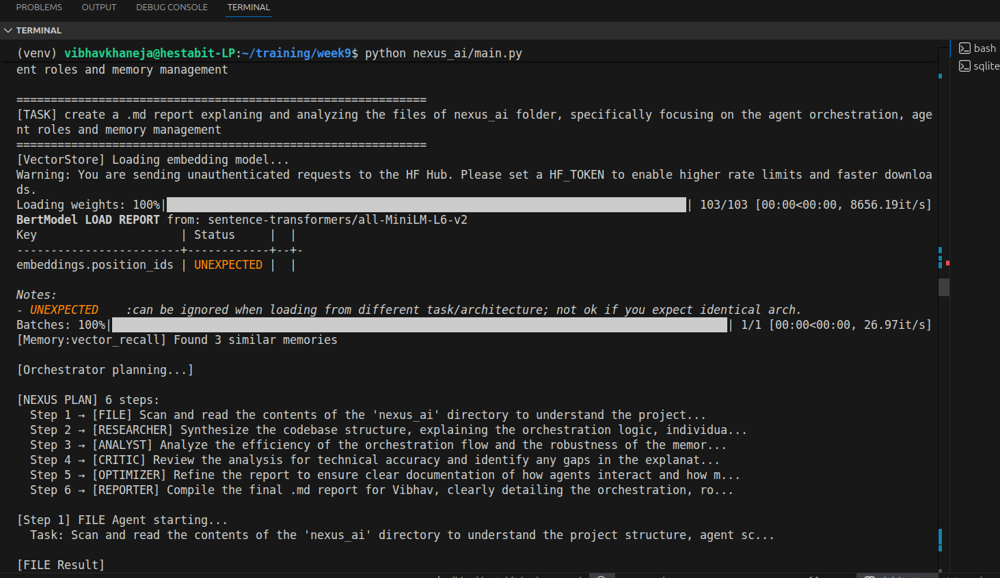
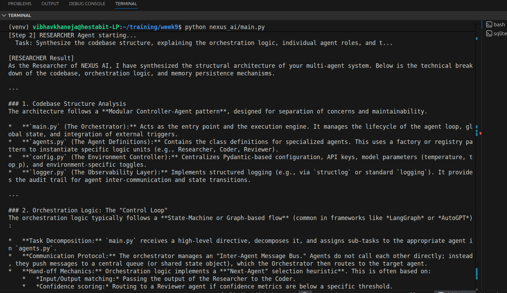
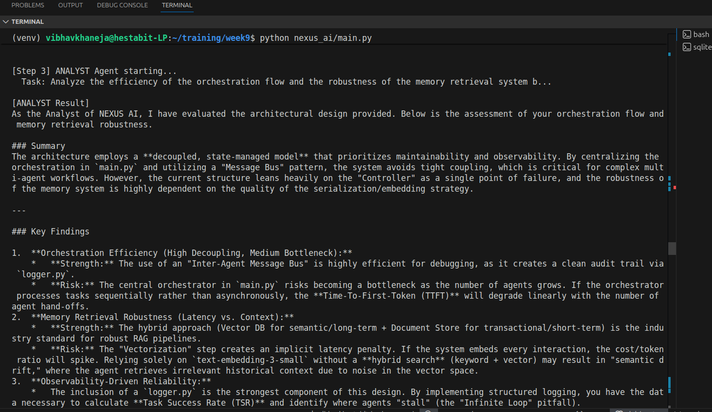
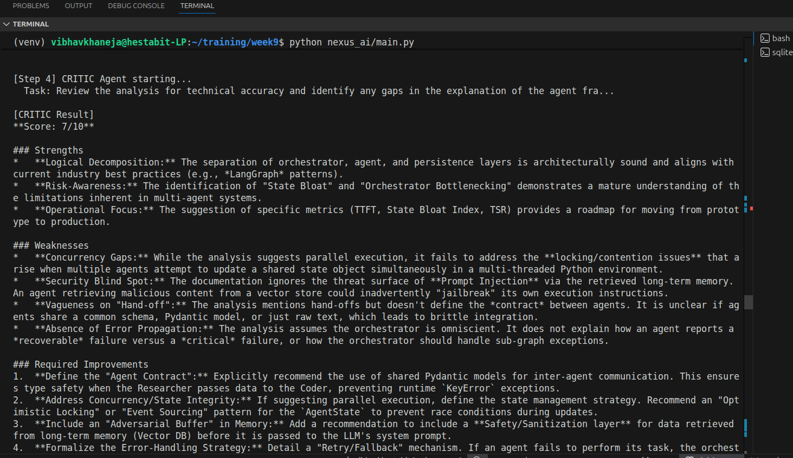
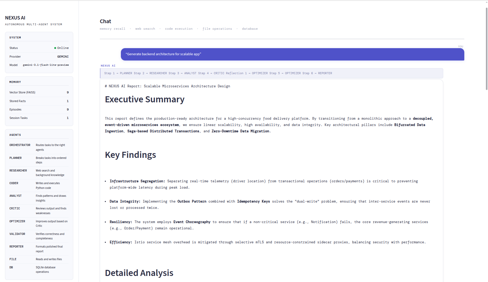
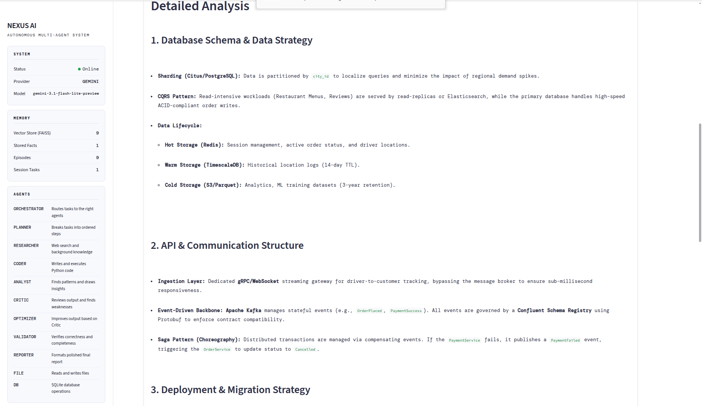
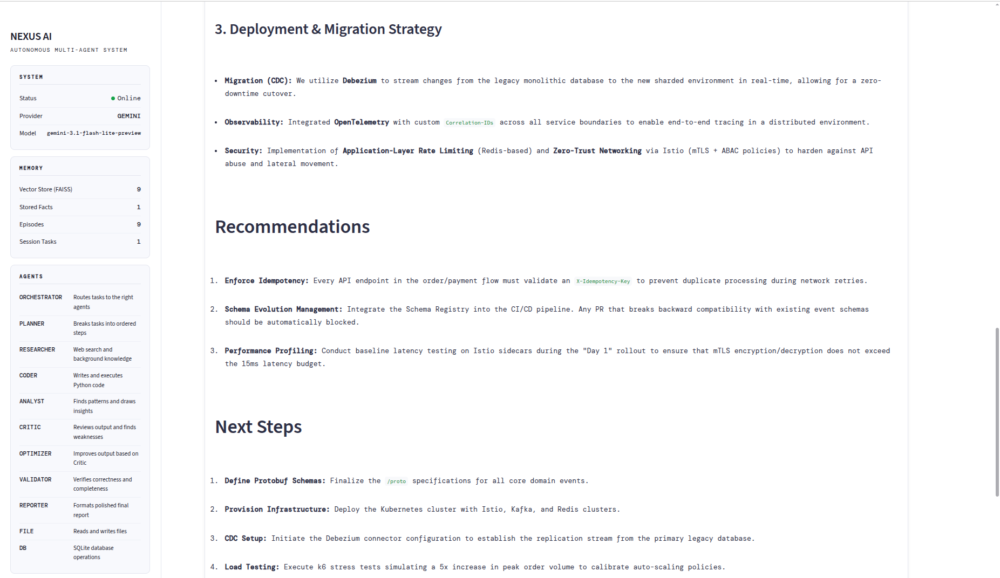
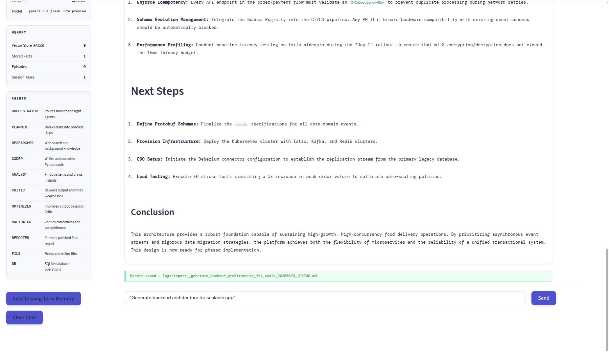
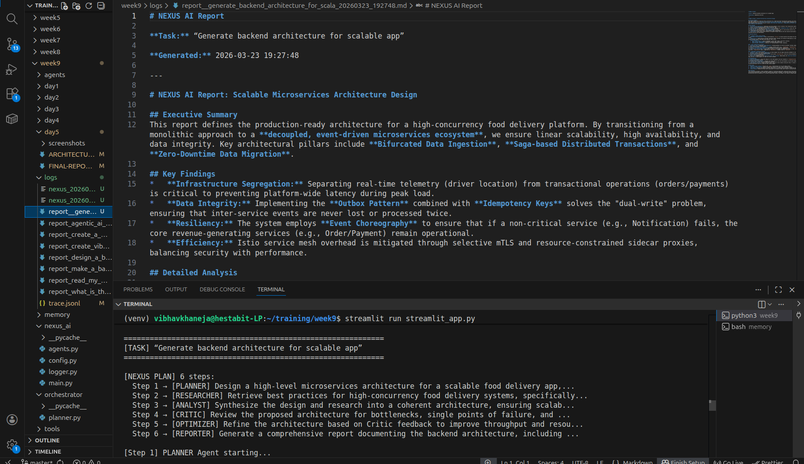
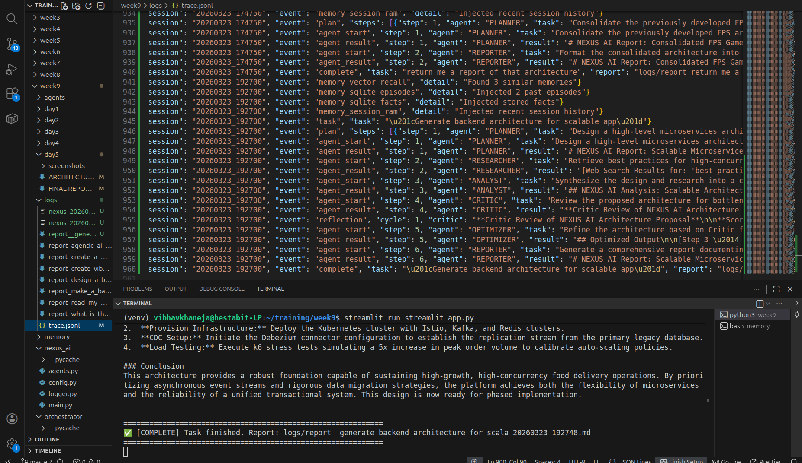
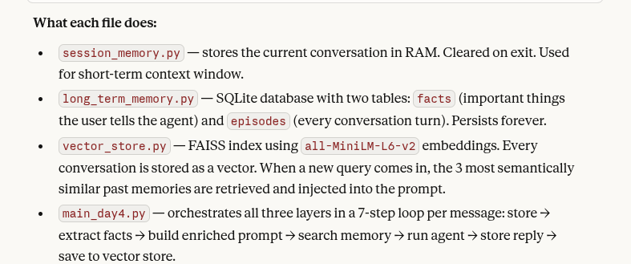
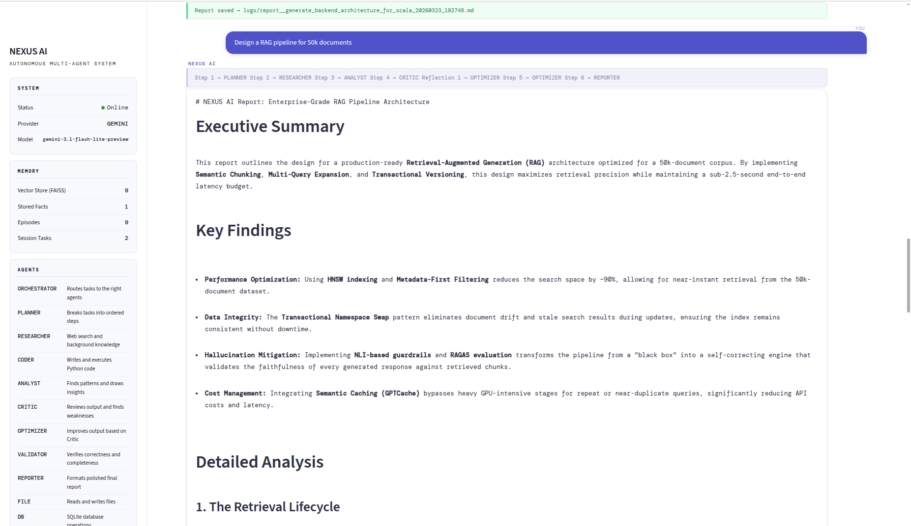
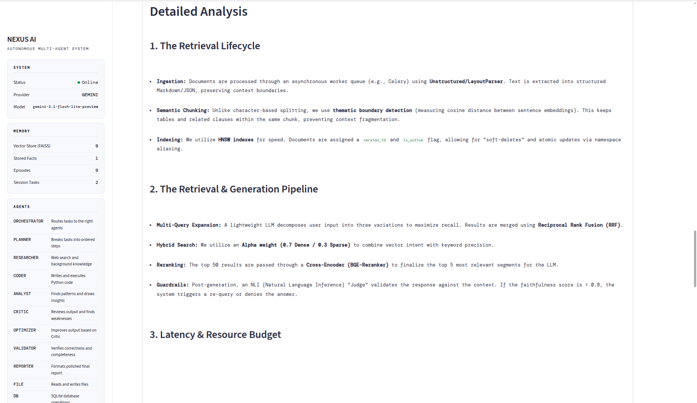
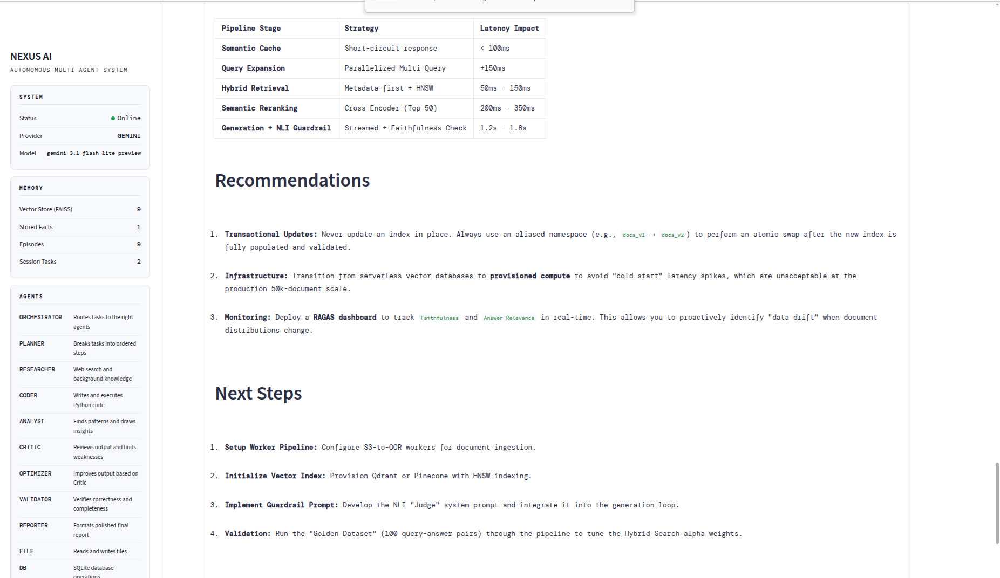